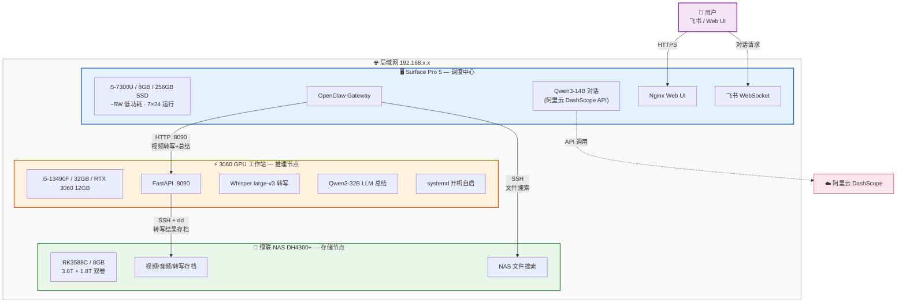
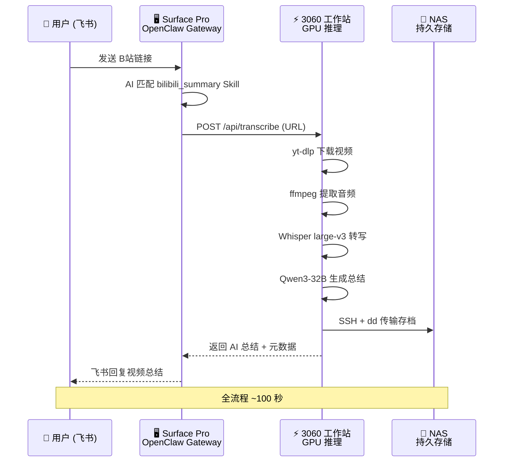

# OpenClaw 实战部署：三机协同打造 7×24 私人 AI 助手

<p align="center">
  
</p>

> **OpenClaw** 是 2026 年最火的开源 AI 助手平台之一——它不只是一个聊天机器人框架，而是一个完整的 **AI Agent 操作系统**：支持飞书 / Web 多渠道接入，内置工具调用（function calling）、技能系统（Skills）、记忆管理、多 Agent 协作，还能接入任意 OpenAI 兼容的大模型。
>
> 本项目是一份**从零到可用的完整实战记录**——用一台旧 Surface Pro + 一块 RTX 3060 + 一台家用 NAS，搭建三机协同的分布式私人 AI 助手，24 小时踩坑实录。

---

## 项目亮点

- **三机协同架构**：Surface Pro（5W 低功耗调度中心）+ RTX 3060（GPU 推理）+ NAS（5.4T 持久存储），局域网 SSH 互联
- **5 个实战 Skill**：系统信息、天气查询推送、个人知识库、NAS 文件搜索、B站视频自动总结
- **B站视频一键总结**：飞书发一个链接 → 自动下载 → Whisper GPU 转写 → Qwen3-32B 总结 → NAS 存档，全流程 ~100 秒
- **零成本语音转写**：利用闲置 3060 GPU 运行 faster-whisper，无需云端 ASR 付费，音视频数据不出局域网
- **飞书原生集成**：通过飞书对话即可操控 AI 助手，支持工具调用、文件搜索、视频总结等
- **完整踩坑记录**：12 个踩坑案例 + 详细诊断过程 + 解决方案，可直接复用
- **硬件性能实测**：Surface Pro / 3060 / NAS 三机 CPU、内存、磁盘、Node.js 基准测试对比

---

## 系统架构



**数据流示例 — B站视频一键总结**：



---

## 已实现的 Skill

| # | Skill | 类型 | 功能 | 技术栈 |
|---|-------|------|------|--------|
| 1 | **system_info** 🖥️ | 命令执行型 | 读取硬件/软件/温度信息 | bash + sensors |
| 2 | **weather** 🌤️ | 命令执行 + 定时推送 | 天气查询 + 飞书每 2h 推送 | wttr.in + cron + Webhook |
| 3 | **personal_info** 👤 | 纯数据型 | 个人知识库问答 | SKILL.md 知识注入 |
| 4 | **nas_search** 🗄️ | 远程命令型 | NAS 文件搜索（10 种子命令） | SSH + find/du |
| 5 | **bilibili_summary** 📺 | API 服务型 | B站视频转写 + AI 总结 | 3060 GPU + Whisper + Qwen3-32B |

---

## 文档导航

| 序号 | 文档 | 内容概述 |
|:----:|------|----------|
| 1 | **[环境构建与 API 配置](./docs/1_OpenClaw_Deploy_Guide.md)** | 选型对比、硬件准备、安装 OpenClaw、接入阿里云 Qwen3 |
| 2 | [Surface Ubuntu 系统安装](./docs/2_Surface_Ubuntu_Setup.md) | Surface Pro 5 安装 Ubuntu 22.04 + linux-surface 内核 |
| 3 | [Nginx HTTPS Web UI](./docs/3_OpenClaw_Nginx_WebUI.md) | Nginx 反向代理、自签名 SSL、局域网 Web UI 访问 |
| 4 | [Workspace 自定义指南](./docs/4_OpenClaw_Workspace.md) | SOUL.md / IDENTITY.md / TOOLS.md 定义 AI 人格与能力 + 模型选型对比 |
| 5 | [Skill 开发指南](./docs/5_OpenClaw_Skills.md) | Skill 原理、6 个实战案例（含 Qwen 费用监控）、3060 GPU 转写服务架构、本地 Whisper 选型分析 |
| 6 | [踩坑记录与时间线](./docs/6_OpenClaw_Troubleshooting_and_Roadmap.md) | 12 个踩坑案例、最佳实践、部署时间线（24h）、功能路线图 |

---

## 快速开始

```bash
# 1. 克隆安装工具
git clone https://github.com/miaoxworld/OpenClawInstaller.git
cd OpenClawInstaller && chmod +x install.sh config-menu.sh

# 2. 一键安装（自动检测环境、安装依赖、引导配置）
./install.sh

# 3. 验证
source ~/.openclaw/env
openclaw agent --agent main --message "你好"
```

详细步骤见 [环境构建与 API 配置](./docs/1_OpenClaw_Deploy_Guide.md)。

---

## 硬件清单与性能实测

| 设备 | 角色 | 规格 | 说明 |
|------|------|------|------|
| Surface Pro 5 | OpenClaw 调度中心 | i5-7300U / 8GB / 256GB SSD | 7×24 运行，Ubuntu 22.04 无桌面模式，功耗 ~5W |
| RTX 3060 工作站 | GPU 推理节点 | i5-13490F / 32GB / RTX 3060 12GB | Whisper + LLM 总结，systemd 开机自启 |
| 绿联 DH4300+ NAS | 持久化存储 | RK3588C / 8GB / 3.6T+1.8T 双卷 | 视频/音频/转写文本长期存储 |

**性能对比（实测）**：

| 测试项 | Surface Pro | 3060 工作站 | NAS |
|--------|:-----------:|:-----------:|:---:|
| CPU 单核 (pi 5000位) | 191 ms | **85 ms** | 572 ms |
| CPU 多核 (并行 gzip) | 971 ms (4核) | **538 ms (16核)** | 1888 ms (8核) |
| Node.js (50M sqrt) | 682 ms | — | 1159 ms |
| 磁盘写入 (256MB) | 101 MB/s | 280 MB/s | **2.1 GB/s** |

> **结论**：3060 工作站 CPU 性能最强（单核是 NAS 的 6.7 倍），但功耗高不适合 24/7 待机。Surface Pro 单核性能是 NAS 的 3 倍，配合 5W 低功耗，是 OpenClaw Gateway 的最佳载体。NAS 优势在磁盘 I/O 和存储空间，适合做数据节点。

---

## 参考链接

- [OpenClaw 官方仓库](https://github.com/openclaw/openclaw)
- [OpenClaw 一键部署工具](https://github.com/miaoxworld/OpenClawInstaller)
- [OpenClaw Manager 桌面版](https://github.com/miaoxworld/openclaw-manager)
- [阿里云 DashScope](https://dashscope.console.aliyun.com/)
- [DashScope OpenAI 兼容模式文档](https://help.aliyun.com/zh/model-studio/developer-reference/compatibility-of-openai-with-dashscope)
- [linux-surface 内核](https://github.com/linux-surface/linux-surface)
- [飞书开放平台](https://open.feishu.cn/)
- [faster-whisper](https://github.com/SYSTRAN/faster-whisper)

---

> **撰写日期**：2026 年 2 月 8~10 日
>
> 如有问题欢迎评论交流！
