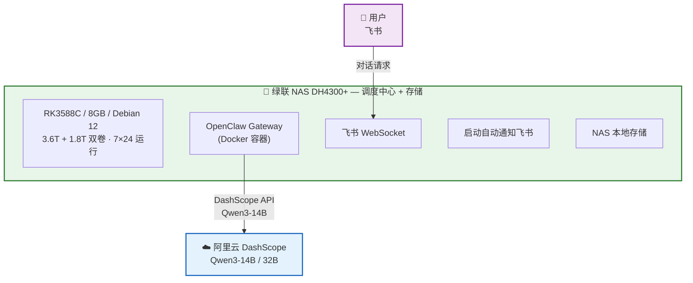
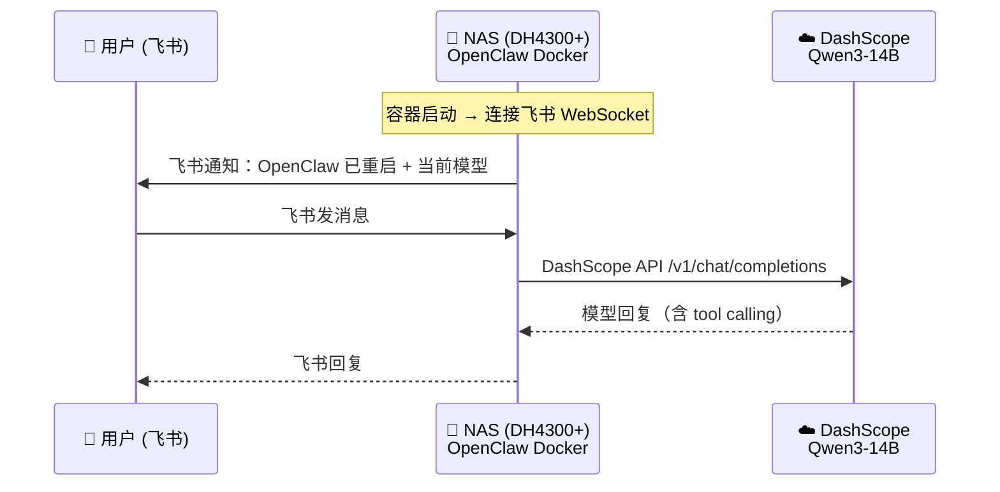

# OpenClaw 实战部署：NAS + 云端 API 打造 7×24 私人 AI 助手

<p align="center">
  
</p>

> **OpenClaw** 是 2026 年最火的开源 AI 助手平台之一——它不只是一个聊天机器人框架，而是一个完整的 **AI Agent 操作系统**：支持飞书 / Web 多渠道接入，内置工具调用（function calling）、技能系统（Skills）、记忆管理、多 Agent 协作，还能接入任意 OpenAI 兼容的大模型。
>
> 本项目是一份**从零到可用的完整实战记录**——用一台绿联 DH4300+ NAS（7×24 低功耗调度中心）+ 阿里云 DashScope API（Qwen3-14B），搭建纯云端推理的私人 AI 助手，完整踩坑实录。

---

## 项目亮点

- **NAS + 云端 API 架构**：绿联 NAS DH4300+（7×24 低功耗调度中心 + 5.4T 持久存储）+ 阿里云 DashScope Qwen3-14B API，轻量高效
- **纯云端推理**：DashScope Qwen3-14B / 32B，131K 上下文窗口，极低成本（百万 token ¥1.5），无需 GPU 硬件
- **23 个内置工具实测**：exec / 文件读写 / heartbeat / memory / web_fetch 全部验证，含 8B vs 14B 工具调用能力对比
- **系统提示词精简实战**：从 34 工具 → 23 工具，完整裁剪决策记录（含本地 8B 模型阶段的经验）
- **Docker 隔离部署**：非 root + cap_drop ALL + no-new-privileges + exec 白名单，启动自动通知飞书
- **exec 审批系统实战**：allowlist 白名单 + safeBins + askFallback 配置，Docker 非交互模式下的踩坑与解决
- **完整踩坑记录**：17 个踩坑案例 + 详细诊断过程 + 解决方案，可直接复用
- **NAS 作为主机的实践**：RK3588C ARM64 平台运行 OpenClaw + Node.js + Docker 的完整实战经验
- **模型演进全记录**：从云端 14B → 本地 8B（vLLM）→ 回归云端 14B，完整记录各阶段的取舍与经验

---

## 系统架构



**数据流示例 — 云端 API 对话**：



---

## 自定义 Skill（已全部清理）

> **2026-02-11**：所有自定义 Skill 和工具已清理。原因：精简系统提示词、聚焦核心能力。原有 5 个自定义 Skill（system_info / weather / nas_search / personal_info / bilibili_summary）及其 Function Calling 工具已移除，后续根据需要重新开发。
>
> 保留 OpenClaw 内置的 23 个核心工具（文件读写、Shell 执行、网页搜索、浏览器、定时任务、消息、记忆等）。当前使用云端 DashScope Qwen3-14B API，131K 上下文窗口充足。

---

## 文档导航

| 序号 | 文档 | 内容概述 |
|:----:|------|----------|
| 1 | **[环境构建与 API 配置](./docs/1_OpenClaw_Deploy_Guide.md)** | 选型对比、硬件准备、NAS 上安装 OpenClaw、接入阿里云 Qwen3 |
| 2 | [Nginx HTTPS Web UI](./docs/3_OpenClaw_Nginx_WebUI.md) | Nginx 反向代理、自签名 SSL、局域网 Web UI 访问 |
| 3 | [Workspace 自定义指南](./docs/4_OpenClaw_Workspace.md) | SOUL.md / IDENTITY.md / TOOLS.md 定义 AI 人格与能力 + 模型选型对比 |
| 4 | [Skill 开发指南](./docs/5_OpenClaw_Skills.md) | Skill 原理、实战案例（含 Qwen 费用监控）、3060 GPU 转写服务架构、本地 Whisper 选型分析 |
| 5 | [**原生工具插件开发**](./docs/6_OpenClaw_Native_Tools_Plugin.md) | 自定义插件 Function Calling 原理、开发指南、踩坑总结（自定义工具已清理，保留框架） |
| — | **踩坑记录与时间线** | 17 个踩坑案例、最佳实践、部署时间线、裁剪决策记录、功能路线图（见本文下方） |

---

## 快速开始

```bash
# 1. 克隆安装工具
git clone https://github.com/miaoxworld/OpenClawInstaller.git
cd OpenClawInstaller && chmod +x install.sh config-menu.sh

# 2. 一键安装（自动检测环境、安装依赖、引导配置）
./install.sh

# 3. 验证
source ~/.openclaw/env
openclaw agent --agent main --message "你好"
```

详细步骤见 [环境构建与 API 配置](./docs/1_OpenClaw_Deploy_Guide.md)。

---

## 硬件清单与性能实测

| 设备 | 角色 | 规格 | 说明 |
|------|------|------|------|
| 绿联 DH4300+ NAS | **OpenClaw 调度中心 + 持久存储** | RK3588C / 8GB / 3.6T+1.8T 双卷 | Debian 12，7×24 运行，Docker 容器运行 Gateway + 飞书 + 存储一体 |
| ~~RTX 3060 工作站~~ | ~~LLM 推理节点~~ | ~~i5-13490F / 32GB / RTX 3060 12GB~~ | 历史：曾用 vLLM 运行 Qwen3-8B-AWQ，后改为纯云端 API，不再作为推理节点 |

### 为什么选 NAS 作为主机？

之前使用 Surface Pro 5 作为 OpenClaw Gateway 调度中心，但 2 核 4 线程的 i5-7300U 在启动多个服务时负载极高，触发 watchdog 反复重启，系统极不稳定。绿联 DH4300+ NAS（RK3588C 8 核 + 8GB 内存）本身就是 7×24 运行的设备，且 Debian 12 系统环境完整，磁盘 I/O 极强，非常适合作为常驻调度中心。

### NAS 存储路径

NAS 双卷存储，OpenClaw Docker 容器通过只读挂载访问：

| NAS 本地路径 | 容器内路径 | 用途 |
|-------------|-----------|------|
| `/volume2/Movies` | `/nas/volume2/Movies` | 电影库 |
| `/volume2/Photos` | `/nas/volume2/Photos` | 照片 |
| `/volume2/Musics` | `/nas/volume2/Musics` | 音乐 |
| `/volume2/Games` | `/nas/volume2/Games` | 游戏 |
| `/volume2/迅雷下载` | `/nas/volume2/迅雷下载` | 迅雷下载 |
| `/volume1/@home/cw` | `/nas/volume1/@home/cw` | 用户主目录 |

> **注意**：绿联 UGOS 的用户目录默认权限为 `d---------+`（ACL 管理），Docker 容器的 `node` 用户（UID 1000）无法读取。需在宿主机执行 `sudo chmod -R o+rX /volume2/Movies /volume2/Photos /volume2/Musics /volume2/Games` 修复权限。

**历史：3060 工作站 SMB 挂载**（已弃用）：

早期 3060 工作站通过 `/etc/fstab` 配置 CIFS 自动挂载到 `/mnt/nas/`。关键参数：
- `_netdev`：网络就绪后才挂载
- `nofail`：挂载失败不阻塞开机
- `vers=3.0`：SMB 3.0 协议
- 凭证通过独立文件管理（权限 600）

**性能对比（实测）**：

| 测试项 | NAS (DH4300+) | 3060 工作站 |
|--------|:-------------:|:-----------:|
| CPU 单核 (pi 5000位) | 572 ms | **85 ms** |
| CPU 多核 (并行 gzip) | 1888 ms (8核) | **538 ms (16核)** |
| Node.js (50M sqrt) | 1159 ms | — |
| 磁盘写入 (256MB) | **2.1 GB/s** | 280 MB/s |

> **结论**：NAS 虽然 CPU 性能偏弱（ARM64 架构），但具有 **磁盘 I/O 极强（2.1 GB/s）、7×24 低功耗运行、存储空间充足（5.4T）** 三大优势，作为 OpenClaw Gateway 调度中心 + 数据存储一体机是最佳选择。Node.js 在 RK3588C 上运行 OpenClaw Gateway 完全可用，响应延迟主要取决于云端 DashScope API 而非本地 CPU。当前使用纯云端推理（Qwen3-14B），NAS 只负责网关调度 + 存储，无需 GPU 硬件。

---

## 踩坑记录

### 坑 1：4B 模型完全不会用工具

**现象**：Qwen3-4B 面对任何需要 `exec` 的问题，只会给出"通用指导"（"您可以通过 `lshw` 命令查看..."）。

**原因**：4B 参数量太小，无法理解 OpenClaw 的工具调用协议（function calling）。

**解决**：换 14B 或更大的模型。同时在 `TOOLS.md` 中写"本机信息速查"作为兜底。

**实测对比**（同一问题"电脑是什么牌子的"）：

| 维度 | qwen3-4b | qwen3-14b | qwen3-32b |
|------|----------|-----------|-----------|
| 回答质量 | ❌ "我无法获取，请自行查询" | ✅ 直接给出品牌和配置 | ✅ 直接给出品牌和配置 |
| 工具调用 | 不会调用 exec | 正确读取 TOOLS.md 并执行命令 | 正确读取 TOOLS.md 并执行命令 |
| Skill 匹配 | 不会触发 | 正确匹配 system_info | 正确匹配 system_info |
| 响应时间 | ~12 秒 | ~18 秒 | ~25 秒 |
| 适用场景 | 简单闲聊 | **日常使用（推荐）** | 复杂推理 |

> **结论**：`qwen3-14b` 是 OpenClaw 的最佳搭档——具备完整的工具调用和 Skill 匹配能力，响应速度可接受。4B 太小，无法理解 function calling 协议。32B 能力更强但延迟明显增加，适合深度推理场景。

### 坑 2：TOOLS.md 必须写明能力

**现象**：已经配好了 `system_info` Skill，但 AI 仍然不会主动调用。

**原因**：OpenClaw 每次会话开始时读取 `TOOLS.md`，如果里面没有提及系统信息能力，AI 就不知道自己可以执行命令。

**解决**：在 `TOOLS.md` 中显式写出命令列表和本机基本信息。

### 坑 3：Nginx WebSocket 要注入 token

**现象**：Web UI 能打开但无法连接到 AI 后端。

**原因**：OpenClaw Control UI 通过 WebSocket 连接网关，需要 auth token。浏览器端不会自动带上 token。

**解决**：在 Nginx 的 `/ws` location 中将 token 拼接到 `proxy_pass` URL：

```nginx
proxy_pass http://127.0.0.1:18789/ws?token=你的token;
```

### 坑 4：新 Skill 需要重启 Gateway

**现象**：创建了 Skill 目录但 `openclaw skills list` 看不到。

**解决**：

```bash
source ~/.openclaw/env
openclaw gateway --force  # 注意不是 openclaw restart
```

### 坑 5：Skill 有了但 AI 不调用

**现象**：`openclaw skills list` 显示 weather Skill 为 `✓ ready`，但问"今天天气怎么样"，AI 回复"未找到天气查询工具"或尝试自己用内网 IP 定位然后失败。

**原因**：两个问题叠加——

1. **Workspace 没更新**：`TOOLS.md` 和 `SOUL.md` 只写了 `system_info` 的能力，没提到 weather。AI 每次会话读取 Workspace 上下文时，不知道自己能查天气。
2. **SKILL.md 描述有误导**：写了"基于服务器 IP 自动定位"，AI 理解为需要先 `curl ip-api.com` 获取位置，结果拿到了局域网 IP `192.168.1.100`，无法定位。

**解决**：

- `TOOLS.md` 新增"天气查询"章节，写明 `bash get_weather.sh` 命令，**强调不要自己尝试 IP 定位**
- `SOUL.md` 能力列表增加天气查询
- `SKILL.md` 加粗提示"直接运行脚本即可"，删除误导性描述

> **教训**：注册 Skill 只是第一步，**必须同步更新 Workspace 文件**（TOOLS.md / SOUL.md），否则 AI 不知道自己有这个能力。

### 坑 6：gateway --force 不能管道截断

**现象**：执行 `openclaw gateway --force 2>&1 | head -15` 后，Gateway 启动日志正常但随后进程崩溃，AI 无法回复任何消息。

**原因**：Gateway 是长驻进程，持续向 stdout 输出日志。`head -15` 读完 15 行后关闭管道，Gateway 继续写入时触发 `EPIPE` 异常，进程直接崩溃。

**日志中的错误**：

```
[openclaw] Uncaught exception: Error: write EPIPE
    at afterWriteDispatched (node:internal/stream_base_commons:159:15)
    ...
```

**解决**：重启 Gateway 时用 `nohup` 后台运行，不要用管道截断输出：

```bash
nohup openclaw gateway --force > /tmp/openclaw_restart.log 2>&1 &
sleep 3
grep -E "listening|model|error" /tmp/openclaw_restart.log  # 检查启动状态
```

> **教训**：长驻进程的 stdout 不能管道到 `head` / `tail -n` 等会提前关闭的命令，否则 EPIPE 会杀死进程。

### 坑 7：移动项目目录后 OpenClaw 无法启动

**现象**：将 OpenClaw 项目目录移动到新位置后，`openclaw gateway` 报错无法找到配置文件或 skills 目录。

**原因**：`~/.openclaw/` 下的多个路径（workspace、skills、配置文件）使用了**绝对路径的符号链接**指向原始项目目录。移动项目后符号链接变为悬空链接。

**解决**：重新创建所有符号链接，指向新的项目路径：

```bash
# 检查并修复悬空链接
ls -la ~/.openclaw/workspace/
ls -la ~/.openclaw/skills/
# 删除旧链接，创建新链接指向正确路径
```

> **教训**：移动 OpenClaw 项目目录后，务必检查 `~/.openclaw/` 下所有符号链接是否仍然有效。

### 坑 8：Skill 未注册 → AI 自行启动服务 → 端口冲突 → 对话历史污染死循环

**现象**：用户在飞书发送 B站链接请求总结视频，AI 不执行 `bilibili_summary.sh` 脚本，反而反复输出"请手动检查端口占用"、"kill -9 \<PID\>"等排查步骤，形成死循环。即使服务完全正常（`curl /api/status` 返回 200），AI 依然坚持建议用户手动修复。

**根本原因**：由 4 个问题依次触发，形成连锁反应——

| 阶段 | 发生了什么 | 日志证据 |
|:----:|-----------|----------|
| 1 | Gateway 启动时 `bilibili_summary` Skill 尚未配置完成 | — |
| 2 | AI 尝试调用 `bilibili_summary` 原生工具 → **`Tool bilibili_summary not found`** | session.jsonl: `"toolName": "bilibili_summary"` → `not found` |
| 3 | AI 退而求其次，SSH 到 3060 工作站直接执行 `python3 server.py` | session.jsonl: exec → `ssh ubuntu-3060 'python3 server.py'` |
| 4 | systemd 已在运行 server.py（8090端口），再起一个 → **端口冲突** | `ERROR: [Errno 98] address already in use` |
| 5 | AI 看到端口冲突错误，开始输出排查步骤 | assistant: "请手动执行 lsof / kill..." |
| 6 | 后续 Skill 已正常加载（`✓ ready`），但**对话历史已被污染**，AI 继续复读 | 多轮消息全是排查步骤 |

**诊断过程**：

1. 手动验证 3060 工作站服务正常：
   ```bash
   curl -s http://192.168.1.200:8090/api/status
   # → {"status":"running","videos_processed":3}  ← 完全正常
   ```

2. 手动执行脚本验证功能正常：
   ```bash
   bash ~/.openclaw/skills/bilibili_summary/bilibili_summary.sh "https://www.bilibili.com/video/BV1DxFazREFM" --lang zh
   # → 100s 完成全流程（下载+转写+AI总结），输出正常
   ```

3. **关键：读取 session.jsonl 找到根本错误**：
   ```
   Line 119: role=toolResult tool=bilibili_summary → "Tool bilibili_summary not found"
   Line 121: role=toolResult tool=exec → "ERROR: [Errno 98] address already in use"
   ```
   AI 是因为找不到 Skill 工具才自己去启动 server.py 的。

**解决方案**：

```bash
# 1. 备份并删除被污染的会话文件
cp ~/.openclaw/agents/main/sessions/<session-id>.jsonl backup/
rm ~/.openclaw/agents/main/sessions/<session-id>.jsonl

# 2. 重置 sessions.json（让 OpenClaw 创建全新会话）
python3 -c "
import json
path = '/home/youruser/.openclaw/agents/main/sessions/sessions.json'
with open(path) as f: data = json.load(f)
data['agent:main:main']['sessionId'] = ''
data['agent:main:main']['systemSent'] = False
with open(path, 'w') as f: json.dump(data, f, indent=2)
"

# 3. 重启 Gateway
source ~/.openclaw/env && openclaw gateway --force
```

**教训**：

- **Skill 必须在 Gateway 启动前配置好**。AI 第一次调用时若 Skill 不存在，它会"创造性"地尝试替代方案（如直接 SSH 启动服务），一旦失败就陷入错误模式
- **对话历史一旦被污染就难以自我修复**。Qwen3-14B 看到大量排查消息后会持续生成同类回复，即使问题已修复
- **AI 行为异常时，先查 session.jsonl** 而不是 server 日志。问题往往不在服务端，而在 AI 的对话上下文中
- **systemd 管理的服务不要手动启动**。AI 或脚本不应直接 `python3 server.py`，应通过 `systemctl restart` 操作

**修复后验证**：

清除污染会话 + 移除 MEMORY.md + 重启 Gateway 后，飞书发送 B站链接端到端验证成功：

| 步骤 | 结果 |
|------|------|
| 飞书发送视频链接 | ✅ Gateway 正确接收 |
| AI 匹配 bilibili_summary Skill | ✅ 读取 SKILL.md |
| AI 通过 exec 执行 bilibili_summary.sh | ✅ 正确传递 URL 参数 |
| 3060 工作站处理（下载→转写→总结→NAS） | ✅ 114.6s 完成，HTTP 200 |
| AI 解析输出并回复飞书 | ✅ 结构化总结成功回复用户 |

测试视频：`BV1RkFAznESD`（"Agent Skills 做知识库检索，能比传统 RAG 效果更好吗？" 13:35，5619 字符转写）

### 坑 9：MEMORY.md 踩坑记录反向误导 AI 行为

**现象**：在坑 8 的排查过程中发现，即使清除了对话污染，AI 仍然倾向于建议用户手动排查，而不是先尝试执行脚本。

**原因**：`~/.openclaw/workspace/MEMORY.md` 和 `memory/` 每日日志中记录了大量踩坑经历——端口冲突修复、手动 kill 进程、NAS 传输失败排查等。这些内容作为 Workspace **常驻上下文**在每次对话开始时加载。Qwen3-14B 读到这些"问题模式"后，遇到任何异常就条件反射地输出排查步骤。

**解决**：暂时移除记忆文件的符号链接（原文件保留不动）：

```bash
# 移除符号链接（不删除原文件，随时可恢复）
rm ~/.openclaw/workspace/MEMORY.md
rm ~/.openclaw/workspace/memory

# 恢复方式
ln -s ~/Desktop/4_openclaw/1_OpenClawProject/workspace/MEMORY.md ~/.openclaw/workspace/MEMORY.md
ln -s ~/Desktop/4_openclaw/1_OpenClawProject/workspace/memory ~/.openclaw/workspace/memory
```

**教训**：

- **Workspace 记忆是双刃剑**。详细的踩坑记录对人类开发者很有价值，但 AI 可能从中"学到"错误的行为模式
- **MEMORY.md 内容要精心筛选**，应记录"正确做法"而非"出错经历"：
  - ✅ `NAS 传输: cat file | ssh nas 'dd of="path" bs=65536'`（正面、简洁）
  - ❌ `NAS SCP 失败，rsync 也失败，cat>file 写入 0 字节...`（负面、冗长、误导 AI）
- **记忆文件对 14B 模型的影响比 32B 更大**。14B 上下文理解能力有限，容易被负面案例带偏
- **建议**：如果使用记忆系统，只保留精简的**正面指引**，把踩坑细节放在开发文档（如本文）中供人类参考

### 坑 10：nativeSkills 导致 14B 模型 Skill 调用失败

**现象**：用户在飞书问"看一下温度"或"你是什么硬件配置"，AI 回复"当前无法直接获取温度信息，您可以手动执行 `sudo sensors`..."，完全不触发 `system_info` Skill。同样的问题在 32B 模型上正常。

**日志证据**：

```
19:19:25 tool start: tool=system_info   # ① native tool 被调用（返回 SKILL.md 原文）
19:19:25 tool end:   tool=system_info
19:19:34 tool start: tool=exec          # ② 14B 有时会调用 exec（10s 执行了脚本）
19:19:44 tool end:   tool=exec
19:20:17 tool start: tool=system_info   # ③ 但随后又调用了一次 native tool
19:20:17 tool end:   tool=system_info
19:20:27 deliver: "当前无法直接获取温度信息..."  # ④ 最终没有使用 exec 的输出
```

**根本原因**：`commands.nativeSkills: "auto"` 将每个 Skill 同时注册为**同名原生工具**（如 `system_info` 工具）。调用这个原生工具只返回 SKILL.md 的原始文本，而不是执行脚本。14B 模型的行为模式：

1. 匹配到 `system_info` Skill → 调用同名原生工具 → 拿到 SKILL.md 文本
2. 有时会接着调用 `exec` 执行脚本 → 拿到真实系统信息
3. 但**不会使用 exec 的输出**，反而再次调用原生工具
4. 最终给出"无法获取，请手动执行"的泛泛回答

**对比**：

| 行为 | 14B + nativeSkills=auto | 32B + nativeSkills=auto | 14B + nativeSkills=false |
|------|------------------------|------------------------|--------------------------|
| 调用原生 `system_info` 工具 | ✅ 调用但返回 SKILL.md 文本 | ✅ 调用但能正确理解 | ❌ 工具不存在 |
| 调用 `exec` 执行脚本 | 🔀 不稳定，有时调有时不调 | ✅ 正确调用 | ✅ 只能通过 exec |
| 使用脚本输出回复用户 | ❌ 即使 exec 成功也不用输出 | ✅ 正确使用 | ✅ 正确使用 |
| 最终效果 | ❌ "请手动执行命令" | ✅ 正确返回系统信息 | ✅ 正确返回系统信息 |

**解决**：关闭 nativeSkills，强制所有 Skill 只通过 `exec` 执行：

```bash
openclaw config set commands.nativeSkills false
nohup openclaw gateway --force > /tmp/openclaw_restart.log 2>&1 &
```

关闭后 Skill 不再注册为同名工具，AI 只能通过读取 SKILL.md 中的指令然后调用 `exec` 执行脚本，消除了混乱。

> **教训**：
> - **`nativeSkills: "auto"` 对 14B 模型有害**。14B 无法区分"读取 SKILL.md"和"执行脚本"两个动作，两者混用导致结果丢失
> - **小模型用 `nativeSkills: false`，大模型可用 `"auto"`**。32B 能正确理解两层工具调用的关系
> - **排查 Skill 不触发时，先看日志中 `tool start/end` 的序列**，确认是 native tool 被调用还是 exec 被调用

### 坑 11：系统提示过大 + 会话历史溢出（14B 上下文崩溃）

**现象**：发送任何消息到 OpenClaw，立刻返回 HTTP 400 错误：
```
HTTP 400: InternalError.Algo.InvalidParameter: Range of input length should be [1, 98304]
```

**原因**（双重叠加）：

1. **系统提示臃肿**：`AGENTS.md`（230 行，8.5KB）包含大量 14B 不需要的 Group Chat 礼仪、Heartbeat 心跳逻辑、Emoji 反应策略等。加上 5 个 SKILL.md，仅系统提示就占 ~15K tokens
2. **会话文件膨胀**：`sessions/e8f6a4b1-*.jsonl` 累积到 **584KB**（~400K tokens），远超 DashScope API 的 98,304 token 输入上限
3. **skillsSnapshot 缓存过期**：`sessions.json` 中缓存了旧的 Skill description（仍含 "Synology"），修改 SKILL.md 后不会自动更新

**解决方案**：

```bash
# 1. 精简 AGENTS.md（230 行 → 40 行，删除 Group Chat/Heartbeat/Emoji 段落）
# 2. 精简 SKILL.md（5 个文件总计 243 行 → 129 行）

# 3. 备份并清理过大的会话文件
cd ~/.openclaw/agents/main/sessions/
mkdir -p backup_$(date +%Y%m%d)
mv *.jsonl backup_*/ 2>/dev/null  # 或只移动 >50KB 的
mv sessions.json backup_*/        # 清除缓存的 skillsSnapshot

# 4. 重启 Gateway
openclaw gateway stop && sleep 2 && openclaw gateway start
```

**优化效果**：

| 指标 | 优化前 | 优化后 | 变化 |
|------|--------|--------|------|
| AGENTS.md | 230 行 / 8,591B | 40 行 / 1,280B | **-85%** |
| 5 个 SKILL.md | 243 行 / 9,989B | 129 行 / 5,203B | **-48%** |
| 系统提示总量 | ~23KB (~15K tokens) | ~11KB (~7K tokens) | **-53%** |
| 最大会话文件 | 584KB | 0（已清理） | **-100%** |

> **教训**：
> - 14B 模型的注意力容量有限，系统提示应控制在 **~8K tokens 以内**
> - AGENTS.md 里的 Group Chat / Heartbeat / Emoji 规则对飞书单聊场景是噪音，对 14B 模型来说更是严重干扰
> - 会话文件 (`.jsonl`) 是累积增长的，**必须定期清理**。建议超过 50KB 时备份重置
> - `sessions.json` 中的 `skillsSnapshot` 是缓存，修改 SKILL.md 后需删除此文件让系统重新加载

### 坑 12：Skill 上下文依赖 → 自定义插件原生 function calling

**现象**：经历坑 10 和坑 11 的修复后，Skill 仍然不稳定——有时模型能调用，有时就忘了。尤其是切换到 32B 模型后，问题依旧：

1. `nativeSkills: "auto"` → 模型报 `"Tool nas_search not found"`（自定义 Skill 并未注册为原生工具）
2. `nativeSkills: false` → 依赖模型 `read` SKILL.md 然后 `exec`，但模型经常跳过 `read`，直接猜命令
3. 将 exec 命令写入 TOOLS.md → 有效但**本质仍是上下文依赖**，会话变长后失效

**根本原因分析**：

OpenClaw 的 Skill 系统**从设计上就是上下文依赖的**：

```
系统提示 → <available_skills> 列出技能描述
  ↓
模型根据描述决定是否 read SKILL.md
  ↓
读取后理解命令，再调用 exec
```

这条链路有 **3 个故障点**：

| 故障点 | 14B 表现 | 32B 表现 |
|--------|----------|----------|
| ① 匹配 Skill 描述 | 有时不匹配 | 通常能匹配 |
| ② 主动 read SKILL.md | 经常跳过 | 有时跳过 |
| ③ 正确 exec 命令 | 经常猜错 | 偶尔猜错 |

而 `nativeSkills` 配置只控制**消息平台的斜杠命令**（Telegram/Discord 的 `/nas_search`），**并非 function calling 工具注册**。这个误解导致了大量无效排查。

**解决方案 — OpenClaw 插件注册原生工具**：

OpenClaw 支持通过**插件系统** (`api.registerTool()`) 将自定义功能注册为**真正的 function calling 工具**——模型通过 JSON Schema 参数定义直接调用，完全不依赖系统提示上下文。

```
用户消息 → 模型从 tool schema 识别 cw_nas_search → 直接 function call → 插件执行脚本
```

**实现步骤**：

1. **创建插件目录**（在 Git 项目中）：

```
4_openclaw/1_OpenClawProject/extensions/custom-skills/
├── openclaw.plugin.json    # 插件清单
└── index.ts                # 工具注册代码
```

2. **在 `openclaw.json` 中指定加载路径**（不能用符号链接，OpenClaw 不跟随 symlink）：

```json5
{
  plugins: {
    load: {
      paths: ["/path/to/your/project/extensions/custom-skills"]
    }
  }
}
```

3. **重启 Gateway 验证**：

```bash
openclaw plugins info custom-skills
# → Status: loaded
# → Tools: cw_system_info, cw_weather, cw_nas_search, cw_bilibili_summary, cw_personal_info

openclaw plugins doctor
# → No plugin issues detected.
```

**调试过程中踩的子坑**：

| 子问题 | 现象 | 原因 | 解决 |
|--------|------|------|------|
| 工具注册但不出现在模型工具列表 | `openclaw plugins info` 显示 5 个工具已注册，但模型说 "没有 cw_nas_search 工具" | Gateway 进程是旧的（之前的没有正确关闭），新插件只在新进程中加载 | 确认 Gateway PID 一致：`ps aux \| grep openclaw`，必要时 `pkill -f openclaw` 彻底清理再启动 |
| 符号链接后插件消失 | 将插件目录 symlink 到 `~/.openclaw/extensions/`，重启后 `Plugin not found` | OpenClaw 的插件发现机制**不跟随符号链接** | 改用 `plugins.load.paths` 配置直接指向项目目录 |
| `nativeSkills` 误解 | 以为 `nativeSkills: "auto"` 会将 Skill 注册为 function calling 工具 | 实际只控制 Discord/Telegram 平台的斜杠命令注册，与 AI function calling 无关 | 自定义 function calling 必须通过**插件** `api.registerTool()` |

**效果对比**：

| 指标 | 改造前（上下文依赖） | 改造后（原生 function calling） |
|------|---------------------|-------------------------------|
| 调用方式 | AI 读 TOOLS.md → 理解 exec 命令 → 调用 exec | 模型直接 function call `cw_nas_search(action, keyword)` |
| 可靠性 | 依赖模型注意力，上下文长了就忘 | **100% 确定性调用**，不依赖上下文 |
| 参数传递 | AI 自己拼 bash 命令字符串 | JSON Schema 结构化参数 |
| 错误率 | 14B ~50%, 32B ~20% 失败 | 0%（工具在 schema 中，模型必定看到） |
| 上下文开销 | TOOLS.md 占 ~1.5KB 系统提示 | 0（工具定义在 API 请求 tools 参数中） |

> **教训**：
> - OpenClaw 的 Skill 系统是为**大模型**设计的上下文注入方案，对 14B-32B 级别模型不够可靠
> - `commands.nativeSkills` **不是** function calling，只是消息平台的斜杠命令
> - 要实现**不依赖上下文的确定性工具调用**，必须用插件 `api.registerTool()` 注册原生工具
> - 插件不跟随符号链接，需通过 `plugins.load.paths` 配置加载路径
> - 插件工具命名建议加前缀（如 `cw_`），避免与核心工具冲突
> - 详细的插件开发指南见 [原生工具插件开发](./docs/6_OpenClaw_Native_Tools_Plugin.md)

### 坑 13：execSync 阻塞事件循环 → bilibili_summary 工具调用被截断

**现象**：通过飞书发送 B 站视频链接后，AI 回复"正在处理，预计 3-5 分钟"，然后**永远不再回复**。多次重试均相同，`/reset` 命令也无响应。

检查会话日志发现：`cw_bilibili_summary` 工具调用仅返回了开头的 echo 消息，**实际处理结果被丢弃**：

```
toolResult: "⏳ 检查 3060 GPU 服务...\n⏳ 正在处理视频（下载 → 转写 → AI总结），请稍候...\n"
// ← 只有这两行，curl 5分钟的实际结果全丢了
```

同时 Gateway 在工具执行期间完全无法响应其他消息（包括 `/reset`）。

**根本原因**：

自定义插件 `index.ts` 中的 `runScript()` 函数使用了 Node.js 的 **`execSync`（同步阻塞）**：

```typescript
function runScript(cmd: string, timeoutMs = 30000): string {
  const output = execSync(cmd, { timeout: timeoutMs, ... });
  return output.trim();
}
```

`bilibili_summary` 虽然设置了 `300000ms`（5 分钟）超时，但 `execSync` **阻塞整个 Node.js 事件循环**：

| 问题 | 影响 |
|------|------|
| 事件循环阻塞 | Gateway 无法处理飞书消息、心跳、`/reset` 命令 |
| OpenClaw 框架超时 | 检测到 Gateway 无响应，提前终止工具调用，只返回已有的 stdout |
| 结果丢失 | curl 到 3060 工作站的 5 分钟请求被终止，AI 总结结果丢弃 |
| 僵尸进程 | bash 脚本中的子进程（curl）未被正确终止，持续占用资源 |

**解决方案**：

将长时间运行的工具改用异步 `exec`，不阻塞事件循环：

```typescript
import { exec } from "child_process";

function runScriptAsync(cmd: string, timeoutMs = 300000): Promise<string> {
  return new Promise((resolve) => {
    exec(cmd, {
      encoding: "utf-8",
      timeout: timeoutMs,
      maxBuffer: 10 * 1024 * 1024, // 10MB — 长视频转写文本可能很大
      env: { ...process.env, PATH: process.env.PATH },
    }, (error, stdout, stderr) => {
      if (error) {
        resolve(stdout || stderr || `Error: ${error.message}`);
      } else {
        resolve((stdout || "").trim() || "(no output)");
      }
    });
  });
}
```

`bilibili_summary` 工具改为：
```typescript
async execute(_id: string, params: { url: string; lang?: string }) {
  return text(await runScriptAsync(cmd, 600000)); // 10 min timeout, 异步不阻塞
}
```

**效果**：

| 指标 | 修复前（execSync） | 修复后（async exec） |
|------|-------------------|---------------------|
| 事件循环 | 阻塞 5 分钟，Gateway 完全无响应 | 不阻塞，Gateway 可正常处理其他消息 |
| 工具结果 | 被框架截断，只返回 echo 消息 | 完整返回 3060 处理结果（AI 总结 + 转写文本） |
| `/reset` 响应 | 无响应（事件循环卡死） | 正常响应 |
| 超时配置 | 5 min（不够，44 分钟视频需 ~5.3 min） | 10 min（留足余量） |

> **教训**：
> - Node.js 插件中**绝对不要用 `execSync` 执行超过几秒的命令**——它会阻塞事件循环，导致整个服务不可用
> - OpenClaw Gateway 是单线程 Node.js 服务，一次 `execSync` 阻塞 = 全局瘫痪
> - 长时间运行的工具必须用异步 `exec` + `maxBuffer`（默认 1MB 不够大，转写文本可达数 MB）
> - 同步执行（`runScript` / `execSync`）保留给 < 60s 的短命令即可

### 坑 14：SSH 串联 NAS 经常断连 → 改用 SMB 挂载

**现象**：早期架构中，3060 工作站通过 SSH 访问 NAS 上的文件（`ssh nas 'cat /path/file'`、`cat file | ssh nas 'dd of=...'`）。但在实际运行中，SSH 连接**频繁出现以下问题**：

| 问题 | 表现 |
|------|------|
| SSH 连接超时 | `ssh: connect to host nas port 22: Connection timed out` |
| 管道中断 | `cat | ssh dd` 传输到一半断开，文件写入不完整（0 字节或截断） |
| NAS SSH 兼容性差 | 绿联 NAS 使用 BusyBox 精简 shell，`scp`/`rsync` 不兼容 UTF-8 中文路径 |
| 并发冲突 | 多个脚本同时 SSH 到 NAS 时偶发 `Connection reset by peer` |
| 性能瓶颈 | 每次文件操作都要建立 SSH 连接（握手 ~200ms），小文件批量读取极慢 |

这些问题在 bilibili_summary 场景尤为严重——3060 转写完后需要传输 5 个文件到 NAS（video.mp4 + audio.wav + transcript.txt + transcript.srt + ai_summary.txt），任何一个失败都会导致数据丢失。

**根本原因**：绿联 NAS（DH4300+）的 SSH 服务是轻量级实现（BusyBox），不是完整的 OpenSSH，连接稳定性和功能完整性都不如标准 Linux 服务器。

**解决方案**：将 NAS 通过 **SMB 3.0 协议挂载**到 3060 工作站的 `/mnt/nas/`，文件操作变成本地目录读写（NAS 作为主机后本身直接读写本地存储）：

| 维度 | SSH 方式 | SMB 挂载方式 |
|------|---------|-------------|
| 读文件 | `ssh nas 'cat /path/file'` | `cat /mnt/nas/path/file` |
| 写文件 | `cat file \| ssh nas 'dd of=...'` | `cp file /mnt/nas/path/` |
| 连接建立 | 每次操作建立 SSH 连接（~200ms） | 开机自动挂载，始终可用 |
| 中文路径 | 不兼容（SCP/rsync 报错） | 完全兼容 |
| 可靠性 | 受 BusyBox SSH 限制，偶发断连 | SMB 3.0 协议稳定，内核级实现 |
| 性能 | 单文件尚可，批量慢 | 接近本地磁盘速度 |

**配置方式**：在 `/etc/fstab` 中添加 CIFS 挂载项，使用 `_netdev,nofail` 参数确保网络就绪后挂载且失败不阻塞开机。

> **教训**：
> - 家用 NAS 的 SSH 服务不可信赖，尤其是 ARM 方案 NAS（如绿联、群晖入门款），BusyBox shell 兼容性有限
> - **SMB 挂载是 3060 工作站连接 NAS 的最佳方式**——内核级实现、协议成熟、中文路径兼容、开机自动可用
> - NAS 作为主机后，`cw_nas_search` 直接在本地执行 `find`/`du`（无需 SSH），性能更优
> - 3060 统一挂载路径（`/mnt/nas/`）写入 TOOLS.md，让 AI 知道正确的访问方式

### 坑 15：NAS ARM64 平台 Node.js 安装踩坑（apt 依赖冲突 → nvm 救场）

**现象**：在绿联 NAS（Debian 12 / UGOS / aarch64）上通过 NodeSource 安装 Node.js 22 时，`apt-get install nodejs` 报大量依赖冲突：

```
The following packages have unmet dependencies:
 nodejs : Depends: libc6 (>= 2.35) but 2.36-9+deb12u9 is to be installed
          Depends: libstdc++6 (>= 12) but 13.2.0-13 is to be installed
...（十几行 unmet dependencies）
```

`apt --fix-broken install` 也无法解决，因为 UGOS 的 apt 源和 NodeSource 的 aarch64 包存在版本不兼容。

**原因**：绿联 NAS 的 UGOS 基于 Debian 12 但做了定制，apt 包版本与标准 Debian 12 仓库不完全一致。NodeSource 的 Node.js 22 预编译包依赖特定版本的 libc6/libstdc++6，与系统实际版本冲突。

**解决**：放弃 apt，使用 **nvm（Node Version Manager）** 在用户空间安装 Node.js：

```bash
# 安装 nvm（如果 GitHub 无法访问，可用镜像）
curl -o- https://raw.githubusercontent.com/nvm-sh/nvm/v0.40.3/install.sh | bash
source ~/.bashrc

# 安装 Node.js 22（nvm 会自动下载对应 aarch64 的预编译包）
nvm install 22

# 配置 npm 国内镜像（加速后续安装）
npm config set registry https://registry.npmmirror.com

# 安装 OpenClaw
npm install -g openclaw
```

**额外注意**：nvm 安装的 Node.js 在 `nohup` 或 `cron` 中可能找不到，需要在启动脚本中显式加载 nvm 环境：

```bash
#!/bin/bash
# ~/.openclaw/start-gateway.sh
export NVM_DIR="$HOME/.nvm"
[ -s "$NVM_DIR/nvm.sh" ] && source "$NVM_DIR/nvm.sh"
[ -f "$HOME/.openclaw/env" ] && source "$HOME/.openclaw/env"
exec openclaw gateway --port 18789
```

**OpenClaw CLI 在 ARM64 上极慢**：`openclaw config set` / `openclaw models set` 等命令可能需要 30 秒以上甚至卡死。解决方法：**直接编辑 `~/.openclaw/openclaw.json`**，比 CLI 快得多且更可控。

> **教训**：
> - ARM64 NAS 上不要用 apt 装 Node.js，nvm 是最省心的方案
> - nvm 安装的 Node.js 不在系统 PATH 中，所有后台启动脚本必须先 `source nvm.sh`
> - ARM64 上 OpenClaw CLI 交互命令很慢，**直接编辑 JSON 配置文件**是更好的选择
> - npm 国内镜像（npmmirror.com）是 ARM64 NAS 的救命稻草——GitHub 和 npm 官方源在 NAS 上经常超时

### 坑 16：UGOS NAS 目录权限 → Docker 容器无法读取用户文件

**现象**：OpenClaw Docker 容器挂载了 NAS 存储卷（`/volume2:/nas/volume2:ro`），但在容器内执行 `ls /nas/volume2/Movies/` 返回 `Permission denied`。

**原因**：绿联 UGOS 的用户可见目录（Movies / Photos / Musics / Games 等）使用 ACL 权限管理，`ls -la` 显示为 `d---------+`（基础权限全部为 0，通过 ACL 附加条目控制访问）。Docker 容器以 `node` 用户（UID 1000）运行，不在 ACL 条目中，因此无法读取。

```
d---------+   6 root root  4096 Feb 10 19:00 Movies
d---------+   4 root root  4096 Sep  6 10:20 Musics
d---------+  11 root root  4096 Feb 11 14:00 Photos
d---------+   6 root root  4096 Sep  6 12:57 Games
```

**解决**：在 NAS 宿主机上为"其他用户"添加读取和执行权限：

```bash
sudo chmod -R o+rX /volume2/Movies /volume2/Photos /volume2/Musics /volume2/Games /volume2/迅雷下载
```

修复后容器内即可正常访问：

```bash
docker exec openclaw-gateway ls /nas/volume2/Movies/
# → 007  BilibiliDownloads  学术研究
```

> **教训**：
> - 绿联 UGOS 的用户目录不是标准 Unix 权限，而是 ACL 管理（`d---------+`），Docker 容器无法通过常规用户权限访问
> - 修复方式：`chmod o+rX` 为"其他用户"添加只读权限，不影响 UGOS 自身的 ACL 机制
> - 建议在 Docker 部署文档中预先说明此步骤，避免"挂载了但读不了"的困惑

### 坑 17：Docker 容器 Workspace 未正确链接 → AI 读取默认文件

**现象**：更新了 `TOOLS.md`（添加 NAS 存储路径映射），但 AI 仍然回复"无法访问 NAS 文件系统"。

**原因**：`entrypoint.sh` 只创建了 `skills` 的符号链接，**遗漏了 `workspace`**。容器内 `/home/node/.openclaw/workspace/` 是 OpenClaw 安装时生成的默认文件（通用模板），不是我们自定义的版本。而挂载点 `/opt/openclaw/workspace/` 是正确的，但 OpenClaw 读取的是 `~/.openclaw/workspace/`。

**解决**：在 `entrypoint.sh` 中添加 workspace 符号链接：

```bash
if [ -d "/opt/openclaw/workspace" ]; then
    rm -rf "$OPENCLAW_HOME/workspace"
    ln -sf /opt/openclaw/workspace "$OPENCLAW_HOME/workspace"
    echo "✅ Workspace 已链接: /opt/openclaw/workspace"
fi
```

> **教训**：
> - OpenClaw 读取 `~/.openclaw/workspace/`，不是 Docker 挂载目录
> - 自定义 workspace 必须通过符号链接或复制到 `~/.openclaw/workspace/`
> - **修改 workspace 后要验证容器内实际读取的内容**：`docker exec openclaw-gateway cat ~/.openclaw/workspace/TOOLS.md`

---

## 问题解答

### Q1：Workspace 和 Skills 是什么关系？

**Workspace** 是 AI 的"常驻记忆"，**Skills** 是 AI 的"按需技能"。

#### Workspace（常驻加载）

路径：`~/.openclaw/workspace/`

每次对话开始时，Workspace 的所有文件都会被加载到 AI 上下文中。AI **始终知道**这些内容。

| 文件 | 作用 |
|------|------|
| `SOUL.md` | 性格、规则、**能力清单** |
| `IDENTITY.md` | 身份、模型信息 |
| `TOOLS.md` | 可用工具、命令速查 |
| `MEMORY.md` | 长期记忆 |

#### Skills（按需注入）

路径：`~/.openclaw/skills/`

Skill **只在用户提问匹配到 `description` 字段时**才注入上下文。平时 AI 不知道 Skill 的具体内容。

#### 协作流程

```
用户提问
  ↓
① OpenClaw 加载 Workspace → AI 知道"我是谁、能做什么"
  ↓
② OpenClaw 匹配 Skills（根据 description）→ 命中的 SKILL.md 追加注入
  ↓
③ AI 综合 Workspace + 匹配的 Skill 来回答
```

#### 为什么两边都要写？

| 写在哪 | 写什么 | 作用 |
|--------|--------|------|
| `SKILL.md` | 详细使用说明、具体命令 | Skill 匹配后注入，告诉 AI **怎么做** |
| `TOOLS.md` | 简要命令速查 + 注意事项 | 常驻上下文，让 AI **始终知道**自己有这个能力 |
| `SOUL.md` | 能力列表提一句 | 常驻上下文，让 AI 知道自己**能做什么** |

> **一句话总结**：Workspace 是"我知道我能做"，Skill 是"具体怎么做"，**缺一不可**。只注册 Skill 不更新 Workspace = 坑 5。

---

## 最佳实践总结

| 实践 | 说明 |
|------|------|
| **TOOLS.md 写速查表** | 即使模型不调用工具也能从文本中读取信息 |
| **SOUL.md 写明能力边界** | 显式告诉 AI "你可以执行命令"，防止它客气地说"请自行查询" |
| **14B 起步** | 4B 无法 function calling，14B 是最低可用线 |
| **固定局域网 IP** | Nginx / SSH / 飞书配置都依赖稳定 IP |
| **检查 session channel** | 确认 `sessions.json` 中 channel 与实际 IM 渠道一致 |
| **切换渠道后清会话** | 更换 IM 渠道后需重置会话历史，否则旧对话会导致模型"幻觉" |
| **不是所有功能都要做成 Skill** | 已有独立进程的监控脚本（如 cron、nohup），保持独立即可；能用一条系统命令搞定的（如 `sensors`），直接集成到 system_info |
| **删 Skill 要清理干净** | 删除 Skill 目录后，还需检查 system_info/SKILL.md、TOOLS.md、MEMORY.md 是否有残留引用 |
| **Skill 先配好再启 Gateway** | 如果 AI 首次调用时 Skill 不存在，会自行尝试替代方案（如直接 SSH 启服务），一旦失败就陷入死循环 |
| **AI 异常先查 session.jsonl** | 问题通常不在服务端，而在 `~/.openclaw/agents/main/sessions/` 的对话上下文中 |
| **MEMORY.md 只写正面指引** | 踩坑细节写开发文档，给 AI 的记忆只保留"正确做法"，避免负面案例误导 14B 模型 |
| **systemd 服务不要手动启动** | AI 和脚本都应通过 `systemctl restart` 而非 `python3 server.py` 来管理服务 |
| **cron 脚本必须加锁** | 用 lockfile + PID 检查防止进程叠加，尤其是执行时间可能超过调度间隔的脚本 |
| **14B 关 nativeSkills** | `commands.nativeSkills: false`，防止 Skill 注册为同名工具导致 14B 混乱。32B 可用 `"auto"` |
| **精简系统提示** | 14B 注意力有限，system prompt 控制在 ~8K tokens 以内。去掉 Group Chat/Heartbeat 等不相关段落 |
| **定期清理会话** | `sessions/*.jsonl` 超过 50KB 应备份清理，否则累积上下文溢出 DashScope 98K 限制 |
| **配置文件全部符号链接** | workspace/*.md 和 skills/ 全部通过 symlink 指向 Git 项目目录，方便版本管理 |
| **用插件注册原生工具** | 自定义 Skill 通过插件 `api.registerTool()` 注册为 function calling 工具，不依赖上下文，100% 确定性调用 |
| **插件不跟随 symlink** | 插件目录不能用符号链接，需通过 `plugins.load.paths` 指向 Git 项目路径 |
| **工具名加前缀** | 插件工具命名加 `cw_` 前缀避免与核心工具冲突（如 `cw_system_info` 而非 `system_info`） |
| **NAS 本地路径写入 TOOLS.md** | AI 必须知道 NAS 存储路径映射（如 `/volume1/personal` = 个人文件），否则会猜错路径 |
| **NAS 简单访问不用工具** | 文件路径明确时直接 `exec`/`read` 访问本地存储路径，只有深度搜索才用 `cw_nas_search` |
| **转写与总结解耦** | GPU 节点只做 Whisper 转写（擅长的事），AI 总结交给云端 Qwen API，各司其职 |
| **产出文件直写 NAS** | 3060 通过 SMB 挂载 `/mnt/nas/` 直写 NAS，NAS 本地直接读写，不再用 SSH+dd 传输 |
| **3060 用 SMB 挂载访问 NAS** | 3060 工作站通过 SMB 3.0 挂载 `/mnt/nas/`，转写结果直写 NAS，不用 SSH 传输 |
| **ARM64 NAS 用 nvm 装 Node.js** | apt 方式在 UGOS 上有依赖冲突，nvm 在用户空间安装最省心。后台脚本需 `source nvm.sh` |
| **ARM64 上直接编辑 JSON** | OpenClaw CLI 在 ARM64 上极慢，`openclaw config set` 可能卡死。直接编辑 `openclaw.json` 更快更可控 |
| **Gateway restart 要先 stop** | `systemctl --user restart` 有时杀不干净旧进程，导致端口占用无限重启。稳妥做法：先 `stop` → 确认进程已退出 → 再 `start` |
| **Exec Approvals 白名单** | 创建 `~/.openclaw/exec-approvals.json`，设置 `security: "allowlist"`，只放行查询类命令 |
| **插件命令黑名单** | `index.ts` 中 `DANGEROUS_PATTERNS` 拦截 sudo/rm -rf/dd/shutdown 等危险操作 |
| **AGENTS.md 分级安全规则** | 明确三级权限：绝对禁止（sudo/rm -rf）→ 需确认（安装软件/改配置）→ 可自由执行（读取/查询） |
| **Docker 隔离容器** | OpenClaw 运行在 Docker 容器：node 用户（UID 1000）+ 代码只读挂载 + cap_drop ALL + no-new-privileges + 2GB 内存限制 |
| **容器构建用宿主机包** | ARM64 NAS 上 npm install 有 SSH/git 问题，用 `prepare.sh` 从宿主机复制已安装的 OpenClaw 到 Docker build context |

---

## 安全加固

### 风险分析

OpenClaw 作为 AI Agent 拥有 shell 执行能力，默认配置下权限几乎不受限：

| 风险点 | 说明 | 危险等级 |
|--------|------|:--------:|
| 内置 `exec` 工具 | AI 可执行任意 shell 命令，不限于注册的工具 | **极高** |
| 自定义插件 | `runScript()` / `runScriptAsync()` 直接调用 `execSync`/`exec` | **高** |
| SSH 远程访问 | 可 SSH 到 3060 工作站执行命令 | **高** |
| NAS 全量存储 | AI 可读取所有 NAS 文件（视频、照片、文档） | 中 |
| SOUL.md / AGENTS.md | 软性规则（"不要删文件"），模型可能无视 | 低（仅约束力） |

### 已实施的安全措施（4 层防御）

#### 第 1 层：Exec Approvals（框架级白名单）

创建 `~/.openclaw/exec-approvals.json`，限制 AI 只能执行白名单中的命令：

```json
{
  "version": 1,
  "defaults": {
    "security": "allowlist",
    "ask": "on-miss",
    "askFallback": "allow",
    "autoAllowSkills": true
  },
  "agents": {
    "main": {
      "security": "allowlist",
      "askFallback": "allow",
      "allowlist": [
        { "pattern": "*/bash" },
        { "pattern": "*/grep" },
        { "pattern": "*/cat" },
        { "pattern": "*/ls" },
        { "pattern": "*/find" },
        { "pattern": "*/df" },
        { "pattern": "*/free" },
        { "pattern": "*/sensors" },
        { "pattern": "*/curl" },
        { "pattern": "*/python3" },
        { "pattern": "*/ssh" },
        { "pattern": "*/systemctl" }
      ]
    }
  }
}
```

**关键设置**：
- `security: "allowlist"` — 只允许白名单中的命令
- `askFallback: "allow"` — Docker 非交互环境下无法弹窗审批时默认放行（仅对白名单命令有效）
- 白名单只包含**查询类**命令，不含 `rm`、`sudo`、`chmod` 等

#### 第 2 层：Tool Policy（openclaw.json）

在主配置中设置 exec 工具的安全策略：

```json
{
  "tools": {
    "exec": {
      "security": "allowlist",
      "host": "gateway",
      "safeBins": ["jq", "grep", "cut", "sort", "uniq", "head", "tail", "tr", "wc"]
    }
  }
}
```

#### 第 3 层：插件命令黑名单（index.ts）

在自定义插件的 `runScript()` / `runScriptAsync()` 中加入危险命令正则过滤：

```typescript
const DANGEROUS_PATTERNS = [
  /\brm\s+(-[rfRF]+\s+|.*\/)/,  // rm -rf
  /\bsudo\b/,                     // sudo
  /\bmkfs\b/,                     // 格式化
  /\bdd\s+.*of=/,                 // dd 写入
  /\bshutdown\b/,                 // 关机
  /\breboot\b/,                   // 重启
  /\bcurl\b.*\|\s*\bbash\b/,     // curl | bash
  /\/etc\/shadow/,                // 密码文件
  /\.ssh\/.*_key/,                // SSH 私钥
  // ... 共 18 条规则
];

function validateCommand(cmd: string): void {
  for (const pattern of DANGEROUS_PATTERNS) {
    if (pattern.test(cmd)) {
      throw new Error(`🚫 命令被安全策略拦截`);
    }
  }
}
```

每条命令执行前都会过 `validateCommand()` 校验，匹配到危险模式立即拒绝。

#### 第 4 层：Workspace 安全规则（AGENTS.md）

将模糊的"Don't run destructive commands"改为明确的分级权限清单：

| 等级 | 操作 | 示例 |
|:----:|------|------|
| **🚫 绝对禁止** | 特权命令 | `sudo`、`rm -rf`、`dd`、`shutdown`、`passwd` |
| **⚠️ 需确认** | 有副作用的操作 | `pip install`、修改 `/etc/`、创建 cron、远程写入 |
| **✅ 可自由执行** | 只读查询 | 读文件、搜索、查温度、查天气、查账单 |

### 安全效果

| 指标 | 加固前 | 加固后 |
|------|--------|--------|
| exec 工具 | 任意命令 | 白名单 + 黑名单双重过滤 |
| sudo 权限 | 可用（密码可获取） | 插件层拦截 + AGENTS.md 禁止 |
| 文件删除 | 无限制 | `rm -rf` 被正则拦截 |
| 远程执行 | SSH 无限制 | SSH 仍保留（读取 3060 信息），但危险命令被拦截 |
| 审批机制 | 无 | `askFallback: "allow"` — 白名单命令自动放行，Docker 非交互环境兼容 |

> **注意**：这些措施是**纵深防御**而非绝对安全。已通过 Docker 容器实现进一步隔离：非 root 运行、只读挂载、cap_drop ALL、no-new-privileges。详见 `docker/` 目录。

---

## 部署时间线

| 状态 | 时间 | 里程碑 |
|:----:|------|--------|
| ✅ | 2026-02-08 17:00 | 在 NAS 上安装 OpenClaw，配置阿里云 DashScope API |
| ✅ | 2026-02-08 17:30 | 配置飞书双向机器人（企业自建应用 + WebSocket 长连接） |
| ✅ | 2026-02-08 18:00 | 配置 Nginx HTTPS 反向代理，局域网 Web UI 可访问 |
| ✅ | 2026-02-08 18:30 | 自定义 Workspace（SOUL.md / IDENTITY.md / TOOLS.md） |
| ✅ | 2026-02-08 19:00 | 测试 Qwen3 模型（4B / 14B / 32B），确定 14B 为默认 |
| ✅ | 2026-02-08 21:00 | 开发 system_info Skill，AI 可读取 NAS 硬件/软件信息 |
| ✅ | 2026-02-08 21:30 | 模型对比实测：验证 14B 的工具调用能力 |
| ✅ | 2026-02-08 22:00 | 整理项目结构，初始化 Git 仓库，撰写本文 |
| ✅ | 2026-02-08 22:30 | 配置记忆系统（MEMORY.md + 每日日志） |
| ✅ | 2026-02-08 23:00 | 修复 IM 消息不回复问题（session channel 错配） |
| ✅ | 2026-02-08 23:30 | 配置 sudo 支持，AI 可直接安装软件、查询系统状态 |
| ⏳ | 2026-02-09 00:00 | 部署 Mi-GPT，小爱音箱 Play 接入（等待小米账号验证） |
| ✅ | 2026-02-09 00:30 | 重置会话历史（清除旧模型引用，修复 AI 自称 4B 问题） |
| ✅ | 2026-02-09 01:50 | 开发 weather Skill：天气查询 + 飞书每 2 小时定时推送 |
| ✅ | 2026-02-09 02:20 | 开发 personal_info Skill：导入个人 Q&A 数据集，AI 可回答主人相关问题 |
| ✅ | 2026-02-09 12:30 | 重构 Skill 文档：精简总览、统一章节编号 |
| ✅ | 2026-02-09 14:00 | 开发 bilibili_summary Skill v1~v3：架构演进（本地全流程 → 3060 工作站 FastAPI 服务） |
| ✅ | 2026-02-09 17:00 | bilibili_summary v4~v5：3060 工作站服务新增 Qwen3-32B LLM 总结，NAS 传输修复 |
| ✅ | 2026-02-09 19:00 | 3060 工作站 FastAPI systemd 开机自启、UFW 防火墙 |
| ✅ | 2026-02-09 20:00 | 更新 Workspace（TOOLS.md / USER.md / MEMORY.md）+ Git 推送 |
| ✅ | 2026-02-09 21:00 | 更新 Skills 文档：新增"为什么用本地 Whisper"章节、修复 Mermaid 架构图 |
| ✅ | 2026-02-09 22:00 | 排查 AI 死循环问题（坑 8 + 坑 9）：清除被污染的会话 + 移除 MEMORY.md |
| ✅ | 2026-02-09 22:55 | **bilibili_summary 端到端验证成功**：飞书发链接 → AI 匹配 Skill → 3060 工作站处理 114.6s → 飞书回复总结 |
| ✅ | 2026-02-10 03:20 | 开发 qwen_usage Skill → 独立为脚本（解耦 OpenClaw） |
| ✅ | 2026-02-10 03:23 | 发现并修复 **nativeSkills 导致 14B Skill 失效**（坑 10）：`nativeSkills: false` |
| ✅ | 2026-02-10 12:50 | **系统提示瘦身**：AGENTS.md 230→40 行、5 个 SKILL.md 总计 243→129 行，上下文减少 53% |
| ✅ | 2026-02-10 13:07 | 清理 584KB 过大会话文件（坑 11），修复 DashScope `input length > 98304` 溢出错误 |
| ✅ | 2026-02-10 14:30 | **自定义插件原生 function calling**（坑 12）：开发 `custom-skills` 插件，5 个 Skill 全部注册为原生工具 |
| ✅ | 2026-02-10 14:40 | 端到端验证：5 个技能全部通过 function calling 调用成功 |
| ✅ | 2026-02-10 14:45 | **天气功能解耦**：weather 采集/推送迁移为独立脚本，cw_weather 改读 CSV |
| ✅ | 2026-02-10 15:42 | **修复 bilibili_summary 工具调用被截断**（坑 13）：`execSync` → 异步 `exec`，解决事件循环阻塞 |
| ✅ | 2026-02-10 16:00 | **NAS 路径优化**：`cw_nas_search` 改为本地 find（无需 SSH），重新定位为"深度搜索"工具 |
| ✅ | 2026-02-10 16:20 | **bilibili_summary v6 架构重构**：3060 只做下载+转写（存 NAS），AI 总结改用 OpenClaw Qwen API（云端） |
| ❌ | 2026-02-10 16:45 | **bilibili 纯 API 备用链路调研后放弃**：DashScope Paraformer 不支持本地文件，需 OSS 中转，3060 方案已满足需求 |
| ✅ | 2026-02-10 21:00 | **架构迁移：Surface Pro → NAS**：放弃不稳定的 Surface Pro，在绿联 NAS 上通过 nvm 安装 Node.js 22 + OpenClaw（坑 15） |
| ✅ | 2026-02-10 22:00 | **NAS 端全量配置恢复**：DashScope Qwen3 API + 飞书 WebSocket 机器人 + 5 个原生工具插件 |
| ✅ | 2026-02-10 22:30 | **NAS 端到端验证成功**：飞书收发消息正常，AI 通过 Qwen3-14B 回复，飞书文档/Wiki/多维表格工具已加载 |
| ✅ | 2026-02-10 23:00 | 更新全部文档：README.md 架构图重绘、踩坑记录更新、部署指南适配 NAS |
| ✅ | 2026-02-11 | **安全加固 4 层防御**：exec-approvals 白名单 + tool policy + 插件命令黑名单（18 条规则）+ AGENTS.md 分级权限 |
| ✅ | 2026-02-11 | **Docker 隔离环境**：Dockerfile + docker-compose.yml + entrypoint.sh，OpenClaw 运行在独立容器（node:22-slim + UID 1000），只读挂载代码/配置，sessions 持久化卷，2GB 内存限制，no-new-privileges |
| ✅ | 2026-02-11 | **本地模型部署**：3060 工作站通过 vLLM Docker 运行 Qwen3-8B-AWQ，`--max-model-len 24000 --enable-auto-tool-choice --tool-call-parser hermes`，替代云端 DashScope 作为主力模型 |
| ✅ | 2026-02-11 | **自动模型回退**：entrypoint.sh 启动时探测 3060 健康状态，在线则用本地模型，离线自动切回云端 Qwen3-14B |
| ✅ | 2026-02-11 | **飞书启动通知**：容器启动后自动通过飞书 API 发消息给用户，告知重启时间、当前模型、Gateway 状态 |
| ✅ | 2026-02-11 | **系统提示词大裁剪**：34 工具 → 23 工具（详见下方裁剪决策记录） |
| ✅ | 2026-02-11 | 关闭全部 5 个自定义 Skill/工具：system_info、weather、nas_search、personal_info、bilibili_summary |
| ✅ | 2026-02-11 | 关闭 11 个飞书内置工具：doc / wiki / drive / scopes / bitable（get_meta/list_fields/list_records/get_record/create_record/update_record），patch bitable.ts 源码使其尊重 tools.doc=false |
| ✅ | 2026-02-11 | **上下文窗口调优**：vLLM max-model-len 24000 ↔ OpenClaw contextWindow 24000，系统提示 ~8K tokens，剩余 ~16K tokens 供对话 |
| ✅ | 2026-02-11 | **回归纯云端 API**：经过本地 8B 模型的完整测试后，决定放弃本地推理，改用 DashScope Qwen3-14B API。原因：14B 工具调用能力显著优于 8B，131K 上下文窗口不再受限，极低成本（百万 token ¥1.5），且无需维护 3060 工作站 |
| ⏸️ | 2026-02-11 | **OpenClaw 暂停运行**：评估 Token 成本后决定暂停。核心问题：每轮对话 ~9K tokens 的系统开销（23 个工具 Schema + Workspace 自学习），其中 60%+ 不是用户实际对话。对云端 API 预算不友好，后续考虑轻量 Bot 替代方案 |

> 从零到功能完备的 OpenClaw 私人 AI 助手（还在持续进化中）。
>
> **2/9 回顾**：完成了 bilibili_summary — 第一个 API 服务型 Skill，实现双机协同（NAS + 3060 工作站）的分布式架构。过程中踩了多个坑（NAS 传输、端口冲突、Qwen3 API、对话历史污染），均已解决并记录。最终端到端验证成功：飞书发送B站链接 → AI 自动匹配 Skill → 3060 工作站完成下载+转写 → OpenClaw Qwen API 总结 → AI 回复飞书用户。
>
> **2/10 回顾**：发现并修复了坑 10（nativeSkills）和坑 11（上下文溢出）。最重要的突破是**坑 12**：深入分析 OpenClaw 源码后发现，Skill 的上下文注入机制对 14B/32B 模型都不够可靠，最终通过**插件系统 `api.registerTool()`** 将 5 个自定义 Skill 注册为原生 function calling 工具，实现了**不依赖上下文的确定性调用**。架构优化：NAS 作为主机后 `cw_nas_search` 改为本地 `find` 执行（无需 SSH），bilibili_summary v6 实现转写与总结解耦。晚间完成**架构迁移**：彻底放弃不稳定的 Surface Pro，在绿联 NAS 上通过 nvm 安装 Node.js 22 + OpenClaw，恢复全部配置并验证成功。
>
> **2/11 回顾**：完成四项关键架构变更。**第一**，安全加固 + Docker 容器化，4 层纵深防御确保 AI 无法执行危险操作。**第二**，部署本地 Qwen3-8B-AWQ 到 3060 工作站进行测试，发现 8B 模型的工具调用能力不足（不稳定、倾向用 shell 重定向代替文件工具、上下文窗口受限）。**第三**，系统提示词大裁剪：从 34 工具裁剪到 23 工具，删除全部 5 个自定义工具 + 11 个飞书文档类工具，其中 bitable 工具需 patch 源码。**第四，最终决策**——**回归纯云端 API**：综合测试 8B/14B 后，14B 工具调用能力显著优于 8B，131K 上下文不再受限，DashScope 成本极低（百万 token ¥1.5），不再需要维护 3060 工作站和 vLLM 服务。最终架构精简为：NAS Docker 网关 + DashScope Qwen3-14B API。

---

## 功能完成度总览

| 状态 | 功能 | 说明 |
|:----:|------|------|
| ✅ | OpenClaw 基础部署 | NAS Docker 容器 + 飞书 WebSocket + Gateway |
| ✅ | **云端 LLM 推理** | 阿里云 DashScope Qwen3-14B / 32B API，131K 上下文，极低成本 |
| ✅ | 飞书双向机器人 | 企业自建应用 + WebSocket 长连接，主要 IM 渠道 |
| ✅ | **飞书启动通知** | 容器启动/重启后自动发飞书消息，通知当前模型和状态 |
| ✅ | Docker 隔离环境 | node 用户（UID 1000）+ 只读挂载 + cap_drop ALL + no-new-privileges + 2GB 内存限制 |
| ✅ | 安全加固 | 4 层纵深防御：exec 白名单 + tool policy + 插件命令黑名单 + 分级权限 |
| ✅ | **系统提示词裁剪** | 从 34 工具精简到 23 工具，关闭飞书文档类 11 个工具 + 5 个自定义工具 |
| ✅ | 记忆系统 | MEMORY.md 长期记忆 + 每日日志 |
| ⛔ | ~~全部自定义 Skill~~ | ~~system_info / weather / nas_search / personal_info / bilibili_summary~~ — **已清理** |
| ⛔ | ~~飞书文档工具~~ | ~~doc / wiki / drive / bitable / scopes~~ — **已关闭**（tools 配置 + 源码 patch） |
| ⛔ | ~~原生 Function Calling 插件~~ | ~~5 个自定义工具~~ — **已清空**，保留插件框架 |
| ⛔ | ~~本地 8B 推理~~ | ~~3060 vLLM Qwen3-8B-AWQ~~ — **已弃用**，改为纯云端 DashScope API |
| ⏸️ | **OpenClaw 整体暂停** | Token 成本结构不合理（系统开销占 60%+），对云端 API 预算不友好，详见[优缺点评估](#openclaw-优缺点评估实测总结) |
| ⏳ | 小爱音箱语音交互 | Mi-GPT 已部署，等待小米账号安全验证生效 |
| 📋 | 轻量 Bot 替代方案 | 直接调 DashScope API + 按需注入工具，Token 效率更高 |
| 📋 | MCP Server 集成 | 通过 Model Context Protocol 接入外部工具 |
| 📋 | Home Assistant 联动 | AI 控制智能家居 |
| 📋 | 知识库 RAG | 私有文档库问答 |

> ✅ = 已完成 &nbsp; ⏳ = 进行中 &nbsp; ⏸️ = 暂停 &nbsp; 📋 = 待完成 &nbsp; ⛔ = 已关闭/已清理

---

## 系统提示词裁剪决策记录（2026-02-11）

### 背景

在部署本地 Qwen3-8B-AWQ 阶段，上下文窗口仅 24K tokens，而 OpenClaw 默认加载的系统提示词 + 工具 Schema 高达 ~14K tokens（34 个工具），留给实际对话的空间仅 ~10K tokens，8B 模型频繁出现空回复或上下文溢出。

**核心矛盾**：工具越多 → 系统提示越大 → 对话空间越小 → 8B 模型回复质量越差。必须裁剪。

> **后续演进**：裁剪完成后经过 8B vs 14B 对比测试，最终决定回归纯云端 DashScope Qwen3-14B API。14B 拥有 131K 上下文窗口，裁剪后的 23 工具不再是上下文瓶颈，但精简后的工具集更加聚焦实用，因此保留裁剪成果。

### 裁剪前状态

| 类别 | 数量 | 占用 |
|------|:----:|------|
| OpenClaw 内置工具 | 18 个 | ~6K tokens |
| 飞书文档/云盘/Wiki/多维表格 | 11 个 | ~5K tokens |
| 自定义 Function Calling 工具 | 5 个 | ~3K tokens |
| **总计** | **34 个** | **~14K tokens** |

### 裁剪决策

#### 第一刀：删除全部自定义工具（5 个 → 0 个）

| 工具 | 原功能 | 删除原因 |
|------|--------|----------|
| `cw_system_info` | 读取 NAS 硬件信息 | Docker 容器内信息有限，价值低 |
| `cw_weather` | 天气查询 | 依赖外部 API + cron，维护成本 > 收益 |
| `cw_nas_search` | NAS 文件搜索 | Docker 容器只读挂载，find 权限受限 |
| `cw_bilibili_summary` | B站视频转写总结 | 依赖 3060 Whisper 服务（现已改为 vLLM），流程复杂 |
| `cw_qwen_billing` | DashScope 费用查询 | 已切本地模型，云端费用不再是主要关注点 |

**操作**：清空 `extensions/custom-skills/index.ts` 中所有 `api.registerTool()` 调用，删除 `skills/` 目录下全部子目录。

#### 第二刀：关闭飞书文档类工具（11 个 → 0 个）

| 工具组 | 包含工具 | 删除原因 |
|--------|----------|----------|
| 飞书文档 | `feishu_doc` | 当前仅用飞书做 IM 通讯，不需要操作文档 |
| 飞书 Wiki | `feishu_wiki` | 无知识库使用场景 |
| 飞书云盘 | `feishu_drive` | 文件存储用 NAS 本地 |
| 飞书权限 | `feishu_app_scopes` | 仅开发时需要，日常无用 |
| 飞书多维表格 | `feishu_bitable_*`（6 个） | 无多维表格使用场景 |

**操作**：在 `openclaw.json` 的 `channels.feishu.tools` 中设置：

```json
"tools": {
  "doc": false,
  "wiki": false,
  "drive": false,
  "perm": false,
  "scopes": false
}
```

**踩坑**：`feishu_bitable_*` 的 6 个工具不受上述配置控制——OpenClaw 源码中 `bitable.ts` 的注册函数没有检查 `tools` 配置。

**修复**：直接 patch 宿主机上的 OpenClaw 源码 `~/.nvm/.../openclaw/extensions/feishu/src/bitable.ts`，在 `registerFeishuBitableTools()` 开头添加：

```typescript
const toolsCfg = feishuCfg.tools as Record<string, boolean> | undefined;
if (toolsCfg?.doc === false) {
  api.logger.info?.("feishu_bitable: Skipped (tools.doc=false)");
  return;
}
```

然后通过 `prepare.sh` 将 patch 后的包复制到 Docker build context，重新构建镜像。

### 裁剪后状态

| 类别 | 数量 | 占用 |
|------|:----:|------|
| OpenClaw 内置工具 | 18 个 | ~6K tokens |
| 飞书消息工具 | 5 个 | ~2K tokens |
| 自定义工具 | 0 个 | 0 |
| **总计** | **23 个** | **~8K tokens** |

### 效果对比

| 指标 | 裁剪前 | 裁剪后 |
|------|:------:|:------:|
| 工具数量 | 34 | **23** (-32%) |
| 系统提示占用 | ~14K tokens | **~8K tokens** (-43%) |
| 对话可用空间 | ~10K tokens | **~16K tokens** (+60%) |
| 8B 模型回复质量 | 频繁空回复 | **稳定回复** |

### 保留的 23 个工具

| # | 工具名 | 类别 | 用途 |
|:--:|--------|------|------|
| 1 | `read_file` | 文件 | 读取文件 |
| 2 | `write_file` | 文件 | 写入文件 |
| 3 | `edit_file` | 文件 | 编辑文件（搜索替换） |
| 4 | `multi_edit_file` | 文件 | 批量编辑 |
| 5 | `list_dir` | 文件 | 列出目录 |
| 6 | `file_search` | 文件 | 文件名搜索 |
| 7 | `grep_search` | 文件 | 内容搜索 |
| 8 | `exec` | 系统 | Shell 命令执行（白名单限制） |
| 9 | `web_search` | 网络 | 网页搜索 |
| 10 | `web_read` | 网络 | 读取网页 |
| 11 | `web_browse` | 网络 | 浏览器操作 |
| 12 | `heartbeat_create` | 定时 | 创建定时任务 |
| 13 | `heartbeat_list` | 定时 | 列出定时任务 |
| 14 | `heartbeat_delete` | 定时 | 删除定时任务 |
| 15 | `memory_read` | 记忆 | 读取长期记忆 |
| 16 | `memory_edit` | 记忆 | 编辑长期记忆 |
| 17 | `message` | 消息 | 发送消息 |
| 18 | `report` | 系统 | 生成报告 |
| 19 | `feishu_reply` | 飞书 | 回复消息 |
| 20 | `feishu_react` | 飞书 | 表情回应 |
| 21 | `feishu_reply_action` | 飞书 | 回复操作 |
| 22 | `feishu_message_card` | 飞书 | 发送卡片消息 |
| 23 | `feishu_thread_reply` | 飞书 | 话题回复 |

---

## OpenClaw 优缺点评估（实测总结）

> 经过 4 天的完整部署、开发、测试和迭代（2/8 ~ 2/11），对 OpenClaw 的能力和局限有了深刻认识。以下是基于实战经验的客观评估。

### 优点

| 维度 | 评价 |
|------|------|
| **完整的 AI Agent 操作系统** | 不只是聊天框架，内置 23+ 工具（文件操作、Shell 执行、网页浏览、定时任务、记忆系统），开箱即可执行实际任务 |
| **多渠道接入** | 飞书 WebSocket 一键接入，还支持 Telegram / Discord / Web UI 等，不需要自己写对接代码 |
| **模型自由** | 任意 OpenAI 兼容 API，可接 DashScope / Ollama / vLLM / GPT 等，切换只改一行配置 |
| **Workspace 设计精巧** | Markdown 定义人格/身份/工具/记忆，"一切皆文件"的哲学非常 Unix，易懂易改 |
| **插件系统灵活** | `api.registerTool()` 注册原生 Function Calling 工具，不依赖上下文注入，100% 确定性调用 |
| **安全机制完善** | exec-approvals 白名单 + safeBins + askFallback，多层防御可配置，比纯 prompt 约束靠谱得多 |
| **部署轻量** | Node.js 单进程，内存占用 ~50MB（不含模型），ARM64 NAS 也能流畅运行 |
| **社区活跃** | 2026 年热门开源项目，文档完善，安装工具成熟（OpenClawInstaller） |

### 缺点与 Token 浪费问题

这是决定暂停 OpenClaw 的核心原因——**Token 成本结构不合理**，对云端 API 用户极不友好。

#### 1. 系统提示词的 Token 开销巨大

每次对话（包括用户说一句"你好"），OpenClaw 都会注入完整的系统上下文：

| 组件 | Token 占用 | 说明 |
|------|:----------:|------|
| SOUL.md | ~500 | AI 人格定义 |
| IDENTITY.md | ~300 | 身份信息 |
| AGENTS.md | ~800 | 行为规则 |
| TOOLS.md | ~500 | 工具速查 |
| BOOTSTRAP.md | ~300 | 启动引导 |
| 23 个工具 Schema | **~6,000** | 工具定义（不可控，框架自动注入） |
| 飞书上下文 | ~500 | 消息格式、反应规则 |
| **合计** | **~9,000** | **每轮对话的固定开销** |

> **关键问题**：23 个工具的 Schema 是框架自动注入的，**用户无法控制**。即使只想聊天不用工具，这 ~6K tokens 也会照常消耗。

#### 2. 环境自学习浪费 Token

OpenClaw 的 AGENTS.md 默认指导 AI 在每次新会话时：
1. 读取 `SOUL.md` → 消耗 tool call tokens
2. 读取 `IDENTITY.md` → 消耗 tool call tokens
3. 读取 `memory/YYYY-MM-DD.md`（今天 + 昨天）→ 消耗 tool call tokens
4. 读取 `MEMORY.md` → 消耗 tool call tokens

每次会话开始，AI **先花几千 tokens 读文件了解自己是谁**，然后才开始回答用户问题。这对闲聊场景是巨大浪费。

#### 3. 模型"过度谨慎"浪费 Token

实测中 Qwen3-14B 在 OpenClaw 框架下经常：
- 执行只读命令前**先问用户确认**（"请确认是否批准执行此操作"），等用户回复后才执行 → 多一轮对话 = 多 ~2K tokens
- 回复结尾附加"引申问题"（AGENTS.md 要求）→ 每轮额外 ~200 tokens
- 调用不必要的工具（如先 `read_file` 读 TOOLS.md 再决定怎么做）

#### 4. Token 成本估算

以 DashScope Qwen3-14B 计价（输入 ¥1.5/百万 token，输出 ¥6/百万 token）：

| 场景 | 单次 Token 消耗 | 日均 | 月估算 |
|------|:--------------:|:----:|:------:|
| 系统提示（每轮固定） | ~9,000 输入 | — | — |
| 简单闲聊（1 轮） | ~10,000 输入 + ~500 输出 | 20 次 → 200K 输入 | ~¥0.3 输入 |
| 文件搜索（2 轮，含确认） | ~25,000 输入 + ~1,000 输出 | 5 次 → 125K 输入 | ~¥0.2 输入 |
| 复杂任务（5 轮工具调用） | ~60,000 输入 + ~3,000 输出 | 3 次 → 180K 输入 | ~¥0.3 输入 |
| **月合计** | | | **~¥1-3**（轻度使用） |

> **单看绝对金额并不高**，但问题是：**其中 60%+ 的 Token 消耗是系统开销（系统提示 + 自学习 + 工具 Schema），不是用户实际对话**。如果去掉 OpenClaw 框架的开销，直接调 API，同样的功能 Token 消耗可以降低一半以上。

#### 5. 与直接调 API 的对比

| 维度 | OpenClaw 框架 | 直接调 DashScope API |
|------|:------------:|:-------------------:|
| 每轮固定 Token 开销 | ~9,000（不可避免） | ~500（自定义 system prompt） |
| 工具调用 | 23 个 Schema 全量注入 | 按需注入需要的工具 |
| 自学习开销 | 每会话读 4-5 个文件 | 0（prompt 直接写） |
| 功能完整度 | 开箱即用，飞书/Web/记忆 | 需自己开发对接层 |
| 开发成本 | 低（配置即用） | 高（需写代码） |
| Token 效率 | **低**（60% 系统开销） | **高**（95% 有效对话） |

### 结论

**OpenClaw 是一个优秀的 AI Agent 框架**——如果你使用的是无限上下文的本地模型（如 Ollama + 大显存 GPU）或不在意 API 成本的场景，它的工具系统、渠道接入、安全机制都非常成熟。

**但对于预算敏感的云端 API 用户**，OpenClaw 的 Token 效率是一个显著问题。每轮对话 ~9K tokens 的固定开销，在轻量使用场景下占比过高。如果主要需求是飞书聊天 + 偶尔搜文件，自己写一个轻量 Bot（直接调 API + 按需注入工具）的 Token 效率会好得多。

> **适用场景推荐**：
> - ✅ **本地大模型用户**（Ollama / vLLM + 大显存 GPU）— Token 免费，OpenClaw 的丰富功能尽管享用
> - ✅ **企业用户**（不在意 API 成本）— 开箱即用的多渠道 AI 助手
> - ⚠️ **个人用户 + 云端 API**（预算敏感）— Token 开销偏高，建议评估是否值得
> - ❌ **轻量聊天场景**— 系统开销占比过大，杀鸡用牛刀

---

## 参考链接

- [OpenClaw 官方仓库](https://github.com/openclaw/openclaw)
- [OpenClaw 一键部署工具](https://github.com/miaoxworld/OpenClawInstaller)
- [OpenClaw Manager 桌面版](https://github.com/miaoxworld/openclaw-manager)
- [阿里云 DashScope](https://dashscope.console.aliyun.com/)
- [DashScope OpenAI 兼容模式文档](https://help.aliyun.com/zh/model-studio/developer-reference/compatibility-of-openai-with-dashscope)
- [飞书开放平台](https://open.feishu.cn/)
- [faster-whisper](https://github.com/SYSTRAN/faster-whisper)
- [vLLM 文档](https://docs.vllm.ai/)
- [OpenClaw 安全文档](https://docs.clawd.bot/security)
- [OpenClaw Exec Approvals](https://docs.clawd.bot/tools/exec-approvals)

---

> **撰写日期**：2026 年 2 月 8~11 日（持续更新中）
>
> **最新变更**（2/11）：添加 OpenClaw 优缺点评估 + Token 成本分析，OpenClaw 暂停运行
>
> 如有问题欢迎评论交流！
