# OpenClaw 实战部署：三机协同打造 7×24 私人 AI 助手

<p align="center">
  
</p>

> **OpenClaw** 是 2026 年最火的开源 AI 助手平台之一——它不只是一个聊天机器人框架，而是一个完整的 **AI Agent 操作系统**：支持飞书 / Web 多渠道接入，内置工具调用（function calling）、技能系统（Skills）、记忆管理、多 Agent 协作，还能接入任意 OpenAI 兼容的大模型。
>
> 本项目是一份**从零到可用的完整实战记录**——用一台旧 Surface Pro + 一块 RTX 3060 + 一台家用 NAS，搭建三机协同的分布式私人 AI 助手，24 小时踩坑实录。

---

## 项目亮点

- **三机协同架构**：Surface Pro（5W 低功耗调度中心）+ RTX 3060（GPU 推理）+ NAS（5.4T 持久存储），局域网 SSH 互联
- **5 个实战 Skill**：系统信息、天气查询推送、个人知识库、NAS 文件搜索、B站视频自动总结
- **B站视频一键总结**：飞书发一个链接 → 自动下载 → Whisper GPU 转写 → Qwen3-32B 总结 → NAS 存档，全流程 ~100 秒
- **零成本语音转写**：利用闲置 3060 GPU 运行 faster-whisper，无需云端 ASR 付费，音视频数据不出局域网
- **飞书原生集成**：通过飞书对话即可操控 AI 助手，支持工具调用、文件搜索、视频总结等
- **原生 Function Calling 插件**：通过自定义插件将 Skill 注册为原生工具，不依赖上下文，100% 确定性调用
- **完整踩坑记录**：14 个踩坑案例 + 详细诊断过程 + 解决方案，可直接复用
- **硬件性能实测**：Surface Pro / 3060 / NAS 三机 CPU、内存、磁盘、Node.js 基准测试对比

---

## 系统架构

```mermaid
graph TB
    subgraph LAN["🌐 局域网 192.168.x.x"]
        direction TB

        subgraph SURFACE["🖥️ Surface Pro 5 — 调度中心"]
            direction TB
            S_HW["i5-7300U / 8GB / 256GB SSD<br/>~5W 低功耗 · 7×24 运行"]
            S1["OpenClaw Gateway"]
            S_PLUGIN["custom-skills 插件<br/>5 个原生 Function Calling 工具"]
            S2["Qwen3-32B 对话<br/>(阿里云 DashScope API)"]
            S3["Nginx Web UI"]
            S4["飞书 WebSocket"]
        end

        subgraph GPU["⚡ 3060 GPU 工作站 — 推理节点"]
            direction TB
            G_HW["i5-13490F / 32GB / RTX 3060 12GB"]
            G1["FastAPI :8090"]
            G2["Whisper large-v3 转写"]
            G3["Qwen3-32B LLM 总结"]
            G4["systemd 开机自启"]
        end

        subgraph NAS["💾 绿联 NAS DH4300+ — 存储节点"]
            direction TB
            N_HW["RK3588C / 8GB<br/>3.6T + 1.8T 双卷"]
            N1["视频/音频/转写存档"]
            N2["NAS 文件搜索"]
        end
    end

    USER["👤 用户<br/>飞书 / Web UI"] -->|"对话请求"| S4
    USER -->|"HTTPS"| S3
    S1 -->|"HTTP :8090<br/>视频转写+总结"| G1
    S1 -->|"SSH<br/>文件搜索"| N2
    G1 -->|"SSH + dd<br/>转写结果存档"| N1
    S2 -.->|"API 调用"| CLOUD["☁️ 阿里云 DashScope"]

    style SURFACE fill:#e3f2fd,stroke:#1565c0,stroke-width:2px
    style GPU fill:#fff3e0,stroke:#e65100,stroke-width:2px
    style NAS fill:#e8f5e9,stroke:#2e7d32,stroke-width:2px
    style LAN fill:#fafafa,stroke:#999,stroke-width:1px
    style USER fill:#f3e5f5,stroke:#7b1fa2,stroke-width:2px
    style CLOUD fill:#fce4ec,stroke:#c62828,stroke-width:1px
```



**数据流示例 — B站视频一键总结**：

```mermaid
sequenceDiagram
    participant U as 👤 用户 (飞书)
    participant S as 🖥️ Surface Pro<br/>OpenClaw Gateway
    participant G as ⚡ 3060 工作站<br/>GPU 推理
    participant N as 💾 NAS<br/>持久存储

    U->>S: 发送 B站链接
    S->>S: AI 匹配 bilibili_summary Skill
    S->>G: POST /api/transcribe (URL)
    G->>G: yt-dlp 下载视频
    G->>G: ffmpeg 提取音频
    G->>G: Whisper large-v3 转写
    G->>G: Qwen3-32B 生成总结
    G->>N: SSH + dd 传输存档
    G-->>S: 返回 AI 总结 + 元数据
    S-->>U: 飞书回复视频总结
    Note over U,N: 全流程 ~100 秒
```



---

## 已实现的 Skill

| # | Skill | 类型 | 功能 | 技术栈 |
|---|-------|------|------|--------|
| 1 | **system_info** 🖥️ | 命令执行型 | 读取硬件/软件/温度信息 | bash + sensors |
| 2 | **weather** 🌤️ | 命令执行 + 定时推送 | 天气查询 + 飞书每 2h 推送 | wttr.in + cron + Webhook |
| 3 | **personal_info** 👤 | 纯数据型 | 个人知识库问答 | SKILL.md 知识注入 |
| 4 | **nas_search** 🗄️ | 远程命令型 | NAS 文件搜索（10 种子命令） | SSH + find/du |
| 5 | **bilibili_summary** 📺 | API 服务型 | B站视频转写 + AI 总结 | 3060 GPU + Whisper + Qwen3-32B |

---

## 文档导航

| 序号 | 文档 | 内容概述 |
|:----:|------|----------|
| 1 | **[环境构建与 API 配置](./docs/1_OpenClaw_Deploy_Guide.md)** | 选型对比、硬件准备、安装 OpenClaw、接入阿里云 Qwen3 |
| 2 | [Surface Ubuntu 系统安装](./docs/2_Surface_Ubuntu_Setup.md) | Surface Pro 5 安装 Ubuntu 22.04 + linux-surface 内核 |
| 3 | [Nginx HTTPS Web UI](./docs/3_OpenClaw_Nginx_WebUI.md) | Nginx 反向代理、自签名 SSL、局域网 Web UI 访问 |
| 4 | [Workspace 自定义指南](./docs/4_OpenClaw_Workspace.md) | SOUL.md / IDENTITY.md / TOOLS.md 定义 AI 人格与能力 + 模型选型对比 |
| 5 | [Skill 开发指南](./docs/5_OpenClaw_Skills.md) | Skill 原理、6 个实战案例（含 Qwen 费用监控）、3060 GPU 转写服务架构、本地 Whisper 选型分析 |
| 6 | [**原生工具插件开发**](./docs/7_OpenClaw_Native_Tools_Plugin.md) | 自定义插件 Function Calling 原理、开发指南、5 个工具实战、踩坑总结 |
| — | **踩坑记录与时间线** | 14 个踩坑案例、最佳实践、部署时间线（28h）、功能路线图（见本文下方） |

---

## 快速开始

```bash
# 1. 克隆安装工具
git clone https://github.com/miaoxworld/OpenClawInstaller.git
cd OpenClawInstaller && chmod +x install.sh config-menu.sh

# 2. 一键安装（自动检测环境、安装依赖、引导配置）
./install.sh

# 3. 验证
source ~/.openclaw/env
openclaw agent --agent main --message "你好"
```

详细步骤见 [环境构建与 API 配置](./docs/1_OpenClaw_Deploy_Guide.md)。

---

## 硬件清单与性能实测

| 设备 | 角色 | 规格 | 说明 |
|------|------|------|------|
| Surface Pro 5 | OpenClaw 调度中心 | i5-7300U / 8GB / 256GB SSD | 7×24 运行，Ubuntu 22.04 无桌面模式，功耗 ~5W |
| RTX 3060 工作站 | GPU 推理节点 | i5-13490F / 32GB / RTX 3060 12GB | Whisper + LLM 总结，systemd 开机自启 |
| 绿联 DH4300+ NAS | 持久化存储 | RK3588C / 8GB / 3.6T+1.8T 双卷 | 视频/音频/转写文本长期存储 |

**性能对比（实测）**：

| 测试项 | Surface Pro | 3060 工作站 | NAS |
|--------|:-----------:|:-----------:|:---:|
| CPU 单核 (pi 5000位) | 191 ms | **85 ms** | 572 ms |
| CPU 多核 (并行 gzip) | 971 ms (4核) | **538 ms (16核)** | 1888 ms (8核) |
| Node.js (50M sqrt) | 682 ms | — | 1159 ms |
| 磁盘写入 (256MB) | 101 MB/s | 280 MB/s | **2.1 GB/s** |

> **结论**：3060 工作站 CPU 性能最强（单核是 NAS 的 6.7 倍），但功耗高不适合 24/7 待机。Surface Pro 单核性能是 NAS 的 3 倍，配合 5W 低功耗，是 OpenClaw Gateway 的最佳载体。NAS 优势在磁盘 I/O 和存储空间，适合做数据节点。

---

## 踩坑记录

### 坑 1：4B 模型完全不会用工具

**现象**：Qwen3-4B 面对任何需要 `exec` 的问题，只会给出"通用指导"（"您可以通过 `lshw` 命令查看..."）。

**原因**：4B 参数量太小，无法理解 OpenClaw 的工具调用协议（function calling）。

**解决**：换 14B 或更大的模型。同时在 `TOOLS.md` 中写"本机信息速查"作为兜底。

**实测对比**（同一问题"电脑是什么牌子的"）：

| 维度 | qwen3-4b | qwen3-14b | qwen3-32b |
|------|----------|-----------|-----------|
| 回答质量 | ❌ "我无法获取，请自行查询" | ✅ 直接给出品牌和配置 | ✅ 直接给出品牌和配置 |
| 工具调用 | 不会调用 exec | 正确读取 TOOLS.md 并执行命令 | 正确读取 TOOLS.md 并执行命令 |
| Skill 匹配 | 不会触发 | 正确匹配 system_info | 正确匹配 system_info |
| 响应时间 | ~12 秒 | ~18 秒 | ~25 秒 |
| 适用场景 | 简单闲聊 | **日常使用（推荐）** | 复杂推理 |

> **结论**：`qwen3-14b` 是 OpenClaw 的最佳搭档——具备完整的工具调用和 Skill 匹配能力，响应速度可接受。4B 太小，无法理解 function calling 协议。32B 能力更强但延迟明显增加，适合深度推理场景。

### 坑 2：TOOLS.md 必须写明能力

**现象**：已经配好了 `system_info` Skill，但 AI 仍然不会主动调用。

**原因**：OpenClaw 每次会话开始时读取 `TOOLS.md`，如果里面没有提及系统信息能力，AI 就不知道自己可以执行命令。

**解决**：在 `TOOLS.md` 中显式写出命令列表和本机基本信息。

### 坑 3：Nginx WebSocket 要注入 token

**现象**：Web UI 能打开但无法连接到 AI 后端。

**原因**：OpenClaw Control UI 通过 WebSocket 连接网关，需要 auth token。浏览器端不会自动带上 token。

**解决**：在 Nginx 的 `/ws` location 中将 token 拼接到 `proxy_pass` URL：

```nginx
proxy_pass http://127.0.0.1:18789/ws?token=你的token;
```

### 坑 4：新 Skill 需要重启 Gateway

**现象**：创建了 Skill 目录但 `openclaw skills list` 看不到。

**解决**：

```bash
source ~/.openclaw/env
openclaw gateway --force  # 注意不是 openclaw restart
```

### 坑 5：Skill 有了但 AI 不调用

**现象**：`openclaw skills list` 显示 weather Skill 为 `✓ ready`，但问"今天天气怎么样"，AI 回复"未找到天气查询工具"或尝试自己用内网 IP 定位然后失败。

**原因**：两个问题叠加——

1. **Workspace 没更新**：`TOOLS.md` 和 `SOUL.md` 只写了 `system_info` 的能力，没提到 weather。AI 每次会话读取 Workspace 上下文时，不知道自己能查天气。
2. **SKILL.md 描述有误导**：写了"基于服务器 IP 自动定位"，AI 理解为需要先 `curl ip-api.com` 获取位置，结果拿到了局域网 IP `192.168.1.100`，无法定位。

**解决**：

- `TOOLS.md` 新增"天气查询"章节，写明 `bash get_weather.sh` 命令，**强调不要自己尝试 IP 定位**
- `SOUL.md` 能力列表增加天气查询
- `SKILL.md` 加粗提示"直接运行脚本即可"，删除误导性描述

> **教训**：注册 Skill 只是第一步，**必须同步更新 Workspace 文件**（TOOLS.md / SOUL.md），否则 AI 不知道自己有这个能力。

### 坑 6：gateway --force 不能管道截断

**现象**：执行 `openclaw gateway --force 2>&1 | head -15` 后，Gateway 启动日志正常但随后进程崩溃，AI 无法回复任何消息。

**原因**：Gateway 是长驻进程，持续向 stdout 输出日志。`head -15` 读完 15 行后关闭管道，Gateway 继续写入时触发 `EPIPE` 异常，进程直接崩溃。

**日志中的错误**：

```
[openclaw] Uncaught exception: Error: write EPIPE
    at afterWriteDispatched (node:internal/stream_base_commons:159:15)
    ...
```

**解决**：重启 Gateway 时用 `nohup` 后台运行，不要用管道截断输出：

```bash
nohup openclaw gateway --force > /tmp/openclaw_restart.log 2>&1 &
sleep 3
grep -E "listening|model|error" /tmp/openclaw_restart.log  # 检查启动状态
```

> **教训**：长驻进程的 stdout 不能管道到 `head` / `tail -n` 等会提前关闭的命令，否则 EPIPE 会杀死进程。

### 坑 7：移动项目目录后 OpenClaw 无法启动

**现象**：将 OpenClaw 项目目录移动到新位置后，`openclaw gateway` 报错无法找到配置文件或 skills 目录。

**原因**：`~/.openclaw/` 下的多个路径（workspace、skills、配置文件）使用了**绝对路径的符号链接**指向原始项目目录。移动项目后符号链接变为悬空链接。

**解决**：重新创建所有符号链接，指向新的项目路径：

```bash
# 检查并修复悬空链接
ls -la ~/.openclaw/workspace/
ls -la ~/.openclaw/skills/
# 删除旧链接，创建新链接指向正确路径
```

> **教训**：移动 OpenClaw 项目目录后，务必检查 `~/.openclaw/` 下所有符号链接是否仍然有效。

### 坑 8：Skill 未注册 → AI 自行启动服务 → 端口冲突 → 对话历史污染死循环

**现象**：用户在飞书发送 B站链接请求总结视频，AI 不执行 `bilibili_summary.sh` 脚本，反而反复输出"请手动检查端口占用"、"kill -9 \<PID\>"等排查步骤，形成死循环。即使服务完全正常（`curl /api/status` 返回 200），AI 依然坚持建议用户手动修复。

**根本原因**：由 4 个问题依次触发，形成连锁反应——

| 阶段 | 发生了什么 | 日志证据 |
|:----:|-----------|----------|
| 1 | Gateway 启动时 `bilibili_summary` Skill 尚未配置完成 | — |
| 2 | AI 尝试调用 `bilibili_summary` 原生工具 → **`Tool bilibili_summary not found`** | session.jsonl: `"toolName": "bilibili_summary"` → `not found` |
| 3 | AI 退而求其次，SSH 到 3060 直接执行 `python3 server.py` | session.jsonl: exec → `ssh ubuntu-3060 'python3 server.py'` |
| 4 | systemd 已在运行 server.py（8090端口），再起一个 → **端口冲突** | `ERROR: [Errno 98] address already in use` |
| 5 | AI 看到端口冲突错误，开始输出排查步骤 | assistant: "请手动执行 lsof / kill..." |
| 6 | 后续 Skill 已正常加载（`✓ ready`），但**对话历史已被污染**，AI 继续复读 | 多轮消息全是排查步骤 |

**诊断过程**：

1. 手动验证 3060 服务正常：
   ```bash
   curl -s http://192.168.1.200:8090/api/status
   # → {"status":"running","videos_processed":3}  ← 完全正常
   ```

2. 手动执行脚本验证功能正常：
   ```bash
   bash ~/.openclaw/skills/bilibili_summary/bilibili_summary.sh "https://www.bilibili.com/video/BV1DxFazREFM" --lang zh
   # → 100s 完成全流程（下载+转写+AI总结），输出正常
   ```

3. **关键：读取 session.jsonl 找到根本错误**：
   ```
   Line 119: role=toolResult tool=bilibili_summary → "Tool bilibili_summary not found"
   Line 121: role=toolResult tool=exec → "ERROR: [Errno 98] address already in use"
   ```
   AI 是因为找不到 Skill 工具才自己去启动 server.py 的。

**解决方案**：

```bash
# 1. 备份并删除被污染的会话文件
cp ~/.openclaw/agents/main/sessions/<session-id>.jsonl backup/
rm ~/.openclaw/agents/main/sessions/<session-id>.jsonl

# 2. 重置 sessions.json（让 OpenClaw 创建全新会话）
python3 -c "
import json
path = '/home/youruser/.openclaw/agents/main/sessions/sessions.json'
with open(path) as f: data = json.load(f)
data['agent:main:main']['sessionId'] = ''
data['agent:main:main']['systemSent'] = False
with open(path, 'w') as f: json.dump(data, f, indent=2)
"

# 3. 重启 Gateway
source ~/.openclaw/env && openclaw gateway --force
```

**教训**：

- **Skill 必须在 Gateway 启动前配置好**。AI 第一次调用时若 Skill 不存在，它会"创造性"地尝试替代方案（如直接 SSH 启动服务），一旦失败就陷入错误模式
- **对话历史一旦被污染就难以自我修复**。Qwen3-14B 看到大量排查消息后会持续生成同类回复，即使问题已修复
- **AI 行为异常时，先查 session.jsonl** 而不是 server 日志。问题往往不在服务端，而在 AI 的对话上下文中
- **systemd 管理的服务不要手动启动**。AI 或脚本不应直接 `python3 server.py`，应通过 `systemctl restart` 操作

**修复后验证**：

清除污染会话 + 移除 MEMORY.md + 重启 Gateway 后，飞书发送 B站链接端到端验证成功：

| 步骤 | 结果 |
|------|------|
| 飞书发送视频链接 | ✅ Gateway 正确接收 |
| AI 匹配 bilibili_summary Skill | ✅ 读取 SKILL.md |
| AI 通过 exec 执行 bilibili_summary.sh | ✅ 正确传递 URL 参数 |
| 3060 处理（下载→转写→总结→NAS） | ✅ 114.6s 完成，HTTP 200 |
| AI 解析输出并回复飞书 | ✅ 结构化总结成功回复用户 |

测试视频：`BV1RkFAznESD`（"Agent Skills 做知识库检索，能比传统 RAG 效果更好吗？" 13:35，5619 字符转写）

### 坑 9：MEMORY.md 踩坑记录反向误导 AI 行为

**现象**：在坑 8 的排查过程中发现，即使清除了对话污染，AI 仍然倾向于建议用户手动排查，而不是先尝试执行脚本。

**原因**：`~/.openclaw/workspace/MEMORY.md` 和 `memory/` 每日日志中记录了大量踩坑经历——端口冲突修复、手动 kill 进程、NAS 传输失败排查等。这些内容作为 Workspace **常驻上下文**在每次对话开始时加载。Qwen3-14B 读到这些"问题模式"后，遇到任何异常就条件反射地输出排查步骤。

**解决**：暂时移除记忆文件的符号链接（原文件保留不动）：

```bash
# 移除符号链接（不删除原文件，随时可恢复）
rm ~/.openclaw/workspace/MEMORY.md
rm ~/.openclaw/workspace/memory

# 恢复方式
ln -s ~/Desktop/4_openclaw/1_OpenClawProject/workspace/MEMORY.md ~/.openclaw/workspace/MEMORY.md
ln -s ~/Desktop/4_openclaw/1_OpenClawProject/workspace/memory ~/.openclaw/workspace/memory
```

**教训**：

- **Workspace 记忆是双刃剑**。详细的踩坑记录对人类开发者很有价值，但 AI 可能从中"学到"错误的行为模式
- **MEMORY.md 内容要精心筛选**，应记录"正确做法"而非"出错经历"：
  - ✅ `NAS 传输: cat file | ssh nas 'dd of="path" bs=65536'`（正面、简洁）
  - ❌ `NAS SCP 失败，rsync 也失败，cat>file 写入 0 字节...`（负面、冗长、误导 AI）
- **记忆文件对 14B 模型的影响比 32B 更大**。14B 上下文理解能力有限，容易被负面案例带偏
- **建议**：如果使用记忆系统，只保留精简的**正面指引**，把踩坑细节放在开发文档（如本文）中供人类参考

### 坑 10：watchdog 误杀 — 系统负载飙升触发无限重启

**现象**：Surface Pro 每隔 2~20 分钟自动重启，一天重启 15+ 次，形成恶性循环。`last reboot` 输出密密麻麻：

```
reboot   system boot  Mon Feb  9 22:45 - 23:00  (00:15)
reboot   system boot  Mon Feb  9 22:24 - 22:44  (00:20)
reboot   system boot  Mon Feb  9 22:06 - 22:23  (00:17)
...（一天 15+ 次）
```

**根本原因**：`watchdog` 服务的负载阈值设得太低，开机时多个服务同时启动导致负载飙升超过阈值，watchdog 强制重启：

```
watchdog[1016]: loadavg 25 18 9 is higher than the given threshold 24 18 12!
watchdog[1016]: shutting down the system because of error 253 = 'load average too high'
```

原始配置 `/etc/watchdog.conf` 中 `max-load-1 = 24`，而 Surface Pro 的 i5-7300U 只有 2 核 4 线程，开机时 OpenClaw Gateway（90% CPU）+ Cursor Server（60% CPU）+ temp_monitor 叠加实例（34% CPU）轻松突破这个阈值。

**恶性循环**：启动 → 负载飙升 → watchdog 触发重启 → 再启动 → 负载再飙 → 再重启...

**解决**：大幅提高 watchdog 负载阈值（温度保护保留）：

```ini
# /etc/watchdog.conf
max-load-1 = 80
max-load-5 = 60
max-load-15 = 40
temperature-sensor = /sys/class/thermal/thermal_zone6/temp
max-temperature = 90   # 温度保护保留
```

**修复效果**：负载从 25 降至 2.9，系统稳定运行不再被误杀。

> **教训**：在资源有限的设备上部署多个常驻服务时，务必检查 watchdog 负载阈值。Surface Pro 这种无风扇 2 核设备，启动时负载波动极大，默认阈值很容易触发。**温度保护比负载保护更重要**——过热真的会损坏硬件，而高负载只是暂时的。

### 坑 11：cron 脚本无锁 → 进程叠加 → CPU 爆炸

**现象**：`ps aux` 发现 `temp_monitor_feishu.sh` 有 **4+ 个实例**同时运行，每个占 16~19% CPU，叠加后消耗 >60% CPU，是坑 10 负载飙升的主要帮凶。

**原因**：cron 每分钟启动一次脚本（`* * * * *`），但脚本内有耗时操作（CSV 汇总 `tail | awk`），执行时间 >60 秒。上一个实例还没结束，下一个就启动了，不断叠加。

**解决**：在脚本开头加 lockfile 防重叠机制：

```bash
# 防止重叠运行
LOCKFILE="/tmp/.temp_monitor.lock"
if [ -f "$LOCKFILE" ]; then
    LOCK_PID=$(cat "$LOCKFILE" 2>/dev/null)
    if [ -n "$LOCK_PID" ] && kill -0 "$LOCK_PID" 2>/dev/null; then
        exit 0  # 上一个实例还在运行，静默退出
    fi
fi
echo $$ > "$LOCKFILE"
trap "rm -f $LOCKFILE" EXIT
```

**修复效果**：同一时刻只有 1 个实例运行，CPU 占用从 >60% 降至 ~19%。

> **教训**：**任何 cron 调度的脚本都应该加锁机制**，尤其是执行时间可能超过调度间隔的脚本。这是 Linux 运维的经典陷阱。推荐方案：lockfile + PID 检查 + `trap` 清理。

### 坑 12：nativeSkills 导致 14B 模型 Skill 调用失败

**现象**：用户在飞书问"看一下温度"或"你是什么硬件配置"，AI 回复"当前无法直接获取温度信息，您可以手动执行 `sudo sensors`..."，完全不触发 `system_info` Skill。同样的问题在 32B 模型上正常。

**日志证据**：

```
19:19:25 tool start: tool=system_info   # ① native tool 被调用（返回 SKILL.md 原文）
19:19:25 tool end:   tool=system_info
19:19:34 tool start: tool=exec          # ② 14B 有时会调用 exec（10s 执行了脚本）
19:19:44 tool end:   tool=exec
19:20:17 tool start: tool=system_info   # ③ 但随后又调用了一次 native tool
19:20:17 tool end:   tool=system_info
19:20:27 deliver: "当前无法直接获取温度信息..."  # ④ 最终没有使用 exec 的输出
```

**根本原因**：`commands.nativeSkills: "auto"` 将每个 Skill 同时注册为**同名原生工具**（如 `system_info` 工具）。调用这个原生工具只返回 SKILL.md 的原始文本，而不是执行脚本。14B 模型的行为模式：

1. 匹配到 `system_info` Skill → 调用同名原生工具 → 拿到 SKILL.md 文本
2. 有时会接着调用 `exec` 执行脚本 → 拿到真实系统信息
3. 但**不会使用 exec 的输出**，反而再次调用原生工具
4. 最终给出"无法获取，请手动执行"的泛泛回答

**对比**：

| 行为 | 14B + nativeSkills=auto | 32B + nativeSkills=auto | 14B + nativeSkills=false |
|------|------------------------|------------------------|--------------------------|
| 调用原生 `system_info` 工具 | ✅ 调用但返回 SKILL.md 文本 | ✅ 调用但能正确理解 | ❌ 工具不存在 |
| 调用 `exec` 执行脚本 | 🔀 不稳定，有时调有时不调 | ✅ 正确调用 | ✅ 只能通过 exec |
| 使用脚本输出回复用户 | ❌ 即使 exec 成功也不用输出 | ✅ 正确使用 | ✅ 正确使用 |
| 最终效果 | ❌ "请手动执行命令" | ✅ 正确返回系统信息 | ✅ 正确返回系统信息 |

**解决**：关闭 nativeSkills，强制所有 Skill 只通过 `exec` 执行：

```bash
openclaw config set commands.nativeSkills false
nohup openclaw gateway --force > /tmp/openclaw_restart.log 2>&1 &
```

关闭后 Skill 不再注册为同名工具，AI 只能通过读取 SKILL.md 中的指令然后调用 `exec` 执行脚本，消除了混乱。

> **教训**：
> - **`nativeSkills: "auto"` 对 14B 模型有害**。14B 无法区分"读取 SKILL.md"和"执行脚本"两个动作，两者混用导致结果丢失
> - **小模型用 `nativeSkills: false`，大模型可用 `"auto"`**。32B 能正确理解两层工具调用的关系
> - **排查 Skill 不触发时，先看日志中 `tool start/end` 的序列**，确认是 native tool 被调用还是 exec 被调用

### 坑 13：系统提示过大 + 会话历史溢出（14B 上下文崩溃）

**现象**：发送任何消息到 OpenClaw，立刻返回 HTTP 400 错误：
```
HTTP 400: InternalError.Algo.InvalidParameter: Range of input length should be [1, 98304]
```

**原因**（双重叠加）：

1. **系统提示臃肿**：`AGENTS.md`（230 行，8.5KB）包含大量 14B 不需要的 Group Chat 礼仪、Heartbeat 心跳逻辑、Emoji 反应策略等。加上 5 个 SKILL.md，仅系统提示就占 ~15K tokens
2. **会话文件膨胀**：`sessions/e8f6a4b1-*.jsonl` 累积到 **584KB**（~400K tokens），远超 DashScope API 的 98,304 token 输入上限
3. **skillsSnapshot 缓存过期**：`sessions.json` 中缓存了旧的 Skill description（仍含 "Synology"），修改 SKILL.md 后不会自动更新

**解决方案**：

```bash
# 1. 精简 AGENTS.md（230 行 → 40 行，删除 Group Chat/Heartbeat/Emoji 段落）
# 2. 精简 SKILL.md（5 个文件总计 243 行 → 129 行）

# 3. 备份并清理过大的会话文件
cd ~/.openclaw/agents/main/sessions/
mkdir -p backup_$(date +%Y%m%d)
mv *.jsonl backup_*/ 2>/dev/null  # 或只移动 >50KB 的
mv sessions.json backup_*/        # 清除缓存的 skillsSnapshot

# 4. 重启 Gateway
openclaw gateway stop && sleep 2 && openclaw gateway start
```

**优化效果**：

| 指标 | 优化前 | 优化后 | 变化 |
|------|--------|--------|------|
| AGENTS.md | 230 行 / 8,591B | 40 行 / 1,280B | **-85%** |
| 5 个 SKILL.md | 243 行 / 9,989B | 129 行 / 5,203B | **-48%** |
| 系统提示总量 | ~23KB (~15K tokens) | ~11KB (~7K tokens) | **-53%** |
| 最大会话文件 | 584KB | 0（已清理） | **-100%** |

> **教训**：
> - 14B 模型的注意力容量有限，系统提示应控制在 **~8K tokens 以内**
> - AGENTS.md 里的 Group Chat / Heartbeat / Emoji 规则对飞书单聊场景是噪音，对 14B 模型来说更是严重干扰
> - 会话文件 (`.jsonl`) 是累积增长的，**必须定期清理**。建议超过 50KB 时备份重置
> - `sessions.json` 中的 `skillsSnapshot` 是缓存，修改 SKILL.md 后需删除此文件让系统重新加载

### 坑 14：Skill 上下文依赖 → 自定义插件原生 function calling

**现象**：经历坑 12 和坑 13 的修复后，Skill 仍然不稳定——有时模型能调用，有时就忘了。尤其是切换到 32B 模型后，问题依旧：

1. `nativeSkills: "auto"` → 模型报 `"Tool nas_search not found"`（自定义 Skill 并未注册为原生工具）
2. `nativeSkills: false` → 依赖模型 `read` SKILL.md 然后 `exec`，但模型经常跳过 `read`，直接猜命令
3. 将 exec 命令写入 TOOLS.md → 有效但**本质仍是上下文依赖**，会话变长后失效

**根本原因分析**：

OpenClaw 的 Skill 系统**从设计上就是上下文依赖的**：

```
系统提示 → <available_skills> 列出技能描述
  ↓
模型根据描述决定是否 read SKILL.md
  ↓
读取后理解命令，再调用 exec
```

这条链路有 **3 个故障点**：

| 故障点 | 14B 表现 | 32B 表现 |
|--------|----------|----------|
| ① 匹配 Skill 描述 | 有时不匹配 | 通常能匹配 |
| ② 主动 read SKILL.md | 经常跳过 | 有时跳过 |
| ③ 正确 exec 命令 | 经常猜错 | 偶尔猜错 |

而 `nativeSkills` 配置只控制**消息平台的斜杠命令**（Telegram/Discord 的 `/nas_search`），**并非 function calling 工具注册**。这个误解导致了大量无效排查。

**解决方案 — OpenClaw 插件注册原生工具**：

OpenClaw 支持通过**插件系统** (`api.registerTool()`) 将自定义功能注册为**真正的 function calling 工具**——模型通过 JSON Schema 参数定义直接调用，完全不依赖系统提示上下文。

```
用户消息 → 模型从 tool schema 识别 cw_nas_search → 直接 function call → 插件执行脚本
```

**实现步骤**：

1. **创建插件目录**（在 Git 项目中）：

```
4_openclaw/1_OpenClawProject/extensions/custom-skills/
├── openclaw.plugin.json    # 插件清单
└── index.ts                # 工具注册代码
```

2. **在 `openclaw.json` 中指定加载路径**（不能用符号链接，OpenClaw 不跟随 symlink）：

```json5
{
  plugins: {
    load: {
      paths: ["/home/chenwei/Desktop/4_openclaw/1_OpenClawProject/extensions/custom-skills"]
    }
  }
}
```

3. **重启 Gateway 验证**：

```bash
openclaw plugins info custom-skills
# → Status: loaded
# → Tools: cw_system_info, cw_weather, cw_nas_search, cw_bilibili_summary, cw_personal_info

openclaw plugins doctor
# → No plugin issues detected.
```

**调试过程中踩的子坑**：

| 子问题 | 现象 | 原因 | 解决 |
|--------|------|------|------|
| 工具注册但不出现在模型工具列表 | `openclaw plugins info` 显示 5 个工具已注册，但模型说 "没有 cw_nas_search 工具" | Gateway 进程是旧的（之前的没有正确关闭），新插件只在新进程中加载 | 确认 Gateway PID 一致：`ps aux \| grep openclaw`，必要时 `pkill -f openclaw` 彻底清理再启动 |
| 符号链接后插件消失 | 将插件目录 symlink 到 `~/.openclaw/extensions/`，重启后 `Plugin not found` | OpenClaw 的插件发现机制**不跟随符号链接** | 改用 `plugins.load.paths` 配置直接指向项目目录 |
| `nativeSkills` 误解 | 以为 `nativeSkills: "auto"` 会将 Skill 注册为 function calling 工具 | 实际只控制 Discord/Telegram 平台的斜杠命令注册，与 AI function calling 无关 | 自定义 function calling 必须通过**插件** `api.registerTool()` |

**效果对比**：

| 指标 | 改造前（上下文依赖） | 改造后（原生 function calling） |
|------|---------------------|-------------------------------|
| 调用方式 | AI 读 TOOLS.md → 理解 exec 命令 → 调用 exec | 模型直接 function call `cw_nas_search(action, keyword)` |
| 可靠性 | 依赖模型注意力，上下文长了就忘 | **100% 确定性调用**，不依赖上下文 |
| 参数传递 | AI 自己拼 bash 命令字符串 | JSON Schema 结构化参数 |
| 错误率 | 14B ~50%, 32B ~20% 失败 | 0%（工具在 schema 中，模型必定看到） |
| 上下文开销 | TOOLS.md 占 ~1.5KB 系统提示 | 0（工具定义在 API 请求 tools 参数中） |

> **教训**：
> - OpenClaw 的 Skill 系统是为**大模型**设计的上下文注入方案，对 14B-32B 级别模型不够可靠
> - `commands.nativeSkills` **不是** function calling，只是消息平台的斜杠命令
> - 要实现**不依赖上下文的确定性工具调用**，必须用插件 `api.registerTool()` 注册原生工具
> - 插件不跟随符号链接，需通过 `plugins.load.paths` 配置加载路径
> - 插件工具命名建议加前缀（如 `cw_`），避免与核心工具冲突
> - 详细的插件开发指南见 [原生工具插件开发](./docs/7_OpenClaw_Native_Tools_Plugin.md)

---

## 问题解答

### Q1：Workspace 和 Skills 是什么关系？

**Workspace** 是 AI 的"常驻记忆"，**Skills** 是 AI 的"按需技能"。

#### Workspace（常驻加载）

路径：`~/.openclaw/workspace/`

每次对话开始时，Workspace 的所有文件都会被加载到 AI 上下文中。AI **始终知道**这些内容。

| 文件 | 作用 |
|------|------|
| `SOUL.md` | 性格、规则、**能力清单** |
| `IDENTITY.md` | 身份、模型信息 |
| `TOOLS.md` | 可用工具、命令速查 |
| `MEMORY.md` | 长期记忆 |

#### Skills（按需注入）

路径：`~/.openclaw/skills/`

Skill **只在用户提问匹配到 `description` 字段时**才注入上下文。平时 AI 不知道 Skill 的具体内容。

#### 协作流程

```
用户提问
  ↓
① OpenClaw 加载 Workspace → AI 知道"我是谁、能做什么"
  ↓
② OpenClaw 匹配 Skills（根据 description）→ 命中的 SKILL.md 追加注入
  ↓
③ AI 综合 Workspace + 匹配的 Skill 来回答
```

#### 为什么两边都要写？

| 写在哪 | 写什么 | 作用 |
|--------|--------|------|
| `SKILL.md` | 详细使用说明、具体命令 | Skill 匹配后注入，告诉 AI **怎么做** |
| `TOOLS.md` | 简要命令速查 + 注意事项 | 常驻上下文，让 AI **始终知道**自己有这个能力 |
| `SOUL.md` | 能力列表提一句 | 常驻上下文，让 AI 知道自己**能做什么** |

> **一句话总结**：Workspace 是"我知道我能做"，Skill 是"具体怎么做"，**缺一不可**。只注册 Skill 不更新 Workspace = 坑 5。

---

## 最佳实践总结

| 实践 | 说明 |
|------|------|
| **TOOLS.md 写速查表** | 即使模型不调用工具也能从文本中读取信息 |
| **SOUL.md 写明能力边界** | 显式告诉 AI "你可以执行命令"，防止它客气地说"请自行查询" |
| **14B 起步** | 4B 无法 function calling，14B 是最低可用线 |
| **固定局域网 IP** | Nginx / SSH / 飞书配置都依赖稳定 IP |
| **检查 session channel** | 确认 `sessions.json` 中 channel 与实际 IM 渠道一致 |
| **切换渠道后清会话** | 更换 IM 渠道后需重置会话历史，否则旧对话会导致模型"幻觉" |
| **不是所有功能都要做成 Skill** | 已有独立进程的监控脚本（如 cron、nohup），保持独立即可；能用一条系统命令搞定的（如 `sensors`），直接集成到 system_info |
| **删 Skill 要清理干净** | 删除 Skill 目录后，还需检查 system_info/SKILL.md、TOOLS.md、MEMORY.md 是否有残留引用 |
| **Skill 先配好再启 Gateway** | 如果 AI 首次调用时 Skill 不存在，会自行尝试替代方案（如直接 SSH 启服务），一旦失败就陷入死循环 |
| **AI 异常先查 session.jsonl** | 问题通常不在服务端，而在 `~/.openclaw/agents/main/sessions/` 的对话上下文中 |
| **MEMORY.md 只写正面指引** | 踩坑细节写开发文档，给 AI 的记忆只保留"正确做法"，避免负面案例误导 14B 模型 |
| **systemd 服务不要手动启动** | AI 和脚本都应通过 `systemctl restart` 而非 `python3 server.py` 来管理服务 |
| **cron 脚本必须加锁** | 用 lockfile + PID 检查防止进程叠加，尤其是执行时间可能超过调度间隔的脚本 |
| **检查 watchdog 阈值** | 无风扇低配设备启动时负载波动大，`max-load-1` 设太低会导致无限重启。温度保护比负载保护更重要 |
| **14B 关 nativeSkills** | `commands.nativeSkills: false`，防止 Skill 注册为同名工具导致 14B 混乱。32B 可用 `"auto"` |
| **精简系统提示** | 14B 注意力有限，system prompt 控制在 ~8K tokens 以内。去掉 Group Chat/Heartbeat 等不相关段落 |
| **定期清理会话** | `sessions/*.jsonl` 超过 50KB 应备份清理，否则累积上下文溢出 DashScope 98K 限制 |
| **配置文件全部符号链接** | workspace/*.md 和 skills/ 全部通过 symlink 指向 Git 项目目录，方便版本管理 |
| **用插件注册原生工具** | 自定义 Skill 通过插件 `api.registerTool()` 注册为 function calling 工具，不依赖上下文，100% 确定性调用 |
| **插件不跟随 symlink** | 插件目录不能用符号链接，需通过 `plugins.load.paths` 指向 Git 项目路径 |
| **工具名加前缀** | 插件工具命名加 `cw_` 前缀避免与核心工具冲突（如 `cw_system_info` 而非 `system_info`） |

---

## 部署时间线

| 状态 | 时间 | 里程碑 |
|:----:|------|--------|
| ✅ | 2026-02-08 17:00 | 安装 OpenClaw，配置阿里云 DashScope API |
| ✅ | 2026-02-08 17:30 | 配置飞书双向机器人（企业自建应用 + WebSocket 长连接） |
| ✅ | 2026-02-08 18:00 | 配置 Nginx HTTPS 反向代理，局域网 Web UI 可访问 |
| ✅ | 2026-02-08 18:30 | 自定义 Workspace（SOUL.md / IDENTITY.md / TOOLS.md） |
| ✅ | 2026-02-08 19:00 | 测试 Qwen3 模型（4B / 14B / 32B），确定 14B 为默认 |
| ✅ | 2026-02-08 21:00 | 开发 system_info Skill，AI 可读取本机硬件/软件信息 |
| ✅ | 2026-02-08 21:30 | 模型对比实测：验证 14B 的工具调用能力 |
| ✅ | 2026-02-08 22:00 | 整理项目结构，初始化 Git 仓库，撰写本文 |
| ✅ | 2026-02-08 22:30 | 配置记忆系统（MEMORY.md + 每日日志） |
| ✅ | 2026-02-08 23:00 | 修复 IM 消息不回复问题（session channel 错配） |
| ✅ | 2026-02-08 23:30 | 配置 sudo 支持，AI 可直接安装软件、查询 SSD 健康等 |
| ⏳ | 2026-02-09 00:00 | 部署 Mi-GPT，小爱音箱 Play 接入（等待小米账号验证） |
| ✅ | 2026-02-09 00:30 | 重置会话历史（清除旧模型引用，修复 AI 自称 4B 问题） |
| ✅ | 2026-02-09 01:50 | 开发 weather Skill：IP 定位 + wttr.in 天气查询 + 飞书每 2 小时定时推送 |
| ✅ | 2026-02-09 02:20 | 开发 personal_info Skill：导入个人 Q&A 数据集，AI 可回答主人相关问题 |
| ✅ | 2026-02-09 02:50 | 开发 doge5l_monitor + temp_monitor Skill（后续已撤回，改为独立运行） |
| ✅ | 2026-02-09 12:00 | 撤回 doge5l_monitor / temp_monitor 独立 Skill，清理 OpenClaw 残留 |
| ✅ | 2026-02-09 12:25 | 温度监控集成到 system_info，通过 `sensors` 命令实时采集（不再依赖外部 CSV） |
| ✅ | 2026-02-09 12:30 | 重构 Skill 文档：精简总览、统一章节编号、删除已撤回内容 |
| ✅ | 2026-02-09 14:00 | 开发 bilibili_summary Skill v1~v3：架构演进（本地全流程 → 3060 FastAPI 服务） |
| ✅ | 2026-02-09 17:00 | bilibili_summary v4~v5：3060 服务新增 Qwen3-32B LLM 总结，NAS dd 传输修复 |
| ✅ | 2026-02-09 19:00 | 3060 FastAPI systemd 开机自启、UFW 防火墙、NAS `cat\|ssh dd` 传输修复 |
| ✅ | 2026-02-09 20:00 | 更新 Workspace（TOOLS.md / USER.md / MEMORY.md）+ Git 推送双仓库 |
| ✅ | 2026-02-09 21:00 | 更新 Skills 文档：新增"为什么用本地 Whisper"章节、修复 Mermaid 架构图 |
| ✅ | 2026-02-09 22:00 | 排查 AI 死循环问题（坑 8 + 坑 9）：清除被污染的会话 + 移除 MEMORY.md |
| ✅ | 2026-02-09 22:55 | **bilibili_summary 端到端验证成功**：飞书发链接 → AI 匹配 Skill → exec 脚本 → 3060 处理 114.6s → 飞书回复总结 |
| ✅ | 2026-02-09 19:30 | 项目目录整理：OpenClaw 配置仓库迁移至 `4_openclaw/1_OpenClawProject`，修复全部 17 个符号链接 |
| ✅ | 2026-02-09 19:50 | 恢复 system_info / weather / personal_info 三个自定义 Skill（迁移时丢失） |
| ✅ | 2026-02-09 23:03 | **修复 Surface 无限重启问题**（坑 10 + 坑 11）：watchdog 阈值调整 + temp_monitor 加锁 |
| ✅ | 2026-02-10 03:20 | 开发 qwen_usage Skill → 独立为 `1_monitor/scripts/qwen_billing/` 脚本（解耦 OpenClaw） |
| ✅ | 2026-02-10 03:23 | 发现并修复 **nativeSkills 导致 14B Skill 失效**（坑 12）：`nativeSkills: false` |
| ✅ | 2026-02-10 12:50 | **系统提示瘦身**：AGENTS.md 230→40 行、5 个 SKILL.md 总计 243→129 行，上下文从 23KB 降至 11KB（减少 53%） |
| ✅ | 2026-02-10 13:00 | 迁移遗漏修复：TOOLS.md 符号链接化 + USER.md 断链修复 + IDENTITY.md NAS 描述更正 |
| ✅ | 2026-02-10 13:07 | 清理 584KB 过大会话文件（坑 13），修复 DashScope `input length > 98304` 溢出错误 |
| ✅ | 2026-02-10 14:30 | **自定义插件原生 function calling**（坑 14）：开发 `custom-skills` 插件，5 个 Skill 全部注册为原生工具 |
| ✅ | 2026-02-10 14:30 | 通过 `plugins.load.paths` 从 Git 项目目录加载插件（符号链接不可用） |
| ✅ | 2026-02-10 14:35 | 精简 TOOLS.md：移除 exec 命令速查（不再需要），改为列出原生工具名 |
| ✅ | 2026-02-10 14:40 | 端到端验证：5 个技能全部通过 function calling 调用成功 |
| ✅ | 2026-02-10 14:45 | **天气功能解耦**：weather 采集/推送迁移到 `1_monitor/scripts/weather/`，cw_weather 改读 CSV |

> 从零到功能完备的 OpenClaw 私人 AI 助手，总计约 **28 小时**（还在持续进化中）。
>
> **2/9 回顾**：完成了 bilibili_summary — 第一个 API 服务型 Skill，实现三机协同（Surface + 3060 GPU + NAS）的分布式架构。过程中踩了多个坑（NAS 传输、端口冲突、Qwen3 API、对话历史污染），均已解决并记录。最终端到端验证成功：飞书发送B站链接 → AI 自动匹配 Skill → 执行脚本 → 3060 完成下载+转写+总结 → AI 回复飞书用户。晚间还修复了 Surface Pro 因 watchdog + cron 脚本叠加导致的无限重启问题（坑 10 + 坑 11），系统负载从 25 降至 2.9，恢复稳定。
>
> **2/10 回顾**：经历了 qwen_usage Skill 开发全过程（阿里云 BSS OpenAPI 账单查询），最终将其从 OpenClaw 解耦为独立脚本。发现并修复了坑 12（nativeSkills）和坑 13（上下文溢出）。最重要的突破是**坑 14**：深入分析 OpenClaw 源码后发现，Skill 的上下文注入机制对 14B/32B 模型都不够可靠，`nativeSkills` 配置也并非 function calling 而只是平台斜杠命令。最终通过**插件系统 `api.registerTool()`** 将 5 个自定义 Skill 注册为原生 function calling 工具，实现了**不依赖上下文的确定性调用**，从根本上解决了技能调用不稳定的问题。

---

## 功能完成度总览

| 状态 | 功能 | 说明 |
|:----:|------|------|
| ✅ | OpenClaw 基础部署 | 安装 + 配置 Qwen3-14B + Gateway |
| ✅ | 飞书双向机器人 | 企业自建应用 + WebSocket 长连接，主要 IM 渠道 |
| ✅ | Nginx HTTPS | 局域网 Web UI（端口 7860） |
| ✅ | system_info Skill | AI 读取硬件/软件/网络信息 + sensors 实时硬件温度 |
| ✅ | sudo 命令执行 | AI 可安装软件、查询 SSD 健康、管理服务 |
| ✅ | 记忆系统 | MEMORY.md 长期记忆 + 每日日志 |
| ✅ | weather Skill | IP 定位 + wttr.in 天气查询 + 飞书每 2 小时推送 |
| ✅ | personal_info Skill | 个人知识库，AI 可回答关于主人的学历、经历、项目等 |
| ✅ | nas_search Skill | SSH 远程搜索 NAS 文件（10 种子命令：search/list/tree/type/size/recent 等） |
| ✅ | bilibili_summary Skill | B站视频全流程：下载 → Whisper GPU 转写 → Qwen3-32B 总结 → NAS 存储 |
| ✅ | **原生 Function Calling 插件** | 5 个 Skill 注册为 `cw_*` 原生工具，不依赖上下文，100% 确定性调用 |
| ⏳ | 小爱音箱语音交互 | Mi-GPT 已部署，等待小米账号安全验证生效 |
| 📋 | 更多 Skill | 日程管理、Docker 管理、智能家居 |
| 📋 | Heartbeat 定时任务 | AI 主动推送日历提醒 |
| 📋 | MCP Server 集成 | 通过 Model Context Protocol 接入外部工具 |
| 📋 | 多 Agent 协作 | Coding Agent、Research Agent 等 |
| 📋 | Home Assistant 联动 | AI 控制智能家居 |
| 📋 | 知识库 RAG | 私有文档库问答 |
| 📋 | 自动化工作流 | AI 监控邮件/代码仓库/服务器 |
| 📋 | 迁移到专用服务器 | 从 Surface Pro 迁移到 NAS 或云服务器 |

> ✅ = 已完成 &nbsp; ⏳ = 进行中 &nbsp; 📋 = 待完成

---

## 参考链接

- [OpenClaw 官方仓库](https://github.com/openclaw/openclaw)
- [OpenClaw 一键部署工具](https://github.com/miaoxworld/OpenClawInstaller)
- [OpenClaw Manager 桌面版](https://github.com/miaoxworld/openclaw-manager)
- [阿里云 DashScope](https://dashscope.console.aliyun.com/)
- [DashScope OpenAI 兼容模式文档](https://help.aliyun.com/zh/model-studio/developer-reference/compatibility-of-openai-with-dashscope)
- [linux-surface 内核](https://github.com/linux-surface/linux-surface)
- [飞书开放平台](https://open.feishu.cn/)
- [faster-whisper](https://github.com/SYSTRAN/faster-whisper)

---

> **撰写日期**：2026 年 2 月 8~10 日
>
> 如有问题欢迎评论交流！
