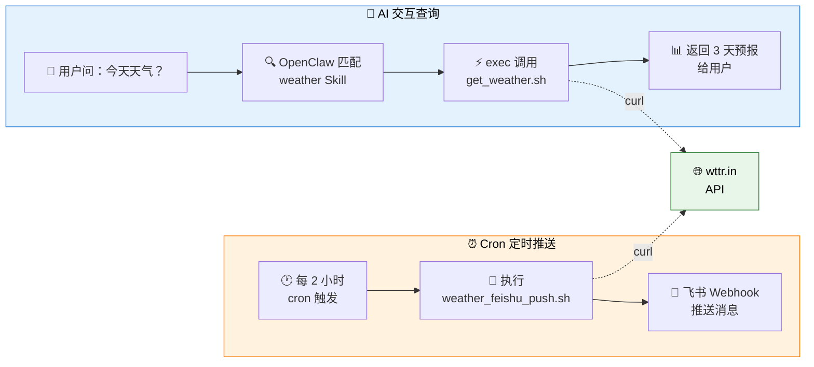
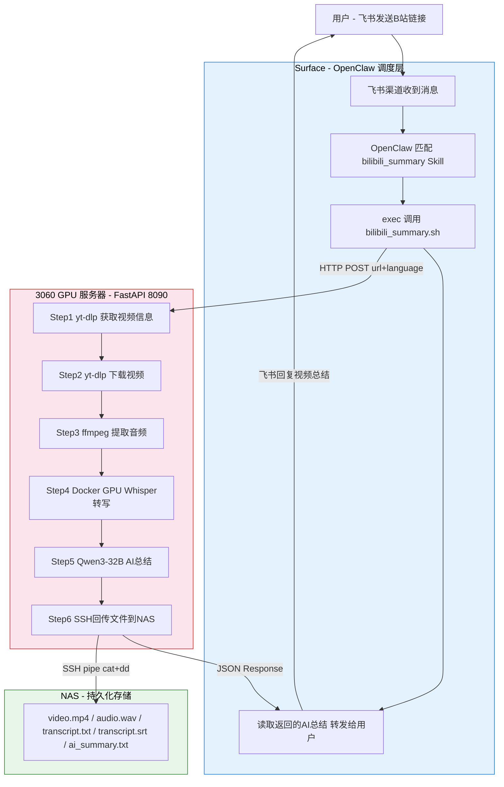

# OpenClaw Skill 开发指南：AI 能力无限扩展

> 本文档详细介绍 OpenClaw 的 Skill 系统——如何用 Markdown + Shell 脚本给 AI 增加全新能力。
>
> 返回 [项目总览](../README.md) | 相关文档：[Workspace 自定义指南](./4_OpenClaw_Workspace.md)

---

## 目录

- [1. Skill 系统概述](#1-skill-系统概述)
  - [1.1 什么是 Skill](#11-什么是-skill)
  - [1.2 工作原理](#12-工作原理)
  - [1.3 开发流程](#13-开发流程)
- [2. 实战案例与总览](#2-实战案例与总览)
  - [2.1 Skill 总览](#21-skill-总览)
  - [2.2 system_info Skill](#22-system_info-skill)
  - [2.3 weather Skill](#23-weather-skill)
  - [2.4 personal_info Skill](#24-personal_info-skill)
  - [2.5 nas_search Skill](#25-nas_search-skill)
  - [2.6 bilibili_summary Skill](#26-bilibili_summary-skill)
  - [2.7 qwen_usage Skill](#27-qwen_usage-skill)
- [3. 更多 Skill 思路](#3-更多-skill-思路)

---

## 1. Skill 系统概述

### 1.1 什么是 Skill

**Skill 系统是 OpenClaw 的杀手级特性。** 一个 Markdown 文件 + 一个 Shell 脚本，就能给 AI 增加一种全新能力——不需要改一行 OpenClaw 源码。

每个 Skill 一个子目录，存放在 `~/.openclaw/skills/` 下：

```
~/.openclaw/skills/
├── system_info/          # Skill 1
│   ├── SKILL.md          # 触发条件 + 使用说明
│   └── gather_info.sh    # 执行脚本
└── weather/              # Skill 2
    ├── SKILL.md
    ├── get_weather.sh
    └── weather_feishu_push.sh
```

### 1.2 工作原理


用户提问 → OpenClaw 根据 `description` 字段匹配 Skill → 将 `SKILL.md` 注入 AI 上下文 → AI 知道该执行什么命令。

### 1.3 开发流程

每个 Skill 的开发只需 3 步：

| 步骤 | 操作 | 说明 |
|:----:|------|------|
| 1 | `mkdir -p ~/.openclaw/skills/<名称>` | 创建 Skill 目录 |
| 2 | 编写脚本 + `SKILL.md` | 脚本实现功能，SKILL.md 定义触发条件和使用说明 |
| 3 | `openclaw gateway --force` | 重启 Gateway 加载新 Skill |

**SKILL.md 模板**：

```markdown
---
name: skill_name
description: 描述这个 Skill 做什么，用户问什么问题时应该触发。写得越详细，匹配越准确。
metadata: { "openclaw": { "emoji": "🔧", "requires": { "bins": ["bash"] } } }
---

# Skill 标题

## 使用方法
运行：`bash ~/.openclaw/skills/skill_name/script.sh`

## 可用命令
- 命令1: `xxx`
- 命令2: `xxx`
```

> **关键点**：`description` 字段决定了什么问题会触发这个 Skill，建议写得详细且覆盖多种表述方式。

---

## 2. 实战案例与总览

### 2.1 Skill 总览

| # | Skill | 类型 | AI 交互 | 定时推送 |
|---|-------|------|---------|----------|
| 1 | **system_info** 🖥️ | 命令执行型 | exec 调用脚本 | — |
| 2 | **weather** 🌤️ | 命令执行 + 定时推送 | exec 调用脚本 | 每 2 小时 → 飞书 |
| 3 | **personal_info** 👤 | 纯数据型 | 直接引用 SKILL.md | — |
| 4 | **nas_search** 🗄️ | 命令执行型 | exec 调用脚本 | — |
| 5 | **bilibili_summary** 📺 | API 服务型 | HTTP 调用 3060 GPU 服务 (whisper + Qwen3-32B) | AI 对话回复 |
| 6 | **qwen_usage** 💰 | 命令执行型 (API) | exec 调用 Python 脚本查询阿里云 BSS 账单 API | — |

五种 Skill 类型：**命令执行型**（脚本 + exec）、**定时推送型**（脚本 + cron + Webhook）、**纯数据型**（只有 SKILL.md）、**API 服务型**（调用远程 GPU 推理服务，3060 承担 GPU 计算 + LLM 总结）、**云 API 查询型**（调用云厂商管理 API 获取账户数据）。

```
~/.openclaw/skills/
├── system_info/           ← 命令执行型
│   ├── SKILL.md
│   └── gather_info.sh
├── weather/               ← 命令执行 + 定时推送
│   ├── SKILL.md
│   ├── get_weather.sh
│   └── weather_feishu_push.sh
├── personal_info/         ← 纯数据型
│   └── SKILL.md
├── nas_search/            ← 命令执行型 (SSH 远程)
│   ├── SKILL.md
│   └── nas_search.sh
├── bilibili_summary/      ← API 服务型 (3060 GPU + Qwen3-32B)
│   ├── SKILL.md
│   ├── bilibili_summary.sh   # 调度脚本 (curl → 3060 API)
│   ├── transcribe_single.py  # Whisper 转写 (部署到 3060 Docker)
│   └── server.py             # FastAPI 服务 (部署到 3060, systemd)
└── qwen_usage/            ← 云 API 查询型 (阿里云 BSS OpenAPI)
    ├── SKILL.md
    ├── query_usage.py         # 查询脚本 (alibabacloud SDK)
    └── query_usage.sh         # 包装脚本 (加载 env + 自动安装依赖)
```

### 2.2 system_info Skill

**① 目标**

让 AI 能读取本机的硬件、软件、温度、网络等真实信息，而不是给出"通用指导"。

**② 创建目录与脚本**

```bash
mkdir -p ~/.openclaw/skills/system_info
```

**gather_info.sh** — 系统信息采集脚本：

```bash
#!/bin/bash
section() { echo -e "\n━━━━━━━━━━━━━━━━━━\n  $1\n━━━━━━━━━━━━━━━━━━"; }

section "🖥️ 操作系统"
. /etc/os-release && echo "  发行版: $PRETTY_NAME"
echo "  内核: $(uname -r)"
echo "  运行时长: $(uptime -p)"

section "⚡ CPU"
grep -m1 'model name' /proc/cpuinfo | cut -d: -f2 | xargs
echo "  核心: $(nproc)  负载: $(cat /proc/loadavg | awk '{print $1,$2,$3}')"

section "🧠 内存"
free -h | grep '^Mem:'

section "🎮 GPU"
lspci | grep -i 'vga\|3d' | head -1

section "💾 磁盘"
df -h | grep '^/dev/'

section "🌡️ 硬件温度"
sensors

# ... 更多模块：网络、主板、软件环境、服务状态等
```

**③ 编写 SKILL.md**

```markdown
---
name: system_info
description: 获取本机硬件和软件信息，包括 CPU、内存、GPU、磁盘、网络、硬件温度、
             已安装软件和运行中的服务。当用户询问电脑配置、系统状态、硬件信息、
             温度等问题时使用此技能。
metadata: { "openclaw": { "emoji": "🖥️", "requires": { "bins": ["bash", "sensors"] } } }
---

# 系统信息采集

## 完整报告
运行：`bash ~/.openclaw/skills/system_info/gather_info.sh`

## 按需查询
- CPU: `grep 'model name' /proc/cpuinfo | head -1`
- 内存: `free -h`
- 磁盘: `df -h`
- 温度: `sensors`（CPU 封装、Core 0/1、PCH、NVMe、电池电压）

## 本机速查
- 设备: Microsoft Surface Pro
- CPU: Intel Core i5-7300U @ 2.60GHz
- 内存: 8GB
- 系统: Ubuntu 22.04.3 LTS
```

**④ 验证与效果**

```bash
source ~/.openclaw/env
openclaw skills list
# ✓ ready   │ 🖥️ system_info   │ 获取本机硬件和软件信息...   │ openclaw-managed
```

在飞书中问 AI "电脑是什么牌子的？硬件配置是什么？"：


AI **真的执行了系统命令**，返回了品牌型号、CPU、内存、磁盘、GPU、电池健康度（96.51%）等真实数据。这就是 Skill 系统 + `exec` 工具的威力。

---

### 2.3 weather Skill

**① 目标与方案选型**

**目标**：AI 能查天气 + 每 2 小时自动推送到飞书 + 自动获取服务器位置。

| API | 优点 | 缺点 | 费用 |
|-----|------|------|------|
| **wttr.in** | 无需 API Key，支持中文，curl 直接调用 | 数据精度一般 | 免费 |
| 和风天气 | 中国城市数据好 | 需注册 API Key | 免费额度有限 |
| OpenWeatherMap | 全球覆盖 | 中文支持弱，需注册 | 免费额度有限 |

最终选择 **[wttr.in](https://wttr.in)** — 零配置、免费、`curl` 一行就能用。

**② IP 定位获取城市**

服务器没有 GPS 硬件，通过 IP 地址反查位置：

```bash
curl -s http://ip-api.com/json/?lang=zh-CN
# {"city":"某城市","lat":xx.xxxx,"lon":xxx.xxxx,...}
```

定位结果：**某城市，某省**（GPS: xx.xxxx, xxx.xxxx），城市级精度对天气查询够用。

**③ 创建目录与脚本**

```bash
mkdir -p ~/.openclaw/skills/weather
```

**get_weather.sh** — AI 通过 `exec` 调用的查询脚本：

```bash
#!/bin/bash
CITY="${1:-YourCity}"
DATA=$(curl -s "https://wttr.in/${CITY}?format=j1&lang=zh")
# python3 解析 JSON，输出当前天气 + 3 天预报 + 逐时预报
```

输出示例：

```
━━━━━━━━━━━━━━━━━━
  🌍 YourCity, YourProvince
  📍 GPS: 32.062, 118.778
━━━━━━━━━━━━━━━━━━

🌡️ 当前天气: 晴朗
  温度: -2°C (体感 -5°C)
  湿度: 63%  风速: 8 km/h (SE)

📅 今天 (2026-02-09)  -1°C ~ 8°C
    09:00  阴天  2°C
    15:00  零星小雨  8°C 🌧️64%

📅 明天 (2026-02-10)  2°C ~ 9°C
    ...
```

支持查询其他城市：`bash get_weather.sh Shanghai`

**④ 飞书定时推送**

**weather_feishu_push.sh** — 通过飞书 Webhook 推送，内容包含：

- 当前天气、温度、体感温度、湿度、风速
- 今日和明日温度范围 + 未来 4 个时段逐时预报
- 穿衣建议（根据温度自动生成）
- 降水提醒（概率 >50% 时提醒带伞）

**穿衣建议逻辑**：

| 温度 | 建议 |
|------|------|
| ≤0°C | 严寒，厚羽绒服 + 围巾手套 |
| 1~10°C | 较冷，棉衣或薄羽绒服 |
| 11~20°C | 凉爽，外套或卫衣 |
| 21~30°C | 舒适，T恤或薄长袖 |
| >30°C | 炎热，防暑降温 |

**Cron 配置**（每 2 小时整点推送）：

```bash
0 */2 * * * /bin/bash /home/youruser/.openclaw/skills/weather/weather_feishu_push.sh
```

**⑤ 编写 SKILL.md**

```markdown
---
name: weather
description: 查询天气信息，包括当前天气、温度、湿度、风速、未来3天预报、逐时预报。
             当用户询问天气、温度、是否下雨、穿什么衣服、需不需要带伞等问题时使用。
metadata: { "openclaw": { "emoji": "🌤️", "requires": { "bins": ["bash", "curl", "python3"] } } }
---

# 天气查询

## 默认城市
某城市 (MyCity)，基于服务器 IP 自动定位

## 查询天气
运行：`bash ~/.openclaw/skills/weather/get_weather.sh`
查询其他城市：`bash ~/.openclaw/skills/weather/get_weather.sh Shanghai`
```

**⑥ 文件清单与架构**

```
~/.openclaw/skills/weather/
├── SKILL.md                  # Skill 定义（触发条件）
├── get_weather.sh            # 天气查询脚本（AI 调用）
├── weather_feishu_push.sh    # 飞书定时推送脚本（cron 调用）
└── weather_push.log          # 推送日志
```



---

### 2.4 personal_info Skill

**① 目标与思路**

**目标**：让 AI 了解主人的个人背景，能回答关于学历、工作经历、项目经验等问题。

**与前两个 Skill 的区别**：这是一个**纯数据 Skill**，不需要执行脚本。所有信息直接写在 SKILL.md 里，Skill 匹配后 AI 即可引用回答。

> 这说明 Skill 不一定需要 Shell 脚本——SKILL.md 本身就是知识注入的载体。

**② 数据来源**

数据来自之前制作的个人 Q&A 数据集 `personal_qa.json`（39 条自问自答），包含：

| 类别 | 内容示例 |
|------|----------|
| 基本信息 | 姓名、性别、籍贯、爱好 |
| 教育经历 | 某中学 → 某大学（本科）→ 某大学（硕士）|
| 工作经历 | 某芯片公司（2021~2024）→ 某AI公司（2024~至今）|
| 项目经验 | 智能座舱手势识别、公文办公助手、语音处理优化 |
| 技术能力 | Pytorch、DeepSpeed、vLLM、CV、嵌入式 |

将 JSON 格式的 Q&A 对整理为结构化 Markdown 表格和分类段落，便于 AI 直接引用。

**③ 编写 SKILL.md**

```markdown
---
name: personal_info
description: 关于主人张三的个人信息，包括教育背景、工作经历、项目经验、技术栈、
             兴趣爱好等。当用户询问"你是谁"、"主人是谁"、"张三是谁"、
             "工作经历"、"学历"、"做过什么项目"等个人相关问题时使用此技能。
metadata: { "openclaw": { "emoji": "👤", "requires": { "bins": [] } } }
---

# 主人档案 — 张三

## 基本信息
| 项目 | 内容 |
|------|------|
| 姓名 | 张三 |
| 籍贯 | 某省某市 |
| 现居 | 上海 |
| 爱好 | 羽毛球、搞小发明 |

## 教育经历
（按时间线整理，含转型关键节点）

## 工作经历
（按公司分段，含职位、项目细节、技术栈）

## 技术能力总结
（分领域表格：框架、部署、CV、语音、嵌入式等）

## 回答规则
- 不要编造主人没有做过的事情
- 档案中没有的信息，如实说不清楚
```

**④ 关键设计**：

- `requires.bins` 为空 — 不需要任何外部命令
- `description` 覆盖多种提问方式（"你是谁"、"主人是谁"、"学历"、"项目"等）
- 末尾加"回答规则"防止 AI 幻觉（如 JSON 原始数据中有一条 AI 虚构的"智慧医疗项目"，已在整理时剔除）

**⑤ 文件清单**

```
~/.openclaw/skills/personal_info/
└── SKILL.md    # 个人档案（纯数据，无脚本）
```

> **要点**：纯数据 Skill 只需一个 SKILL.md，是最简单的 Skill 形式。适合知识库、FAQ、个人档案等不需要执行命令的场景。

---

### 2.5 nas_search Skill

**① 目标与思路**

**目标**：让 AI 能直接搜索和浏览家庭 NAS 上的文件，支持按文件名、文件类型、目录浏览、磁盘占用、最近修改等多种检索方式。

**与其他 Skill 的区别**：这是一个**远程命令执行型 Skill** — 通过 SSH 在 NAS 上执行命令，而非本机命令。属于 "命令执行型" 的一个变体。

| 特性 | 说明 |
|------|------|
| 类型 | 命令执行型（SSH 远程） |
| 连接方式 | SSH 免密登录（`ssh nas`） |
| NAS 型号 | 绿联 NAS（ARM64） |
| 存储卷 | 双卷配置（系统卷 + 数据卷） |

**② NAS 存储结构**

```
Volume 1 (系统卷)
└── docker/            # Docker 服务

Volume 2 (数据卷)
├── Movies/            # 影视资源
├── Photos/            # 照片（按日期/事件分目录）
├── Games/             # 游戏存档
├── Musics/            # 音乐
└── ...                # 其他目录
```

**③ 创建目录与脚本**

```bash
mkdir -p ~/.openclaw/skills/nas_search
```

**nas_search.sh** — 多功能 NAS 文件检索脚本（支持 10 种子命令）：

```bash
#!/bin/bash
# NAS 文件检索脚本 — OpenClaw Skill
# 通过 SSH 远程搜索绿联 NAS (DH4300 Plus) 上的文件

NAS_HOST="nas"
MAX_RESULTS=50

# SSH 执行封装（-n 避免 while 循环中 stdin 被抢占）
nas_exec() {
    ssh -n -o ConnectTimeout=30 -o StrictHostKeyChecking=no "$NAS_HOST" "$@" 2>/dev/null
}
```

支持的子命令：

| 命令 | 功能 | 示例 |
|------|------|------|
| `search <关键词> [目录]` | 按文件名搜索（不区分大小写） | `search myfile` |
| `list <目录>` | 列出目录内容（含大小、时间） | `list /volume2/Photos` |
| `tree <目录> [深度]` | 树形显示目录结构 | `tree /volume2 2` |
| `type <扩展名> [目录]` | 按文件类型搜索 | `type mp4 /volume2` |
| `size <目录>` | 查看磁盘占用（du） | `size /volume2/Photos` |
| `recent [目录] [天数]` | 最近修改的文件 | `recent /volume2 3` |
| `overview` | NAS 存储总览（空间 + 一级目录） | `overview` |
| `movies [系列名]` | 电影库检索 | `movies <系列名>` |
| `photos` | 照片目录一览 | `photos` |

**关键实现细节**：

- **SSH `-n` 参数**：在 `while read` 循环内调用 SSH 时必须加 `-n`，否则内层 SSH 会抢占 stdin，导致循环只执行一次（经典 bash 陷阱）
- **排除系统目录**：搜索时自动排除 `@*` 开头的系统目录和 `#recycle` 回收站
- **结果上限**：默认最多返回 50 条结果，避免输出过多

**④ 编写 SKILL.md**

```markdown
---
name: nas_search
description: 搜索和浏览 NAS (绿联 UGREEN DH4300 Plus) 上的文件。支持按文件名搜索、按文件类型搜索、
             列出目录内容、查看磁盘占用、查看最近修改的文件、查看电影库、查看照片目录。
             当用户询问 NAS 上有什么文件、找某个文件在哪、NAS 存储空间、电影列表、
             照片目录、最近下载了什么、NAS 磁盘容量、查找文件等问题时使用此技能。
metadata: { "openclaw": { "emoji": "🗄️", "requires": { "bins": ["bash", "ssh"] } } }
---

# NAS 文件检索

## 可用命令
- 搜索文件: `bash ~/.openclaw/skills/nas_search/nas_search.sh search <关键词>`
- 列目录: `bash ~/.openclaw/skills/nas_search/nas_search.sh list <目录>`
- 按类型: `bash ~/.openclaw/skills/nas_search/nas_search.sh type <扩展名> [目录]`
- 磁盘占用: `bash ~/.openclaw/skills/nas_search/nas_search.sh size <目录>`
- 存储总览: `bash ~/.openclaw/skills/nas_search/nas_search.sh overview`
- 电影库: `bash ~/.openclaw/skills/nas_search/nas_search.sh movies [系列名]`
- 照片目录: `bash ~/.openclaw/skills/nas_search/nas_search.sh photos`
```

**⑤ 验证效果**

```bash
# NAS 存储总览
bash ~/.openclaw/skills/nas_search/nas_search.sh overview
# 输出: 主机名、系统版本、各 Volume 存储空间、一级目录大小排序

# 按文件名搜索
bash ~/.openclaw/skills/nas_search/nas_search.sh search <关键词>
# 输出: 匹配的文件完整路径列表（自动排除系统目录和回收站）

# 照片目录一览
bash ~/.openclaw/skills/nas_search/nas_search.sh photos
# 输出: 每个相册目录的文件数和占用空间

# 电影系列详情
bash ~/.openclaw/skills/nas_search/nas_search.sh movies <系列名>
# 输出: 该系列下所有文件（按大小排序）+ 字幕文件检查

# 按文件类型搜索
bash ~/.openclaw/skills/nas_search/nas_search.sh type mp4 /volume2
# 输出: 所有 .mp4 文件路径
```

**⑥ 文件清单与架构**

```
~/.openclaw/skills/nas_search/
├── SKILL.md          # Skill 定义（触发条件 + 目录速查）
└── nas_search.sh     # 多功能检索脚本（10 种子命令）
```


> **要点**：这是第一个 **远程执行** 的 Skill — AI 不仅能操作本机，还能通过 SSH 管理家庭 NAS。同样的模式可以扩展到任何 SSH 可达的设备（如 Ubuntu 3060 工作站）。

---

### 2.6 bilibili_summary Skill

**① 目标与定位**

**目标**：用户在飞书对话中发一个 B站视频链接，AI 自动完成全流程——下载视频、语音转文字、AI 总结，把结构化的视频摘要直接回复给用户。全程自动化，将非结构化视频内容转化为可检索的文本和摘要，永久存储在 NAS 上。

**Skill 类型定位 — API 服务型**：这是一种全新的 Skill 类型。不同于之前的命令执行型（本机跑脚本）或纯数据型（只有 Markdown），这里引入了一个**远程 GPU 推理服务**。所有计算密集型任务（视频下载、音频提取、Whisper 语音转写、LLM 总结）都在 3060 GPU 服务器上完成，OpenClaw 仅负责调度和结果转发。

| 特性 | 说明 |
|------|------|
| Skill 类型 | **API 服务型**（HTTP 调用远程 GPU 服务） |
| 核心模型 | faster-whisper large-v3 (语音转写) + Qwen3-32B (内容总结) |
| 硬件架构 | RTX 3060 12GB (GPU 计算) + Surface (OpenClaw 调度) + NAS (持久存储) |
| 转写速度 | 约 15~20x 实时速度（100s 视频 ≈ 7s 转写） |
| 总结模型 | Qwen3-32B (DashScope API，128k context，max_tokens=4000) |

---

**② 为什么选择本地 Whisper 而非云端 ASR**

语音转写是整个流程的核心环节。市面上有大量云端 ASR（语音识别）服务可选，为什么我们选择在自己的 3060 上跑 Whisper？

| 对比维度 | 本地 Whisper (faster-whisper) | 云端 ASR (阿里云/讯飞/Google) |
|----------|------|------|
| **成本** | 一次性硬件投入，RTX 3060 已有，**边际成本为零** | 按时长计费，长期使用费用累积（约 ¥1~3/分钟） |
| **隐私** | 音频数据**全程不出局域网**，不经过第三方服务器 | 音频上传到云端处理，存在数据泄露风险 |
| **速度** | 7 分钟视频约 40s 转写完成，**15~20x 实时速度** | 取决于网络和排队，通常 1~5x 实时速度 |
| **质量** | large-v3 模型，中文口语识别效果优秀 | 头部厂商质量相当，但各有擅长领域 |
| **可用性** | 不依赖外网，局域网内随时可用 | 依赖互联网和 API 稳定性 |
| **定制性** | 可调模型参数（语言/beam_size/VAD等） | 参数有限，黑盒调用 |

**核心决策逻辑**：家里已经有一台 RTX 3060 12GB 的工作站闲置，GPU 算力白白浪费。把它变成私有的 AI 推理节点，不仅**零成本**获得了语音转写能力，还彻底解决了**隐私顾虑**——所有音视频数据始终在自己的局域网内流转，从 3060 到 NAS，不经过任何公网。这也是 OpenClaw "把 AI 能力私有化" 理念的一个典型实践。

> 同样的思路也适用于其他 GPU 推理场景：图像识别、本地 LLM 推理、视频分析等——只要你有闲置 GPU，就不需要为这些能力付费给云厂商。

---

**③ 系统架构总览**

整个系统由三台设备协同完成：Surface 运行 OpenClaw 调度脚本，3060 承担所有 GPU 计算和 LLM 调用，NAS 做持久化存储。



---

**④ 3060 GPU 服务详解 (server.py)**

3060 上运行一个 **FastAPI 常驻服务**（systemd 开机自启），对外暴露 REST API，承担所有计算密集型工作。

**API 接口定义**：

| 接口 | 方法 | 功能 | 说明 |
|------|------|------|------|
| `/api/transcribe` | POST | 核心处理接口 | 接收 B站 URL，返回转写文本 + AI 总结 |
| `/api/status` | GET | 服务状态 | 返回运行状态、已处理视频数 |
| `/api/tasks` | GET | 已处理列表 | 返回所有已处理视频的信息 |

**核心接口 `POST /api/transcribe`**：

请求体：
```json
{
  "url": "https://www.bilibili.com/video/BV1WW4y147Fk",
  "language": "zh"    // zh / ja / en / auto (默认)
}
```

返回体：
```json
{
  "success": true,
  "title": "视频原始标题",
  "uploader": "UP主名称",
  "duration": "05:30",
  "bv_id": "BV1WW4y147Fk",
  "transcript": "完整的语音转写文本...",
  "srt": "1\n00:00:00,000 --> 00:00:05,000\n字幕内容...",
  "ai_summary": "## 视频核心内容\nUP主在视频中...\n\n## 关键要点\n1. ...",
  "local_path": "/home/nasuser/Openclaw-Project/1_Video_Analysis/BV1WW4y147Fk_标题/",
  "nas_path": "/home/nasuser/Openclaw-Project/1_Video_Analysis/BV1WW4y147Fk_标题/",
  "elapsed_seconds": 35.2,
  "error": ""
}
```

**6 步处理流水线**：

| 步骤 | 操作 | 工具 | 产物 | 说明 |
|:----:|------|------|------|------|
| 1 | 获取视频信息 | yt-dlp `--dump-json` | 标题/UP主/BV号/时长 | 不下载，仅获取元数据 |
| 2 | 下载视频 | yt-dlp | `video.mp4` | 最佳画质 MP4 格式 |
| 3 | 提取音频 | ffmpeg | `audio.wav` | 16kHz 单声道 PCM，Whisper 所需格式 |
| 4 | 语音转写 | faster-whisper (Docker GPU) | `transcript.txt` + `transcript.srt` | large-v3 模型，RTX 3060 加速 |
| 5 | AI 总结 | Qwen3-32B (DashScope API) | `ai_summary.txt` | 结构化总结，max_tokens=4000 |
| 6 | 回传 NAS | SSH + dd pipe | NAS 上的完整副本 | 绕过 NAS 的 UTF-8 SCP 兼容问题 |

**关键设计决策**：

- **FastAPI 在宿主机运行，Whisper 在 Docker 容器中运行**：宿主机管理 yt-dlp/ffmpeg/API，转写通过 `docker compose run` 调用 GPU Docker 容器（复用已有的 faster-whisper 镜像），实现 GPU 加速
- **Whisper 模型缓存**：large-v3 模型通过 Docker Volume `model_cache` 持久化，首次启动自动从 ModelScope 下载（约 3GB），后续启动秒级加载
- **LLM 总结在服务端完成**：使用 Qwen3-32B（128k context window），支持总结更长的转写文本（截取前 30000 字符），max_tokens=4000 产出更详实的总结
- **Qwen3 思考标签清理**：Qwen3 模型可能返回 `<think>...</think>` 包裹的推理过程，server.py 用正则自动过滤，只保留最终总结
- **NAS 传输用 `cat | ssh dd`**：NAS（绿联）的 SCP/rsync 不兼容 UTF-8 中文路径，`cat > file` 写入为 0 字节。最终方案：`cat 文件 | ssh nas 'dd of="目标路径" bs=65536'`

**文件名清理规则** (`sanitize_title`)：
```python
title = re.sub(r'[^\u4e00-\u9fff\w\s-]', '', title)  # 只保留中文、字母、数字、空格、横线
title = re.sub(r'\s+', '_', title.strip())              # 空格替换为下划线
return title[:60] or "untitled"                          # 截断60字符
```

---

**⑤ OpenClaw 如何介入 — Skill 调度机制**

OpenClaw 通过标准的 Skill 匹配 + exec 执行机制来调度 3060 服务。整个介入过程分为 3 个阶段：

**阶段 1：Skill 匹配**

用户在飞书发送包含 B站链接的消息（如"帮我总结这个视频 https://www.bilibili.com/video/BVxxx"），OpenClaw 收到消息后扫描所有 Skill 的 `description` 字段。`bilibili_summary` 的描述覆盖了多种表述：

```yaml
description: >
  B站视频处理全流程：下载视频 → 语音转文字 → Qwen3-32B 总结 → 返回结果。
  当用户发来B站链接、说"帮我总结这个视频"、"下载B站视频"、"这个视频讲了什么"、
  "看看这个B站链接"等请求时使用此技能。
```

匹配成功后，SKILL.md 的完整内容被注入 AI 上下文。

**阶段 2：exec 执行脚本**

AI 根据 SKILL.md 中的使用说明，通过 OpenClaw 的 `exec` 工具执行 Shell 命令：

```bash
bash ~/.openclaw/skills/bilibili_summary/bilibili_summary.sh "https://www.bilibili.com/video/BVxxx"
```

脚本做的事极其简单：
1. 检查 3060 GPU 服务是否在线（`GET /api/status`）
2. 调用 3060 GPU 服务（`POST /api/transcribe`，超时 900s）
3. 解析 JSON 返回，格式化输出到 stdout

```
📺 B站视频总结
==================================================
标题: 我又买房了！证明我不是你买我推荐我买我不买的博主
UP主: 某UP主
时长: 05:30
BV号: BV1WW4y147Fk
处理耗时: 35.2s

📁 存储位置:
  NAS: /home/nasuser/Openclaw-Project/1_Video_Analysis/BV1WW4y147Fk_标题/
  3060: /home/nasuser/Openclaw-Project/1_Video_Analysis/BV1WW4y147Fk_标题/
  文件: video.mp4 / audio.wav / transcript.txt / transcript.srt / ai_summary.txt

📝 AI 总结 (Qwen3-32B):
──────────────────────────────────────────────────
## 视频核心内容
UP主在视频中分享了自己购房的经历...

## 关键要点
1. 所购房源为清退洋房三居室...
2. 选择该房源的主要原因是...
...

## 一句话总结
真金白银买下永丰清退洋房三居！...
──────────────────────────────────────────────────
```

**阶段 3：AI 转发结果**

OpenClaw AI 读取脚本的 stdout 输出，根据 SKILL.md 中的指引（"把 AI 总结内容原样或稍加润色后回复给用户"），将总结内容在飞书对话中回复给用户。用户可以继续追问视频细节。

**调用链路总结**：

```
用户(飞书) → OpenClaw(匹配Skill) → exec(bilibili_summary.sh)
  → curl POST(3060 FastAPI) → [yt-dlp → ffmpeg → whisper → qwen3 → NAS]
  → JSON Response → stdout → OpenClaw AI → 飞书回复用户
```

---

**⑥ 3060 服务部署与管理**

**Systemd 开机自启**：3060 上的 FastAPI 服务通过 systemd 管理，开机自动启动：

```ini
# /etc/systemd/system/bilibili-transcribe.service
[Unit]
Description=Bilibili Video Transcription Service (FastAPI + Whisper GPU)
After=network.target docker.service
Wants=docker.service

[Service]
Type=simple
User=cw
WorkingDirectory=/home/nasuser/Openclaw-Project
ExecStart=/usr/bin/python3 /home/nasuser/Openclaw-Project/server.py
Restart=on-failure
RestartSec=10

[Install]
WantedBy=multi-user.target
```

**服务管理命令**：

```bash
# 查看状态
sudo systemctl status bilibili-transcribe

# 重启服务（更新代码后）
sudo systemctl restart bilibili-transcribe

# 查看实时日志
journalctl -u bilibili-transcribe -f

# 远程检查（从 Surface）
curl http://192.168.1.200:8090/api/status
# → {"status":"running","time":"...","output_dir":"...","videos_processed":1}

# 查看已处理视频列表
curl http://192.168.1.200:8090/api/tasks
# → {"videos":[{"name":"BV1WW4y147Fk_标题","has_video":true,"has_transcript":true,...}]}
```

**防火墙配置**：3060 的 UFW 仅对局域网开放 8090 端口：

```bash
sudo ufw allow from 192.168.1.0/24 to any port 8090 proto tcp
```

---

**⑦ Whisper 转写脚本 (transcribe_single.py)**

运行在 3060 的 Docker GPU 容器内，由 `server.py` 通过 `docker compose run` 调用：

```python
# 用法: python3 transcribe_single.py <音频文件> <输出目录> [语言]
# 语言: zh / ja / en / auto (默认 auto)
# 输出: <name>.txt (纯文本) + <name>.srt (带时间戳 SRT 字幕)
```

| 参数 | 值 | 说明 |
|------|-----|------|
| model | `large-v3` | 最高精度模型，约 3GB，需 6GB VRAM |
| compute_type | `float16` | RTX 3060 GPU 半精度推理 |
| vad_filter | `True` | VAD 过滤静音段，提升速度和准确性 |
| hallucination_silence_threshold | `2.0` | 防止长静音段产生幻觉文本 |
| repetition_penalty | `1.1` | 抑制重复输出 |
| beam_size | `5` | 束搜索宽度 |

Docker 容器挂载方式：宿主机的音频文件和转写脚本通过 `-v` 挂载到容器 `/workspace/` 目录，转写结果写回宿主机。

---

**⑧ 存储结构**

每个视频在 3060 和 NAS 上各保存一份完整副本：

```
/home/nasuser/Openclaw-Project/1_Video_Analysis/
└── BV1WW4y147Fk_我又买房了证明我不是你买我推荐我买我不买的博主/
    ├── video.mp4          # 原始视频 (best quality MP4)
    ├── audio.wav          # 音频 (16kHz mono PCM)
    ├── transcript.txt     # 语音转写纯文本
    ├── transcript.srt     # 带时间戳 SRT 字幕
    └── ai_summary.txt     # Qwen3-32B AI 总结
```

3060 本地路径和 NAS 路径结构一致，NAS 作为长期存储，3060 本地作为处理缓存。

---

**⑨ 实际测试效果**

使用一个 1 分 42 秒的中文房产类视频完整测试：

| 阶段 | 耗时 | 说明 |
|------|------|------|
| Step 1-2: 下载视频 | ~8s | yt-dlp 获取信息 + 下载 35MB MP4 |
| Step 3: 提取音频 | ~1s | ffmpeg 转 WAV 16kHz |
| Step 4: Whisper 转写 | ~7.5s | Docker GPU，large-v3 模型 |
| Step 5: Qwen3-32B 总结 | ~10s | DashScope API，详细结构化总结 |
| Step 6: 回传 NAS | ~3s | SSH pipe dd，5 个文件 |
| **3060 总耗时** | **~30s** | 服务端一站式完成 |
| OpenClaw 调度 + 飞书回复 | ~3s | curl 调用 + 结果转发 |
| **端到端总计** | **~33s** | 用户发链接到收到总结 |

转写精度：Whisper large-v3 对中文口语识别效果良好，480 字符纯文本 + 47 段 SRT 字幕，语义完整可读。

AI 总结质量：Qwen3-32B 输出约 800-1500 字符的结构化总结，包含核心内容概括、关键要点列表、具体数据提取、一句话总结。

**飞书端到端验证**（2026-02-09 22:55）：

使用 13 分 35 秒的技术类视频 `BV1RkFAznESD`（"Agent Skills 做知识库检索，能比传统 RAG 效果更好吗？"）完整验证飞书 → OpenClaw → 3060 → NAS → 飞书回复的全链路：

| 阶段 | 耗时 | 说明 |
|------|------|------|
| 飞书消息 → OpenClaw 匹配 Skill | ~2s | AI 读取 SKILL.md，构造 exec 命令 |
| Step 1-3: 下载 + 音频提取 | ~3s | 28.9MB MP4 + 24.9MB WAV |
| Step 4: Whisper 转写 | ~87s | 13 分钟视频，5619 字符 |
| Step 5: Qwen3-32B 总结 | ~20s | 详细结构化总结（核心概括+关键要点+结论建议） |
| Step 6: 回传 NAS | ~5s | 5 个文件 SSH pipe dd |
| **3060 总耗时** | **~114.6s** | 全部在 3060 完成 |
| AI 回复飞书 | ~3s | 润色总结 + 飞书推送 |
| **端到端总计** | **~120s** | 13 分钟视频从链接到收到总结 |

结论：短视频（1-2 分钟）约 30-40 秒完成，长视频（10+ 分钟）约 2 分钟完成。Whisper 转写耗时与视频时长基本成正比（约 15-20x 实时速度）。

---

**⑩ SKILL.md 定义**

```markdown
---
name: bilibili_summary
description: >
  B站视频处理全流程：下载视频 → 语音转文字 → Qwen3-32B 总结 → 返回结果。
  当用户发来B站链接、说"帮我总结这个视频"、"下载B站视频"、"这个视频讲了什么"、
  "看看这个B站链接"等请求时使用此技能。
  所有处理都在 3060 GPU 服务器完成（下载+转写+LLM总结+存储到NAS），
  脚本直接输出视频信息 + AI总结，你把结果转发给用户即可。
metadata: { "openclaw": { "emoji": "📺", "requires": { "bins": ["bash", "curl", "python3"] } } }
---

# B站视频总结

用户给你一个B站视频链接，你需要：
1. 调用脚本（3060 服务会自动完成：下载 → 转写 → Qwen3-32B 总结 → 存 NAS）
2. 把脚本输出的 AI 总结直接回复给用户

## 使用方式
bash ~/.openclaw/skills/bilibili_summary/bilibili_summary.sh "B站URL"
bash ~/.openclaw/skills/bilibili_summary/bilibili_summary.sh "B站URL" --lang zh

## 你拿到输出后应该做什么
1. 把 AI 总结内容原样或稍加润色后回复给用户
2. 包含视频基本信息（标题、UP主、时长）
3. 告知文件存储位置
4. 如果用户追问细节，可以让用户查看 NAS 上的完整转写文本
```

---

**⑪ 文件清单与部署**

```
# Surface (OpenClaw Skill 目录)
~/.openclaw/skills/bilibili_summary/
├── SKILL.md                  # Skill 触发定义 + AI 指引
├── bilibili_summary.sh       # 调度脚本 (curl → 3060 API → 格式化输出)
├── transcribe_single.py      # Whisper 转写脚本 (开发备份，部署到 3060)
└── server.py                 # GPU 服务端代码 (开发备份，部署到 3060)

# 3060 GPU 服务器
/home/nasuser/Openclaw-Project/
├── server.py                 # FastAPI 服务主程序 (systemd 管理)
├── transcribe_single.py      # Whisper 转写脚本 (Docker 容器内运行)
├── start_service.sh          # 手动启动脚本 (备用)
├── logs/
│   └── server.log            # 服务运行日志
└── 1_Video_Analysis/         # 视频处理输出目录
    └── BVxxx_标题/           # 每个视频一个子目录

# NAS (持久化存储)
/home/nasuser/Openclaw-Project/
└── 1_Video_Analysis/         # 与 3060 同构的镜像目录
    └── BVxxx_标题/
```

**依赖安装（3060 一次性配置）**：

```bash
# Python 包
pip3 install --break-system-packages yt-dlp fastapi uvicorn python-multipart pyyaml

# 系统包
sudo apt install -y ffmpeg

# 防火墙（仅局域网可访问）
sudo ufw allow from 192.168.1.0/24 to any port 8090 proto tcp

# Systemd 开机自启
sudo systemctl enable bilibili-transcribe
```

---

**⑫ 踩坑记录**

| 问题 | 原因 | 解决方案 |
|------|------|----------|
| NAS SCP 传输中文路径失败 | 绿联 NAS 的 SCP 实现不兼容 UTF-8 编码路径 | 改用 `cat 文件 \| ssh nas 'dd of="路径" bs=65536'` |
| NAS `cat > file` 写入 0 字节 | NAS 的 BusyBox shell 管道重定向行为异常 | 改用 `dd of=file` 替代 `cat > file` |
| 3060 服务外部不可达 | UFW 防火墙未放行 8090 端口 | `ufw allow from 192.168.1.0/24 to any port 8090 proto tcp` |
| 视频标题特殊字符导致路径异常 | B站标题含 `【】！？` 等字符 | `sanitize_title()` 正则清洗，只保留中文+字母+数字 |
| pip3 安装报错 | Ubuntu 24.04 PEP 668 限制 | 添加 `--break-system-packages` 参数 |
| Qwen3 返回含 `<think>` 标签 | qwen3 系列模型的思维链输出 | 正则 `re.sub(r"<think>[\s\S]*?</think>", "")` 过滤 |

> **要点**：这是第一个 **API 服务型** Skill，实现了 **三机协同的分布式架构**：Surface 做轻量调度（OpenClaw + bash 脚本），3060 做重计算（GPU 转写 + LLM 总结），NAS 做持久存储。OpenClaw 的介入方式与其他 Skill 完全一致（description 匹配 → SKILL.md 注入 → exec 执行脚本），但脚本内部通过 HTTP API 将工作卸载到了远程 GPU 服务器。这种模式可以扩展到任何需要 GPU 的 AI 场景（如图像识别、视频生成等）。

---

### 2.7 qwen_usage Skill

**① 目标与思路**

**目标**：让 AI 能查询自己消耗了多少 API 费用——按天、按模型、按 token 类型的完整费用明细。

**与其他 Skill 的区别**：这是一个**云 API 查询型 Skill** — 不执行本机命令，也不调用远程 GPU，而是通过阿里云 SDK 调用云厂商的管理 API（BSS OpenAPI）获取账单数据。需要额外的 RAM AccessKey 凭证。

> DashScope 本身没有用量查询 API，需要通过阿里云统一的费用中心查询。

**② 创建目录与脚本**

```bash
mkdir -p ~/.openclaw/skills/qwen_usage
pip install alibabacloud-bssopenapi20171214 alibabacloud-tea-openapi
```

**query_usage.py** — 核心查询逻辑（精简）：

```python
# 阿里云 BSS OpenAPI 查询 DashScope 费用
# 关键坑：ProductCode 不是 "dashscope" 而是 "sfm" (大模型服务平台百炼)

# 1. 月度总费用
overview_req = bss_models.QueryBillOverviewRequest(
    billing_cycle="2026-02", product_code="sfm"
)

# 2. 逐天实例级明细（必须指定 BillingDate）
for day in range(1, today + 1):
    bill_req = bss_models.DescribeInstanceBillRequest(
        billing_cycle="2026-02", billing_date=f"2026-02-{day:02d}",
        product_code="sfm", granularity="DAILY", max_results=300
    )
    # instance_id 格式: "账户ID;实例ID;模型名;token类型;;0"
    # 例: "3337639;llm-xxx;qwen3-14b;thinking_input_token;;0"
    # 解析可得：按模型 + 按 token 类型的费用明细
```

**query_usage.sh** — 包装脚本：加载 `~/.openclaw/env` 环境变量 + 首次自动安装依赖。

**③ 编写 SKILL.md**

```markdown
---
name: qwen_usage
description: 查询 Qwen API (DashScope) 的调用费用和用量统计。包括今日费用、本月累计、
             每日明细、日均费用和月度预估。当用户询问"API 花了多少钱"、"今天用了多少
             token"、"Qwen 费用"、"DashScope 用量"、"本月开销"等问题时使用此技能。
metadata: { "openclaw": { "emoji": "💰", "requires": { "bins": ["python3"] } } }
---

# Qwen API 用量查询

## 查询用量
运行：`bash ~/.openclaw/skills/qwen_usage/query_usage.sh`

## 查询指定月份
运行：`bash ~/.openclaw/skills/qwen_usage/query_usage.sh 2026-01`

## 环境要求
需要阿里云 RAM AccessKey（非 DashScope API Key），配置在 ~/.openclaw/env：
- ALIBABA_CLOUD_ACCESS_KEY_ID
- ALIBABA_CLOUD_ACCESS_KEY_SECRET
权限：AliyunBSSReadOnlyAccess（只读账单）
```

**④ 关键设计**

- **产品代码坑**：DashScope 在阿里云计费系统中的 ProductCode **不是** `dashscope`，而是 **`sfm`**（大模型服务平台百炼），用错则返回空结果
- **逐天查询**：`DescribeInstanceBill` 使用 `Granularity=DAILY` 时**必须指定 `BillingDate`**，因此脚本遍历当月每一天分别查询
- **instance_id 解析**：每条账单的 `instance_id` 字段格式为 `账户ID;实例ID;模型名;token类型;;序号`，解析后可输出按模型 + token 类型的费用明细
- **双 Key 体系**：DashScope API Key（`sk-xxx`，调用模型推理）和 阿里云 AccessKey（`LTAI5txxx`，调用管理 API）是完全独立的两套凭证
- **数据延迟**：账单有约 24 小时延迟，今天的费用明天才出

**⑤ 验证效果**

```bash
source ~/.openclaw/env && bash ~/.openclaw/skills/qwen_usage/query_usage.sh
```

输出示例：

```
━━━━━━━━━━━━━━━━━━━━━━━━━━━━━━━━━━
  💰 Qwen API 用量报告 (大模型服务平台百炼)
━━━━━━━━━━━━━━━━━━━━━━━━━━━━━━━━━━

📅 查询周期: 2026-02
💰 本月累计费用: ¥8.8000

📈 每日明细:
  2026-02-01  ¥0.3831
  2026-02-09  ¥6.8840

🤖 模型费用明细:
  📌 qwen3-14b    ¥6.1034  (69.4%)   ← 思考 token 占大头
  📌 qwen-plus    ¥1.6694  (19.0%)

📊 统计:  日均 ¥2.14  本月预估 ¥59.84
```

**⑥ 文件清单与架构**

```
~/.openclaw/skills/qwen_usage/
├── SKILL.md             # Skill 定义（触发条件 + 使用说明）
├── query_usage.py       # Python 查询脚本（alibabacloud SDK）
└── query_usage.sh       # 包装脚本（加载 env + 自动安装依赖）
```


> **要点**：这是第一个 **云 API 查询型** Skill。同样的模式可扩展到：查询其他云服务费用、监控 API 配额等场景。核心踩坑：**ProductCode 是 `sfm` 不是 `dashscope`**。

---

## 3. 更多 Skill 思路

基于同样的模式，可以继续开发：

| Skill | 类型 | 功能 | 实现思路 |
|-------|------|------|----------|
| `stock_monitor` | 定时推送 | 股票/基金监控 | 行情 API + 飞书推送 |
| ~~`file_search`~~ → **`nas_search`** | 命令执行 | NAS 文件搜索 | ✅ 已实现（SSH + find） |
| ~~`video_summary`~~ → **`bilibili_summary`** | API 服务型 | B站视频转写 + 总结 | ✅ 已实现（3060 GPU + whisper + Qwen3-32B） |
| **`qwen_usage`** | 云 API 查询 | Qwen API 费用监控 | ✅ 已实现（阿里云 BSS OpenAPI + RAM AccessKey） |
| `docker_manager` | 命令执行 | Docker 管理 | `docker ps` / `docker logs` |
| `smart_home` | 命令执行 | 智能家居控制 | Home Assistant API |
| `faq` | 纯数据 | 常见问题解答 | SKILL.md 写入 Q&A |

> **Skill 的精髓**：Markdown 定义触发条件，Shell 脚本实现逻辑（或直接用 Markdown 注入知识），AI 作为中间调度层。已实现五种 Skill 类型：**命令执行型**（本机/SSH）、**定时推送型**（cron + Webhook）、**纯数据型**（Markdown 知识注入）、**API 服务型**（GPU 推理卸载）、**云 API 查询型**（云厂商 SDK 调用）。技术栈：bash + curl + python3 + FastAPI + Docker + systemd + alibabacloud SDK。
