# OpenClaw Skill 开发指南：AI 能力无限扩展

> 本文档详细介绍 OpenClaw 的 Skill 系统——如何用 Markdown + Shell 脚本给 AI 增加全新能力。
>
> 返回 [项目总览](../README.md) | 相关文档：[Workspace 自定义指南](./4_OpenClaw_Workspace.md)

---

## 目录

- [1. Skill 系统概述](#1-skill-系统概述)
  - [1.1 什么是 Skill](#11-什么是-skill)
  - [1.2 工作原理](#12-工作原理)
  - [1.3 开发流程](#13-开发流程)
- [2. 实战案例与总览](#2-实战案例与总览)
- [3. 更多 Skill 思路](#3-更多-skill-思路)

---

## 1. Skill 系统概述

### 1.1 什么是 Skill

**Skill 系统是 OpenClaw 的杀手级特性。** 一个 Markdown 文件 + 一个 Shell 脚本，就能给 AI 增加一种全新能力——不需要改一行 OpenClaw 源码。

> **📌 重要更新**：本项目的 5 个 Skill 已通过**自定义插件**注册为**原生 function calling 工具**（`cw_*`），不再依赖系统提示上下文。Skill 脚本本身不变，插件作为调用入口包装它们。详见 [原生工具插件开发](./6_OpenClaw_Native_Tools_Plugin.md)。

每个 Skill 一个子目录，存放在 `~/.openclaw/skills/` 下：

```
~/.openclaw/skills/
├── system_info/          # Skill 1
│   ├── SKILL.md          # 触发条件 + 使用说明
│   └── gather_info.sh    # 执行脚本
└── weather/              # Skill 2
    ├── SKILL.md
    ├── get_weather.sh
    └── weather_feishu_push.sh
```

### 1.2 工作原理

```mermaid
flowchart LR
    A["🧑 用户提问<br/>电脑什么牌子？"] --> B["🔍 OpenClaw<br/>匹配 Skill 描述"]
    B --> C["📖 AI 读取<br/>SKILL.md"]
    C --> D["⚡ AI 调用 exec<br/>执行 bash 命令"]
    D --> E["📊 返回真实数据<br/>Microsoft Surface Pro"]

    style A fill:#e3f2fd,stroke:#1976d2,color:#000
    style B fill:#fff3e0,stroke:#f57c00,color:#000
    style C fill:#f3e5f5,stroke:#7b1fa2,color:#000
    style D fill:#fce4ec,stroke:#c62828,color:#000
    style E fill:#e8f5e9,stroke:#2e7d32,color:#000
```



用户提问 → OpenClaw 根据 `description` 字段匹配 Skill → 将 `SKILL.md` 注入 AI 上下文 → AI 知道该执行什么命令。

### 1.3 开发流程

每个 Skill 的开发只需 3 步：

| 步骤 | 操作 | 说明 |
|:----:|------|------|
| 1 | `mkdir -p ~/.openclaw/skills/<名称>` | 创建 Skill 目录 |
| 2 | 编写脚本 + `SKILL.md` | 脚本实现功能，SKILL.md 定义触发条件和使用说明 |
| 3 | `openclaw gateway --force` | 重启 Gateway 加载新 Skill |

**SKILL.md 模板**：

```markdown
---
name: skill_name
description: 描述这个 Skill 做什么，用户问什么问题时应该触发。写得越详细，匹配越准确。
metadata: { "openclaw": { "emoji": "🔧", "requires": { "bins": ["bash"] } } }
---

# Skill 标题

## 使用方法
运行：`bash ~/.openclaw/skills/skill_name/script.sh`

## 可用命令
- 命令1: `xxx`
- 命令2: `xxx`
```

> **关键点**：`description` 字段决定了什么问题会触发这个 Skill，建议写得详细且覆盖多种表述方式。

---

## 2. 实战案例与总览

### 2.1 Skill 总览

| # | Skill | 类型 | AI 交互 | 定时推送 |
|---|-------|------|---------|----------|
| 1 | **system_info** 🖥️ | 命令执行型 | cw_system_info function call | — |
| 2 | **weather** 🌤️ | CSV 读取型（已解耦） | cw_weather 读 CSV | 独立 cron 采集 + 飞书推送 |
| 3 | **nas_search** 🗄️ | 命令执行型 (SSH 远程) | cw_nas_search function call | — |
| 4 | **bilibili_summary** 📺 | API 服务型 | cw_bilibili_summary function call | — |
| 5 | **qwen_billing** 💰 | 云 API 查询型 | cw_qwen_billing function call | — |

五种 Skill 类型：**命令执行型**（脚本 + exec）、**定时推送型**（脚本 + cron + Webhook）、**纯数据型**（只有 SKILL.md）、**API 服务型**（调用远程 GPU 推理服务）、**云 API 查询型**（调用云厂商管理 API）。

```
~/.openclaw/skills/
├── system_info/           ← 命令执行型
│   ├── SKILL.md
│   └── gather_info.sh
├── weather/               ← 命令执行 + 定时推送（已解耦到 1_monitor/）
│   ├── SKILL.md
│   └── get_weather.sh
├── nas_search/            ← 命令执行型 (SSH 远程)
│   ├── SKILL.md
│   └── nas_search.sh
├── bilibili_summary/      ← API 服务型 (3060 GPU Whisper 转写)
│   ├── SKILL.md
│   └── bilibili_summary.sh
└── qwen_usage/            ← 云 API 查询型 (阿里云 BSS OpenAPI)
    ├── SKILL.md
    ├── query_usage.py
    └── query_usage.sh
```

> **📌 各工具详细文档**已迁移至 [原生工具插件开发 — 第 5 节](./6_OpenClaw_Native_Tools_Plugin.md#5-实战5-个原生工具)。

---

## 3. 更多 Skill 思路

基于同样的模式，可以继续开发：

| Skill | 类型 | 功能 | 实现思路 |
|-------|------|------|----------|
| `stock_monitor` | 定时推送 | 股票/基金监控 | 行情 API + 飞书推送 |
| `docker_manager` | 命令执行 | Docker 管理 | `docker ps` / `docker logs` |
| `smart_home` | 命令执行 | 智能家居控制 | Home Assistant API |
| `faq` | 纯数据 | 常见问题解答 | SKILL.md 写入 Q&A |

> **Skill 的精髓**：Markdown 定义触发条件，Shell 脚本实现逻辑（或直接用 Markdown 注入知识），AI 作为中间调度层。技术栈：bash + curl + python3 + FastAPI + Docker + systemd + alibabacloud SDK。
