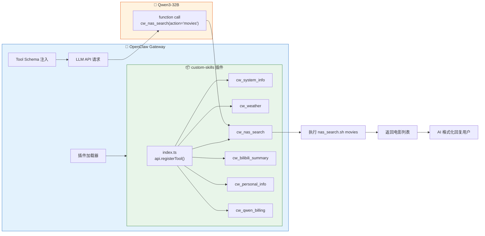

# OpenClaw 原生工具插件开发：从上下文依赖到 Function Calling

> 本文档介绍如何通过 OpenClaw 插件系统将自定义 Skill 注册为**原生 function calling 工具**，实现不依赖系统提示上下文的确定性调用。
>
> 返回 [项目总览](../README.md) | 相关文档：[Skill 开发指南](./5_OpenClaw_Skills.md) | [踩坑记录](../README.md#踩坑记录)

---

## 目录

- [1. 为什么需要原生工具](#1-为什么需要原生工具)
  - [1.1 Skill 系统的问题](#11-skill-系统的问题)
  - [1.2 nativeSkills 的误解](#12-nativeskills-的误解)
  - [1.3 原生工具方案](#13-原生工具方案)
- [2. 插件架构](#2-插件架构)
  - [2.1 整体原理](#21-整体原理)
  - [2.2 文件结构](#22-文件结构)
  - [2.3 Skill vs Plugin Tool 对比](#23-skill-vs-plugin-tool-对比)
- [3. 开发指南](#3-开发指南)
  - [3.1 插件清单 (openclaw.plugin.json)](#31-插件清单)
  - [3.2 工具注册 (index.ts)](#32-工具注册)
  - [3.3 工具参数设计](#33-工具参数设计)
  - [3.4 执行脚本与返回结果](#34-执行脚本与返回结果)
- [4. 配置与部署](#4-配置与部署)
  - [4.1 加载路径配置](#41-加载路径配置)
  - [4.2 重启与验证](#42-重启与验证)
  - [4.3 调试技巧](#43-调试技巧)
- [5. 实战：5 个原生工具](#5-实战5-个原生工具)
- [6. 注意事项与踩坑](#6-注意事项与踩坑)

---

## 1. 为什么需要原生工具

### 1.1 Skill 系统的问题

OpenClaw 的 Skill 系统设计优雅——一个 Markdown + 一个脚本就能扩展 AI 能力。但它从底层就是**上下文依赖**的：

```
系统提示 → <available_skills> 列出技能描述
  ↓
模型根据描述决定是否 read SKILL.md    ← 故障点①：模型可能不 read
  ↓
读取后理解命令，再调用 exec            ← 故障点②：模型可能猜错命令
```

实测中，这条链路在 14B 和 32B 模型上都会出错：

| 故障模式 | 14B | 32B |
|----------|-----|-----|
| 不匹配 Skill 描述 | 常见 | 偶尔 |
| 跳过 `read SKILL.md` 直接猜命令 | 常见 | 偶尔 |
| exec 命令拼写错误 | 常见 | 少见 |
| 上下文变长后忘记工具 | 常见 | 偶尔 |

尝试过的缓解方案：

1. **精简系统提示**（坑 13）：减少 53% 上下文 → 缓解但未根治
2. **写入 TOOLS.md exec 命令**：有效但仍是上下文依赖 → 会话变长失效
3. **关闭 nativeSkills**：只是去掉干扰，不能提升调用率

### 1.2 nativeSkills 的误解

`commands.nativeSkills` 的文档描述容易让人误以为它控制 function calling：

> `commands.nativeSkills`（默认 `"auto"`）在支持时原生注册 **Skill** 命令。

但通过阅读 OpenClaw 源码发现，它实际只控制**消息平台的斜杠命令**：

- `"auto"` → 在 Discord/Telegram 注册 `/nas_search` 斜杠命令
- `false` → 不注册斜杠命令

**与 AI 的 function calling / tool_use 完全无关。**

### 1.3 原生工具方案

OpenClaw 插件系统的 `api.registerTool()` 可以注册真正的 function calling 工具：

```
用户消息 → 模型从 tool JSON schema 识别 cw_nas_search → function call → 插件执行脚本
```

- 工具定义在 API 请求的 `tools` 参数中，不占系统提示空间
- 模型通过 JSON Schema 参数结构化调用，不需要理解 bash 命令
- **100% 确定性**——工具在 schema 中，模型必定看到

---

## 2. 插件架构

### 2.1 整体原理



### 2.2 文件结构

```
4_openclaw/1_OpenClawProject/
├── extensions/
│   └── custom-skills/
│       ├── openclaw.plugin.json    # 插件清单（必须）
│       └── index.ts                # 工具注册代码
├── skills/                         # 原有 Skill 脚本（仍然保留）
│   ├── system_info/gather_info.sh
│   ├── weather/get_weather.sh
│   ├── nas_search/nas_search.sh
│   ├── bilibili_summary/bilibili_summary.sh
│   └── personal_info/SKILL.md
└── workspace/
    └── TOOLS.md                    # 简化为工具列表（不再写 exec 命令）
```

**关键**：原有的 Skill 脚本不需要修改，插件只是作为**调用入口**包装它们。

### 2.3 Skill vs Plugin Tool 对比

| 维度 | Skill（上下文注入） | Plugin Tool（原生 function calling） |
|------|---------------------|--------------------------------------|
| 调用方式 | AI 读 SKILL.md → 理解 → exec | 模型直接 function call |
| 可靠性 | 依赖模型注意力 | 100% 确定性 |
| 参数传递 | AI 自己拼 bash 命令字符串 | JSON Schema 结构化参数 |
| 上下文开销 | SKILL.md + TOOLS.md 占系统提示 | 0（在 API `tools` 参数中） |
| 新增技能 | 创建 SKILL.md + 脚本 + 更新 TOOLS.md | 在 index.ts 中 `registerTool()` |
| 适用模型 | 32B+ 较可靠 | 任何支持 function calling 的模型 |
| OpenClaw 版本要求 | 任意 | 需支持插件系统（2026.1+） |

---

## 3. 开发指南

### 3.1 插件清单

每个插件必须有 `openclaw.plugin.json`：

```json
{
  "id": "custom-skills",
  "name": "Custom Skills Tools",
  "description": "将自定义技能注册为原生 function calling 工具",
  "version": "1.0.0",
  "configSchema": {
    "type": "object",
    "additionalProperties": false,
    "properties": {}
  }
}
```

- `id`：唯一标识，用于 `openclaw plugins info <id>`
- `configSchema`：必须提供，即使不接受配置。空 schema 用上面的格式。

### 3.2 工具注册

`index.ts` 导出一个函数，接收 `api` 对象：

```typescript
export default function (api: any) {
  api.registerTool({
    name: "cw_my_tool",         // 工具名（建议 cw_ 前缀）
    label: "My Tool",            // 显示标签
    description: "工具描述...",   // 模型看到的描述，决定何时调用
    parameters: {                // JSON Schema 格式的参数定义
      type: "object",
      properties: {
        param1: { type: "string", description: "参数说明" },
      },
      required: ["param1"],
    },
    async execute(_id: string, params: { param1: string }) {
      // 执行逻辑，返回 { content: [{ type: "text", text: "..." }] }
      return { content: [{ type: "text", text: "result" }] };
    },
  });
}
```

**关键字段**：

| 字段 | 必需 | 说明 |
|------|------|------|
| `name` | ✅ | 工具唯一标识，不能与核心工具冲突 |
| `label` | 建议 | 显示名称 |
| `description` | ✅ | **最重要**——模型根据这个决定何时调用 |
| `parameters` | ✅ | JSON Schema，定义参数类型和约束 |
| `execute` | ✅ | 异步执行函数，返回 `AgentToolResult` |

### 3.3 工具参数设计

参数用标准 JSON Schema 格式：

```typescript
parameters: {
  type: "object",
  properties: {
    action: {
      type: "string",
      enum: ["search", "list", "overview"],  // 枚举约束
      description: "操作类型",
    },
    keyword: {
      type: "string",
      description: "搜索关键词（可选）",
    },
  },
  required: ["action"],   // 必填参数
}
```

**最佳实践**：

- 用 `enum` 限制参数范围，减少模型出错
- `description` 写清每个值的含义
- 尽量用 `string` 而非复杂类型
- 可选参数不放在 `required` 中

### 3.4 执行脚本与返回结果

通用的脚本执行 + 结果封装：

```typescript
import { execSync } from "child_process";

function runScript(cmd: string, timeoutMs = 30000): string {
  try {
    const output = execSync(cmd, {
      encoding: "utf-8",
      timeout: timeoutMs,
      env: { ...process.env, PATH: process.env.PATH },
    });
    return output.trim() || "(no output)";
  } catch (err: any) {
    const stderr = err.stderr?.toString?.() || "";
    const stdout = err.stdout?.toString?.() || "";
    return stdout || stderr || `Error: ${err.message}`;
  }
}

function text(content: string) {
  return { content: [{ type: "text" as const, text: content }] };
}

// 在 execute 中使用
async execute(_id: string, params: { city?: string }) {
  return text(runScript(`bash ~/script.sh "${params.city || ""}"`));
}
```

---

## 4. 配置与部署

### 4.1 加载路径配置

> **重要**：OpenClaw 的插件发现不跟随符号链接（symlink）。

在 `openclaw.json` 中配置 `plugins.load.paths` 指向插件目录：

```bash
openclaw config set plugins.load.paths '["/home/chenwei/Desktop/4_openclaw/1_OpenClawProject/extensions/custom-skills"]'
```

### 4.2 重启与验证

```bash
# 重启 Gateway
systemctl --user restart openclaw-gateway.service
sleep 8

# 验证插件加载
openclaw plugins info custom-skills
# → Status: loaded
# → Origin: config
# → Tools: cw_system_info, cw_weather, cw_nas_search, ...

# 验证无问题
openclaw plugins doctor
# → No plugin issues detected.
```

### 4.3 调试技巧

**1. 确认 Gateway 进程是新的**：

```bash
ps aux | grep openclaw-gateway
# 确认 PID 和启动时间是重启后的
```

**2. 查看 session 确认工具调用**：

```bash
LATEST=$(ls -t ~/.openclaw/agents/main/sessions/*.jsonl | head -1)
python3 -c "
import json
with open('$LATEST') as f:
    for line in f:
        d = json.loads(line.strip())
        if d.get('type') == 'message' and d['message'].get('role') == 'toolResult':
            print(d['message'].get('toolName'))
"
```

如果输出 `cw_nas_search` 而非 `exec`，说明原生工具调用成功。

**3. 插件内添加调试日志**：

```typescript
api.on("before_agent_start", (event: any, ctx: any) => {
  console.error(`[debug] agent=${ctx?.agentId}, prompt_len=${event?.prompt?.length}`);
});
```

---

## 5. 实战：6 个原生工具

| 工具名 | 对应脚本 | 参数 | 超时 |
|--------|----------|------|------|
| `cw_system_info` | `gather_info.sh` | `query`: full/cpu/memory/disk/temperature/network/services | 15s |
| `cw_weather` | `weather_read.sh`（读CSV） | `city`: 城市名（可选，默认南京读CSV秒回） | 15s |
| `cw_nas_search` | `nas_search.sh` | `action`: search/type/list/tree/size/recent/overview/movies/photos + `keyword` + `path`（仅深度搜索用，简单访问直接走 SMB 挂载） | 30s |
| `cw_bilibili_summary` | `bilibili_summary.sh` | `url`: B站链接 + `lang`: auto/zh/ja/en（3060 下载+转写，返回文本由 AI 总结） | 10min |
| `cw_personal_info` | 直接读 SKILL.md | `topic`: all/education/work/skills/basic | — |
| `cw_qwen_billing` | `qwen_billing.sh` | `month`: YYYY-MM（可选，默认当月） | 60s |

**端到端测试结果**：

| # | 测试消息 | 调用工具 | 方式 | 状态 |
|---|----------|----------|------|------|
| 1 | "电脑温度多少" | `cw_system_info` | function call | ✅ CPU 75°C |
| 2 | "南京天气" | `cw_weather` | function call | ✅ 8°C 阴天 |
| 3 | "NAS存储空间怎样" | `cw_nas_search` | function call | ✅ volume2 使用 79% |
| 4 | "你主人是谁" | `cw_personal_info` | function call | ✅ 完整简历输出 |
| 5 | "总结B站视频 URL" | `cw_bilibili_summary` | function call | ✅ 正确报告 404（测试 URL） |
| 6 | "Qwen API花了多少钱" | `cw_qwen_billing` | function call | ✅ 本月 ¥11.37，按模型拆分 |

---

## 6. 注意事项与踩坑

### 插件发现不跟随符号链接

❌ 不行：
```bash
ln -s /project/extensions/custom-skills ~/.openclaw/extensions/custom-skills
```

✅ 正确做法：
```json5
// openclaw.json
{ plugins: { load: { paths: ["/project/extensions/custom-skills"] } } }
```

### 工具名不能与核心工具冲突

核心工具名包括：`read`, `write`, `edit`, `exec`, `process`, `browser`, `canvas`, `nodes`, `cron`, `message`, `tts`, `gateway`, `image`, `web_search`, `web_fetch` 等。

建议统一加 `cw_` 前缀。

### Gateway 重启后务必确认 PID

旧的 Gateway 进程不包含新插件。如果 `systemctl restart` 没生效，需要手动 kill：

```bash
pkill -f "openclaw-gateway"
sleep 3
systemctl --user start openclaw-gateway.service
```

### 插件与 Skill 可以共存

插件注册的原生工具和 Skill 系统可以同时存在。模型会优先使用原生工具（因为在 tool schema 中）。Skill 作为后备保留即可。

### 数据采集与工具解耦

不需要每次调用工具都实时查询外部 API——可以用独立 cron 脚本定期采集数据写入 CSV，插件只读 CSV。

**以天气为例**：

```
cron 每2h → weather_collect.sh → wttr.in → weather_data.csv
                                                    ↑
cw_weather 插件 → weather_read.sh → 读 CSV 最新行 ──┘
```

- 采集脚本在 `1_monitor/scripts/weather/`，独立于 OpenClaw
- 默认城市（南京）读 CSV 毫秒级响应，不消耗 API 调用
- 非默认城市走实时查询兜底
- 飞书推送也从 CSV 读取，不重复查询 API

### NAS SMB 挂载 — 简单访问不需要 cw_nas_search

NAS 已通过 SMB 挂载到 Surface Pro 和 3060 两台机器的 `/mnt/nas/`：

| 本地挂载路径 | NAS 共享 | 说明 |
|-------------|---------|------|
| `/mnt/nas/personal` | personal_folder | 个人文件 |
| `/mnt/nas/movies` | Movies | 电影库 |
| `/mnt/nas/photos` | Photos | 照片 |
| `/mnt/nas/downloads` | 迅雷下载 | 下载目录 |
| ... | ... | ... |

**使用原则**：
- 用户给出明确路径（如"NAS 的 Openclaw-Project/xxx"）→ AI 直接用内置 `exec`/`read` 访问 `/mnt/nas/personal/Openclaw-Project/xxx`
- 需要关键词搜索、按类型搜、最近修改等 → 调用 `cw_nas_search`（走 SSH，搜索速度是 SMB 的 10 倍+）

### bilibili_summary 的转写与总结解耦

v6 架构将 3060 GPU 定位为**纯转写节点**，AI 总结由 OpenClaw 的 Qwen API（云端）完成：

```
用户发 B站链接
  ↓
cw_bilibili_summary → 3060 FastAPI
  ↓
3060: 下载到 NAS → ffmpeg → Whisper GPU 转写 → 结果存 NAS
  ↓
返回转写文本 → OpenClaw AI (Qwen API) 生成结构化总结
```

好处：
- 3060 只做它最擅长的事（GPU 转写），不需要运行大语言模型
- 总结质量由云端模型决定，可随时切换更强的模型
- 所有文件（视频/音频/转写/元信息）直接 SMB 写入 NAS，无需 SSH+dd 传输

### description 是调用触发的关键

模型根据 `description` 决定何时调用工具。写好 description 的要点：

- 列出**用户会说的话**（如"用户问天气、温度、是否下雨时调用"）
- 写清工具**能做什么**
- 不要太长（模型处理 tool schema 也有成本）

---

> **完整源码**：[`extensions/custom-skills/index.ts`](../extensions/custom-skills/index.ts)
>
> 相关文档：[Skill 开发指南](./5_OpenClaw_Skills.md) | [踩坑记录](../README.md#坑-14skill-上下文依赖--自定义插件原生-function-calling)
