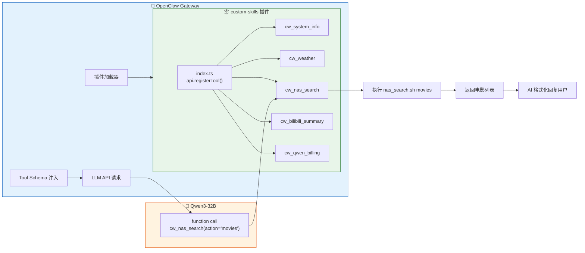
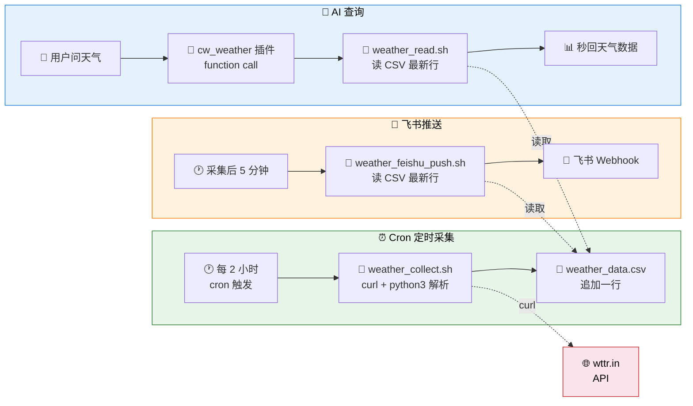
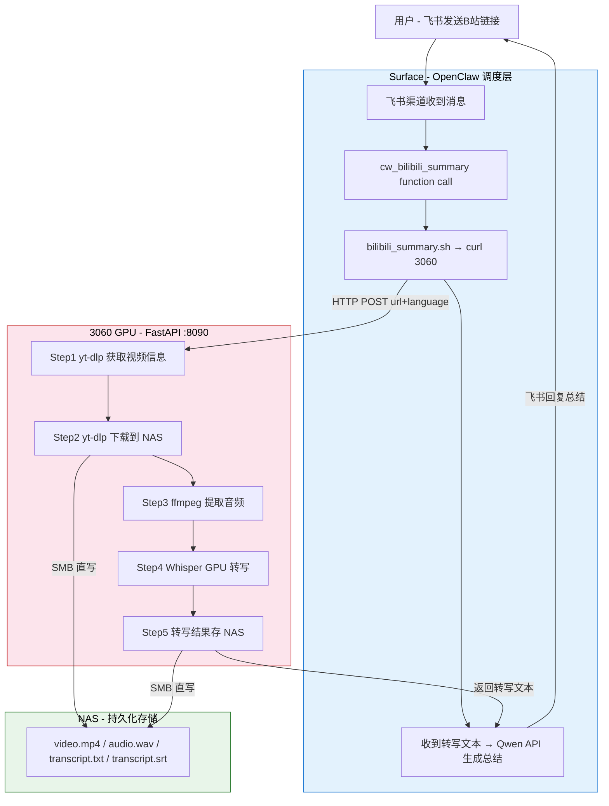

# OpenClaw 原生工具插件开发：从上下文依赖到 Function Calling

> 本文档介绍如何通过 OpenClaw 插件系统将自定义 Skill 注册为**原生 function calling 工具**，实现不依赖系统提示上下文的确定性调用。
>
> 返回 [项目总览](../README.md) | 相关文档：[Skill 开发指南](./5_OpenClaw_Skills.md) | [踩坑记录](../README.md#踩坑记录)

---

## 目录

- [1. 为什么需要原生工具](#1-为什么需要原生工具)
  - [1.1 Skill 系统的问题](#11-skill-系统的问题)
  - [1.2 nativeSkills 的误解](#12-nativeskills-的误解)
  - [1.3 原生工具方案](#13-原生工具方案)
- [2. 插件架构](#2-插件架构)
  - [2.1 整体原理](#21-整体原理)
  - [2.2 文件结构](#22-文件结构)
  - [2.3 Skill vs Plugin Tool 对比](#23-skill-vs-plugin-tool-对比)
- [3. 开发指南](#3-开发指南)
  - [3.1 插件清单 (openclaw.plugin.json)](#31-插件清单)
  - [3.2 工具注册 (index.ts)](#32-工具注册)
  - [3.3 工具参数设计](#33-工具参数设计)
  - [3.4 执行脚本与返回结果](#34-执行脚本与返回结果)
- [4. 配置与部署](#4-配置与部署)
  - [4.1 加载路径配置](#41-加载路径配置)
  - [4.2 重启与验证](#42-重启与验证)
  - [4.3 调试技巧](#43-调试技巧)
- [5. 实战：5 个原生工具](#5-实战5-个原生工具)
  - [5.1 cw_system_info — 系统信息](#51-cw_system_info--系统信息)
  - [5.2 cw_weather — 天气查询](#52-cw_weather--天气查询)
  - [5.3 cw_nas_search — NAS 深度搜索](#53-cw_nas_search--nas-深度搜索)
  - [5.4 cw_bilibili_summary — B站视频转写+总结](#54-cw_bilibili_summary--b站视频转写总结)
  - [5.5 cw_qwen_billing — API 费用查询](#55-cw_qwen_billing--api-费用查询)
- [6. 注意事项与踩坑](#6-注意事项与踩坑)

---

## 1. 为什么需要原生工具

### 1.1 Skill 系统的问题

OpenClaw 的 Skill 系统设计优雅——一个 Markdown + 一个脚本就能扩展 AI 能力。但它从底层就是**上下文依赖**的：

```
系统提示 → <available_skills> 列出技能描述
  ↓
模型根据描述决定是否 read SKILL.md    ← 故障点①：模型可能不 read
  ↓
读取后理解命令，再调用 exec            ← 故障点②：模型可能猜错命令
```

实测中，这条链路在 14B 和 32B 模型上都会出错：

| 故障模式 | 14B | 32B |
|----------|-----|-----|
| 不匹配 Skill 描述 | 常见 | 偶尔 |
| 跳过 `read SKILL.md` 直接猜命令 | 常见 | 偶尔 |
| exec 命令拼写错误 | 常见 | 少见 |
| 上下文变长后忘记工具 | 常见 | 偶尔 |

尝试过的缓解方案：

1. **精简系统提示**（坑 13）：减少 53% 上下文 → 缓解但未根治
2. **写入 TOOLS.md exec 命令**：有效但仍是上下文依赖 → 会话变长失效
3. **关闭 nativeSkills**：只是去掉干扰，不能提升调用率

### 1.2 nativeSkills 的误解

`commands.nativeSkills` 的文档描述容易让人误以为它控制 function calling：

> `commands.nativeSkills`（默认 `"auto"`）在支持时原生注册 **Skill** 命令。

但通过阅读 OpenClaw 源码发现，它实际只控制**消息平台的斜杠命令**：

- `"auto"` → 在 Discord/Telegram 注册 `/nas_search` 斜杠命令
- `false` → 不注册斜杠命令

**与 AI 的 function calling / tool_use 完全无关。**

### 1.3 原生工具方案

OpenClaw 插件系统的 `api.registerTool()` 可以注册真正的 function calling 工具：

```
用户消息 → 模型从 tool JSON schema 识别 cw_nas_search → function call → 插件执行脚本
```

- 工具定义在 API 请求的 `tools` 参数中，不占系统提示空间
- 模型通过 JSON Schema 参数结构化调用，不需要理解 bash 命令
- **100% 确定性**——工具在 schema 中，模型必定看到

---

## 2. 插件架构

### 2.1 整体原理



### 2.2 文件结构

```
4_openclaw/1_OpenClawProject/
├── extensions/
│   └── custom-skills/
│       ├── openclaw.plugin.json    # 插件清单（必须）
│       └── index.ts                # 工具注册代码
├── skills/                         # 原有 Skill 脚本（仍然保留）
│   ├── system_info/gather_info.sh
│   ├── weather/get_weather.sh
│   ├── nas_search/nas_search.sh
│   ├── bilibili_summary/bilibili_summary.sh
│   └── qwen_billing/qwen_billing.sh
└── workspace/
    └── TOOLS.md                    # 简化为工具列表（不再写 exec 命令）
```

**关键**：原有的 Skill 脚本不需要修改，插件只是作为**调用入口**包装它们。

### 2.3 Skill vs Plugin Tool 对比

| 维度 | Skill（上下文注入） | Plugin Tool（原生 function calling） |
|------|---------------------|--------------------------------------|
| 调用方式 | AI 读 SKILL.md → 理解 → exec | 模型直接 function call |
| 可靠性 | 依赖模型注意力 | 100% 确定性 |
| 参数传递 | AI 自己拼 bash 命令字符串 | JSON Schema 结构化参数 |
| 上下文开销 | SKILL.md + TOOLS.md 占系统提示 | 0（在 API `tools` 参数中） |
| 新增技能 | 创建 SKILL.md + 脚本 + 更新 TOOLS.md | 在 index.ts 中 `registerTool()` |
| 适用模型 | 32B+ 较可靠 | 任何支持 function calling 的模型 |
| OpenClaw 版本要求 | 任意 | 需支持插件系统（2026.1+） |

---

## 3. 开发指南

### 3.1 插件清单

每个插件必须有 `openclaw.plugin.json`：

```json
{
  "id": "custom-skills",
  "name": "Custom Skills Tools",
  "description": "将自定义技能注册为原生 function calling 工具",
  "version": "1.0.0",
  "configSchema": {
    "type": "object",
    "additionalProperties": false,
    "properties": {}
  }
}
```

- `id`：唯一标识，用于 `openclaw plugins info <id>`
- `configSchema`：必须提供，即使不接受配置。空 schema 用上面的格式。

### 3.2 工具注册

`index.ts` 导出一个函数，接收 `api` 对象：

```typescript
export default function (api: any) {
  api.registerTool({
    name: "cw_my_tool",         // 工具名（建议 cw_ 前缀）
    label: "My Tool",            // 显示标签
    description: "工具描述...",   // 模型看到的描述，决定何时调用
    parameters: {                // JSON Schema 格式的参数定义
      type: "object",
      properties: {
        param1: { type: "string", description: "参数说明" },
      },
      required: ["param1"],
    },
    async execute(_id: string, params: { param1: string }) {
      // 执行逻辑，返回 { content: [{ type: "text", text: "..." }] }
      return { content: [{ type: "text", text: "result" }] };
    },
  });
}
```

**关键字段**：

| 字段 | 必需 | 说明 |
|------|------|------|
| `name` | ✅ | 工具唯一标识，不能与核心工具冲突 |
| `label` | 建议 | 显示名称 |
| `description` | ✅ | **最重要**——模型根据这个决定何时调用 |
| `parameters` | ✅ | JSON Schema，定义参数类型和约束 |
| `execute` | ✅ | 异步执行函数，返回 `AgentToolResult` |

### 3.3 工具参数设计

参数用标准 JSON Schema 格式：

```typescript
parameters: {
  type: "object",
  properties: {
    action: {
      type: "string",
      enum: ["search", "list", "overview"],  // 枚举约束
      description: "操作类型",
    },
    keyword: {
      type: "string",
      description: "搜索关键词（可选）",
    },
  },
  required: ["action"],   // 必填参数
}
```

**最佳实践**：

- 用 `enum` 限制参数范围，减少模型出错
- `description` 写清每个值的含义
- 尽量用 `string` 而非复杂类型
- 可选参数不放在 `required` 中

### 3.4 执行脚本与返回结果

通用的脚本执行 + 结果封装：

```typescript
import { execSync } from "child_process";

function runScript(cmd: string, timeoutMs = 30000): string {
  try {
    const output = execSync(cmd, {
      encoding: "utf-8",
      timeout: timeoutMs,
      env: { ...process.env, PATH: process.env.PATH },
    });
    return output.trim() || "(no output)";
  } catch (err: any) {
    const stderr = err.stderr?.toString?.() || "";
    const stdout = err.stdout?.toString?.() || "";
    return stdout || stderr || `Error: ${err.message}`;
  }
}

function text(content: string) {
  return { content: [{ type: "text" as const, text: content }] };
}

// 在 execute 中使用
async execute(_id: string, params: { city?: string }) {
  return text(runScript(`bash ~/script.sh "${params.city || ""}"`));
}
```

---

## 4. 配置与部署

### 4.1 加载路径配置

> **重要**：OpenClaw 的插件发现不跟随符号链接（symlink）。

在 `openclaw.json` 中配置 `plugins.load.paths` 指向插件目录：

```bash
openclaw config set plugins.load.paths '["/home/chenwei/Desktop/4_openclaw/1_OpenClawProject/extensions/custom-skills"]'
```

### 4.2 重启与验证

```bash
# 重启 Gateway
systemctl --user restart openclaw-gateway.service
sleep 8

# 验证插件加载
openclaw plugins info custom-skills
# → Status: loaded
# → Origin: config
# → Tools: cw_system_info, cw_weather, cw_nas_search, ...

# 验证无问题
openclaw plugins doctor
# → No plugin issues detected.
```

### 4.3 调试技巧

**1. 确认 Gateway 进程是新的**：

```bash
ps aux | grep openclaw-gateway
# 确认 PID 和启动时间是重启后的
```

**2. 查看 session 确认工具调用**：

```bash
LATEST=$(ls -t ~/.openclaw/agents/main/sessions/*.jsonl | head -1)
python3 -c "
import json
with open('$LATEST') as f:
    for line in f:
        d = json.loads(line.strip())
        if d.get('type') == 'message' and d['message'].get('role') == 'toolResult':
            print(d['message'].get('toolName'))
"
```

如果输出 `cw_nas_search` 而非 `exec`，说明原生工具调用成功。

**3. 插件内添加调试日志**：

```typescript
api.on("before_agent_start", (event: any, ctx: any) => {
  console.error(`[debug] agent=${ctx?.agentId}, prompt_len=${event?.prompt?.length}`);
});
```

---

## 5. 实战：5 个原生工具

### 工具总览

| 工具名 | 对应脚本 | 参数 | 超时 |
|--------|----------|------|------|
| `cw_system_info` | `gather_info.sh` | `query`: full/cpu/memory/disk/temperature/network/services | 15s |
| `cw_weather` | `weather_read.sh`（读CSV） | `city`: 城市名（可选，默认南京读CSV秒回） | 15s |
| `cw_nas_search` | `nas_search.sh` | `action`: search/type/list/tree/size/recent/overview/movies/photos + `keyword` + `path` | 30s |
| `cw_bilibili_summary` | `bilibili_summary.sh` | `url`: B站链接 + `lang`: auto/zh/ja/en | 10min |
| `cw_qwen_billing` | `qwen_billing.sh` | `month`: YYYY-MM（可选，默认当月） | 60s |

**端到端测试结果**（14B 模型）：

| # | 测试消息 | 调用工具 | 方式 | 状态 |
|---|----------|----------|------|------|
| 1 | "电脑温度多少" | `cw_system_info` | function call | ✅ CPU 83°C |
| 2 | "南京天气" | `cw_weather` | function call | ✅ 8°C 阴天 |
| 3 | "NAS上有哪些mp4" | `cw_nas_search` | function call | ✅ 按类型搜索成功 |
| 4 | "总结B站视频 URL" | `cw_bilibili_summary` | function call | ✅ 转写+AI总结 |
| 5 | "Qwen API花了多少钱" | `cw_qwen_billing` | function call | ✅ 本月 ¥16.97 |

---

### 5.1 cw_system_info — 系统信息

**功能**：获取本机硬件、软件、温度、网络等真实系统信息，让 AI 回答的是实际数据而非"通用指导"。

**参数**：

| 参数 | 类型 | 说明 |
|------|------|------|
| `query` | enum | `full`=完整报告, `cpu`/`memory`/`disk`/`temperature`/`network`/`services`=按需查询 |

**实现方式**：
- `full` 模式调用 `gather_info.sh` 脚本，一次性采集所有信息
- 其他模式直接执行对应 Linux 命令（`free -h`、`sensors`、`df -h` 等），更快响应

**采集脚本 gather_info.sh**：

```bash
#!/bin/bash
section() { echo -e "\n━━━━━━━━━━━━━━━━━━\n  $1\n━━━━━━━━━━━━━━━━━━"; }

section "🖥️ 操作系统"
. /etc/os-release && echo "  发行版: $PRETTY_NAME"
echo "  内核: $(uname -r)"
echo "  运行时长: $(uptime -p)"

section "⚡ CPU"
grep -m1 'model name' /proc/cpuinfo | cut -d: -f2 | xargs
echo "  核心: $(nproc)  负载: $(cat /proc/loadavg | awk '{print $1,$2,$3}')"

section "🧠 内存"
free -h | grep '^Mem:'

section "🎮 GPU"
lspci | grep -i 'vga\|3d' | head -1

section "💾 磁盘"
df -h | grep '^/dev/'

section "🌡️ 硬件温度"
sensors
# ... 更多模块：网络、主板、软件环境、服务状态等
```

**插件注册代码**（`index.ts` 节选）：

```typescript
api.registerTool({
  name: "cw_system_info",
  label: "System Info",
  description: "获取本机系统信息（CPU、内存、磁盘、温度、网络、运行服务）。用户问电脑配置、系统状态、温度时调用。",
  parameters: {
    type: "object",
    properties: {
      query: {
        type: "string",
        enum: ["full", "cpu", "memory", "disk", "temperature", "network", "services"],
        description: "查询类型",
      },
    },
    required: ["query"],
  },
  async execute(_id: string, params: { query: string }) {
    const q = params.query;
    if (q === "full") {
      return text(runScript(`bash ${SKILLS_DIR}/system_info/gather_info.sh`, 15000));
    }
    const cmds: Record<string, string> = {
      cpu: "grep 'model name' /proc/cpuinfo | head -1 && lscpu | grep -E 'Core|Thread|MHz'",
      memory: "free -h",
      disk: "df -h --total",
      temperature: "sensors 2>/dev/null || echo 'sensors not available'",
      network: "ip addr show | grep 'inet '",
      services: "systemctl list-units --type=service --state=running --no-pager | head -30",
    };
    return text(runScript(cmds[q] || cmds.full, 10000));
  },
});
```

**文件清单**：

```
~/.openclaw/skills/system_info/
├── SKILL.md          # 旧 Skill 定义（保留但不再使用）
└── gather_info.sh    # 系统信息采集脚本
```

---

### 5.2 cw_weather — 天气查询

**功能**：查询天气信息（当前天气、温度、湿度、风速、未来预报），默认城市读 CSV 毫秒级响应。

**参数**：

| 参数 | 类型 | 说明 |
|------|------|------|
| `city` | string | 城市名（英文，如 Shanghai, Beijing），不传默认南京 |

**架构：采集-存储-读取分离**

天气数据不是每次查询实时请求，而是独立 cron 定时采集到 CSV，插件只读 CSV：



**CSV 数据格式**：

```csv
timestamp,city,region,desc,temp_c,feels_c,humidity,wind_speed_kmh,wind_dir,pressure,visibility,uv_index,advice,forecast
2026-02-10 14:42:27,Nanjing,Jiangsu,阴天,8,5,61,18,W,1021,10,2,较冷 棉衣或薄羽绒服,"2026-02-10 3~11C rain:76% ; ..."
```

**穿衣建议逻辑**（内嵌于采集脚本）：

| 温度 | 建议 |
|------|------|
| ≤0°C | 严寒，厚羽绒服 + 围巾手套 |
| 1~10°C | 较冷，棉衣或薄羽绒服 |
| 11~20°C | 凉爽，外套或卫衣 |
| 21~30°C | 舒适，T恤或薄长袖 |
| >30°C | 炎热，防暑降温 |

**Cron 配置**：

```bash
# 天气数据采集 - 每2小时整点
0 */2 * * * /bin/bash ~/Desktop/1_monitor/scripts/weather/weather_collect.sh
# 天气飞书推送 - 采集后5分钟
5 */2 * * * /bin/bash ~/Desktop/1_monitor/scripts/weather/weather_feishu_push.sh
```

**为什么解耦**：

| 原来（OpenClaw Skill 实时查询） | 现在（独立 cron + CSV 缓存） |
|-------------------------------|---------------------------|
| 每次问天气都实时 curl wttr.in | cron 定时采集，AI 读 CSV 秒回 |
| 响应慢（网络延迟 3~15s） | 毫秒级（读本地文件） |
| 如果网络抖动就超时 | 数据已缓存，网络故障不影响查询 |
| 占用 OpenClaw 资源 | 完全独立，OpenClaw 只读 CSV |

**文件清单**：

```
1_monitor/scripts/weather/          # 独立于 OpenClaw，cron 管理
├── weather_collect.sh              # Cron 采集脚本（curl wttr.in → 写 CSV）
├── weather_feishu_push.sh          # 飞书推送（读 CSV → 推送卡片）
├── weather_read.sh                 # AI 读取入口（读 CSV / 实时查询兜底）
├── weather_data.csv                # 天气数据（自动生成，保留 30 天）
├── weather_collect.log             # 采集日志
└── weather_push.log                # 推送日志
```

---

### 5.3 cw_nas_search — NAS 深度搜索

**功能**：通过 SSH 远程搜索绿联 NAS 上的文件（比 SMB 遍历快 10 倍+）。支持关键词搜索、按类型搜索、目录浏览、磁盘占用、最近修改等 9 种操作。

> **注意**：NAS 已通过 SMB 挂载到 `/mnt/nas/`，简单文件访问（如 `cat`/`ls`）直接用内置 `exec`/`read` 即可，**不需要** `cw_nas_search`。此工具仅用于需要深度遍历的搜索场景。

**参数**：

| 参数 | 类型 | 说明 |
|------|------|------|
| `action` | enum | 操作类型（必填） |
| `keyword` | string | 搜索关键词或扩展名（可选） |
| `path` | string | 指定搜索目录路径（可选） |

**支持的 9 种操作**：

| action | 功能 | 示例 |
|--------|------|------|
| `search` | 按文件名关键词搜索（不区分大小写） | `search` + keyword=`myfile` |
| `type` | 按扩展名搜索 | `type` + keyword=`mp4` |
| `list` | 列出目录内容（含大小、时间） | `list` + path=`/mnt/nas/photos` |
| `tree` | 树形显示目录结构 | `tree` + path=`/mnt/nas/personal` |
| `size` | 查看磁盘占用（du） | `size` + path=`/mnt/nas/movies` |
| `recent` | 最近修改的文件 | `recent` + path=`/mnt/nas/personal` |
| `overview` | NAS 存储总览（空间 + 一级目录） | `overview` |
| `movies` | 电影库检索 | `movies` + keyword=`007` |
| `photos` | 照片目录一览 | `photos` |

**核心脚本 nas_search.sh**：

```bash
#!/bin/bash
# NAS 文件检索脚本 — 通过 SSH 远程搜索绿联 NAS (DH4300 Plus)
NAS_HOST="nas"
MAX_RESULTS=50

# SSH 执行封装（-n 避免 while 循环中 stdin 被抢占）
nas_exec() {
    ssh -n -o ConnectTimeout=30 -o StrictHostKeyChecking=no "$NAS_HOST" "$@" 2>/dev/null
}
```

**关键实现细节**：

- **SSH `-n` 参数**：在 `while read` 循环内调用 SSH 时必须加 `-n`，否则内层 SSH 会抢占 stdin，导致循环只执行一次（经典 bash 陷阱）
- **排除系统目录**：搜索时自动排除 `@*` 开头的系统目录和 `#recycle` 回收站
- **结果上限**：默认最多返回 50 条结果，避免输出过多导致上下文溢出

**NAS 存储结构**：

```
Volume 1 (系统卷)
└── docker/            # Docker 服务

Volume 2 (数据卷)
├── Movies/            # 影视资源
├── Photos/            # 照片（按日期/事件分目录）
├── Games/             # 游戏存档
├── Musics/            # 音乐
└── ...                # 其他目录
```

**文件清单**：

```
~/.openclaw/skills/nas_search/
├── SKILL.md          # 旧 Skill 定义（保留但不再使用）
└── nas_search.sh     # 多功能检索脚本（9 种子命令）
```

---

### 5.4 cw_bilibili_summary — B站视频转写+总结

**功能**：用户发一个 B站链接，自动完成全流程——3060 GPU 下载视频到 NAS、Whisper 语音转写、结果存 NAS，返回转写文本由 OpenClaw Qwen API（云端）生成结构化总结。

**参数**：

| 参数 | 类型 | 说明 |
|------|------|------|
| `url` | string | B站视频链接（必填） |
| `lang` | enum | 语言：`auto`/`zh`/`ja`/`en`（可选，默认 auto） |

**v6 架构：三机协同**



**为什么选择本地 Whisper 而非云端 ASR**：

| 对比维度 | 本地 Whisper (faster-whisper) | 云端 ASR (阿里云/讯飞) |
|----------|------|------|
| **成本** | RTX 3060 已有，**边际成本为零** | 按时长计费（约 ¥1~3/分钟） |
| **隐私** | 音频**全程不出局域网** | 音频上传到云端处理 |
| **速度** | 7分钟视频约 40s，**15~20x 实时速度** | 通常 1~5x 实时速度 |
| **可用性** | 不依赖外网，局域网内随时可用 | 依赖互联网和 API 稳定性 |

> 核心决策：家里已有 RTX 3060 12GB 闲置，GPU 算力白白浪费。把它变成私有 AI 转写节点，零成本获得语音转写能力，且数据始终在自己局域网内流转。

**3060 GPU 服务详解 (server.py)**

3060 上运行 **FastAPI 常驻服务**（systemd 开机自启），对外暴露 REST API：

| 接口 | 方法 | 功能 |
|------|------|------|
| `/api/transcribe` | POST | 接收 B站 URL → 下载 → 转写 → 返回文本 |
| `/api/status` | GET | 服务运行状态、已处理视频数 |
| `/api/tasks` | GET | 所有已处理视频列表 |

**5 步处理流水线**：

| 步骤 | 操作 | 工具 | 产物 |
|:----:|------|------|------|
| 1 | 获取视频信息 | yt-dlp `--dump-json` | 标题/UP主/BV号/时长 |
| 2 | 下载视频到 NAS | yt-dlp | `video.mp4` |
| 3 | 提取音频 | ffmpeg | `audio.wav`（16kHz 单声道） |
| 4 | 语音转写 | faster-whisper (Docker GPU) | `transcript.txt` + `transcript.srt` |
| 5 | 结果存 NAS | SMB 直写 | NAS 完整副本 |

> v6 变更：3060 不再做 AI 总结（原 Step 5 是 Qwen3-32B 总结），总结改由 OpenClaw 的 Qwen API 完成。

**Whisper 转写参数**：

| 参数 | 值 | 说明 |
|------|-----|------|
| model | `large-v3` | 最高精度，约 3GB，需 6GB VRAM |
| compute_type | `float16` | RTX 3060 半精度推理 |
| vad_filter | `True` | VAD 过滤静音段，提升速度 |
| hallucination_silence_threshold | `2.0` | 防长静音产生幻觉 |
| repetition_penalty | `1.1` | 抑制重复输出 |
| beam_size | `5` | 束搜索宽度 |

**存储结构**（每个视频一个子目录，3060 和 NAS 同构）：

```
/mnt/nas/personal/Openclaw-Project/1_Video_Analysis/
└── BV1WW4y147Fk_我又买房了证明我不是你买我推荐我买我不买的博主/
    ├── video.mp4          # 原始视频
    ├── audio.wav          # 音频 (16kHz mono)
    ├── transcript.txt     # 语音转写纯文本
    └── transcript.srt     # 带时间戳 SRT 字幕
```

**3060 服务部署**：

```ini
# /etc/systemd/system/bilibili-transcribe.service
[Unit]
Description=Bilibili Video Transcription Service (FastAPI + Whisper GPU)
After=network.target docker.service

[Service]
Type=simple
User=cw
ExecStart=/usr/bin/python3 /path/to/server.py
Restart=on-failure
RestartSec=10

[Install]
WantedBy=multi-user.target
```

```bash
# 服务管理
sudo systemctl status bilibili-transcribe    # 查看状态
sudo systemctl restart bilibili-transcribe   # 重启
journalctl -u bilibili-transcribe -f         # 实时日志
```

**实测性能**：

| 视频时长 | 转写耗时 | 端到端（含下载+回复） |
|----------|---------|---------------------|
| 1分42秒 | ~7.5s | ~33s |
| 13分35秒 | ~87s | ~120s |

> Whisper 转写耗时与视频时长基本成正比（约 15-20x 实时速度）。

**踩坑记录**：

| 问题 | 解决方案 |
|------|----------|
| NAS SCP 传输中文路径失败 | 改用 SMB 直写（v6 已不需要 SSH+dd） |
| 视频标题特殊字符导致路径异常 | `sanitize_title()` 正则清洗，只保留中文+字母+数字 |
| pip3 安装报错（PEP 668） | 添加 `--break-system-packages` 参数 |
| Qwen3 返回含 `<think>` 标签 | 正则 `re.sub(r"<think>[\s\S]*?</think>", "")` 过滤 |

**文件清单**：

```
# Surface（OpenClaw 侧）
~/.openclaw/skills/bilibili_summary/
├── SKILL.md                  # 旧 Skill 定义（保留但不再使用）
├── bilibili_summary.sh       # 调度脚本（curl → 3060 → 返回转写文本）

# 3060 GPU 服务器
/path/to/Openclaw-Project/
├── server.py                 # FastAPI 服务（systemd 管理）
├── transcribe_single.py      # Whisper 转写脚本（Docker GPU 容器内运行）
└── 1_Video_Analysis/         # 视频处理输出目录
```

---

### 5.5 cw_qwen_billing — API 费用查询

**功能**：查询阿里云 DashScope/百炼 Qwen API 的 token 用量和费用明细——按天、按模型、按 token 类型。

**参数**：

| 参数 | 类型 | 说明 |
|------|------|------|
| `month` | string | 查询月份 `YYYY-MM`（可选，默认当月） |

**核心原理**：通过阿里云 BSS OpenAPI（费用中心）查询账单数据，需要 RAM AccessKey 凭证。


**查询脚本核心逻辑**（Python + alibabacloud SDK）：

```python
# 1. 月度总费用
overview_req = bss_models.QueryBillOverviewRequest(
    billing_cycle="2026-02", product_code="sfm"
)

# 2. 逐天实例级明细（必须指定 BillingDate）
for day in range(1, today + 1):
    bill_req = bss_models.DescribeInstanceBillRequest(
        billing_cycle="2026-02", billing_date=f"2026-02-{day:02d}",
        product_code="sfm", granularity="DAILY", max_results=300
    )
    # instance_id 格式: "账户ID;实例ID;模型名;token类型;;0"
    # 解析可得：按模型 + 按 token 类型的费用明细
```

**输出示例**：

```
━━━━━━━━━━━━━━━━━━━━━━━━━━━━━━━━━━
  💰 Qwen API 用量报告 (大模型服务平台百炼)
━━━━━━━━━━━━━━━━━━━━━━━━━━━━━━━━━━

📅 查询周期: 2026-02
💰 本月累计费用: ¥16.97

📈 每日明细:
  2026-02-01  ¥0.38
  2026-02-10  ¥8.43

🤖 模型费用明细:
  📌 qwen3-14b    ¥8.51  (50.1%)
  📌 qwen3-32b    ¥5.42  (31.9%)
  📌 qwen-plus    ¥2.47  (14.6%)

📊 统计:  日均 ¥2.14  本月预估 ¥59.84
```

**关键踩坑**：

| 坑 | 说明 |
|----|------|
| **ProductCode 是 `sfm` 不是 `dashscope`** | DashScope 在阿里云计费系统中的 ProductCode 是 **`sfm`**（大模型服务平台百炼），用 `dashscope` 会返回空结果 |
| **逐天查询** | `DescribeInstanceBill` 用 `Granularity=DAILY` 时**必须**指定 `BillingDate`，所以脚本遍历每一天分别查询 |
| **双 Key 体系** | DashScope API Key（`sk-xxx`，调模型）和 阿里云 AccessKey（`LTAI5txxx`，调管理 API）是**完全独立**的两套凭证 |
| **数据延迟** | 账单有约 24 小时延迟，今天的费用明天才出 |

**凭证配置**（`~/.openclaw/env`）：

```bash
# 模型推理 API Key（DashScope）
export OPENAI_API_KEY=sk-xxx
# 管理 API AccessKey（RAM 用户，仅 AliyunBSSReadOnlyAccess 权限）
export ALIBABA_CLOUD_ACCESS_KEY_ID=LTAI5txxx
export ALIBABA_CLOUD_ACCESS_KEY_SECRET=xxx
```

**文件清单**：

```
# 独立脚本目录（已从 OpenClaw skills 解耦）
scripts/qwen_billing/
├── qwen_billing.sh       # 包装脚本（加载 env + 自动安装依赖 + 调用 Python）
└── query_usage.py        # Python 查询脚本（alibabacloud BSS SDK）
```

---

## 6. 注意事项与踩坑

### 插件发现不跟随符号链接

❌ 不行：
```bash
ln -s /project/extensions/custom-skills ~/.openclaw/extensions/custom-skills
```

✅ 正确做法：
```json5
// openclaw.json
{ plugins: { load: { paths: ["/project/extensions/custom-skills"] } } }
```

### 工具名不能与核心工具冲突

核心工具名包括：`read`, `write`, `edit`, `exec`, `process`, `browser`, `canvas`, `nodes`, `cron`, `message`, `tts`, `gateway`, `image`, `web_search`, `web_fetch` 等。

建议统一加 `cw_` 前缀。

### Gateway 重启后务必确认 PID

旧的 Gateway 进程不包含新插件。如果 `systemctl restart` 没生效，需要手动 kill：

```bash
pkill -f "openclaw-gateway"
sleep 3
systemctl --user start openclaw-gateway.service
```

### 插件与 Skill 可以共存

插件注册的原生工具和 Skill 系统可以同时存在。模型会优先使用原生工具（因为在 tool schema 中）。Skill 作为后备保留即可。

### 数据采集与工具解耦

不需要每次调用工具都实时查询外部 API——可以用独立 cron 脚本定期采集数据写入 CSV，插件只读 CSV。

**以天气为例**：

```
cron 每2h → weather_collect.sh → wttr.in → weather_data.csv
                                                    ↑
cw_weather 插件 → weather_read.sh → 读 CSV 最新行 ──┘
```

- 采集脚本在 `1_monitor/scripts/weather/`，独立于 OpenClaw
- 默认城市（南京）读 CSV 毫秒级响应，不消耗 API 调用
- 非默认城市走实时查询兜底
- 飞书推送也从 CSV 读取，不重复查询 API

### NAS SMB 挂载 — 简单访问不需要 cw_nas_search

NAS 已通过 SMB 挂载到 Surface Pro 和 3060 两台机器的 `/mnt/nas/`：

| 本地挂载路径 | NAS 共享 | 说明 |
|-------------|---------|------|
| `/mnt/nas/personal` | personal_folder | 个人文件 |
| `/mnt/nas/movies` | Movies | 电影库 |
| `/mnt/nas/photos` | Photos | 照片 |
| `/mnt/nas/downloads` | 迅雷下载 | 下载目录 |
| ... | ... | ... |

**使用原则**：
- 用户给出明确路径（如"NAS 的 Openclaw-Project/xxx"）→ AI 直接用内置 `exec`/`read` 访问 `/mnt/nas/personal/Openclaw-Project/xxx`
- 需要关键词搜索、按类型搜、最近修改等 → 调用 `cw_nas_search`（走 SSH，搜索速度是 SMB 的 10 倍+）

### bilibili_summary 的转写与总结解耦

v6 架构将 3060 GPU 定位为**纯转写节点**，AI 总结由 OpenClaw 的 Qwen API（云端）完成：

```
用户发 B站链接
  ↓
cw_bilibili_summary → 3060 FastAPI
  ↓
3060: 下载到 NAS → ffmpeg → Whisper GPU 转写 → 结果存 NAS
  ↓
返回转写文本 → OpenClaw AI (Qwen API) 生成结构化总结
```

好处：
- 3060 只做它最擅长的事（GPU 转写），不需要运行大语言模型
- 总结质量由云端模型决定，可随时切换更强的模型
- 所有文件（视频/音频/转写/元信息）直接 SMB 写入 NAS，无需 SSH+dd 传输

### description 是调用触发的关键

模型根据 `description` 决定何时调用工具。写好 description 的要点：

- 列出**用户会说的话**（如"用户问天气、温度、是否下雨时调用"）
- 写清工具**能做什么**
- 不要太长（模型处理 tool schema 也有成本）

---

> **完整源码**：[`extensions/custom-skills/index.ts`](../extensions/custom-skills/index.ts)
>
> 相关文档：[Skill 开发指南](./5_OpenClaw_Skills.md) | [踩坑记录](../README.md#坑-14skill-上下文依赖--自定义插件原生-function-calling)
